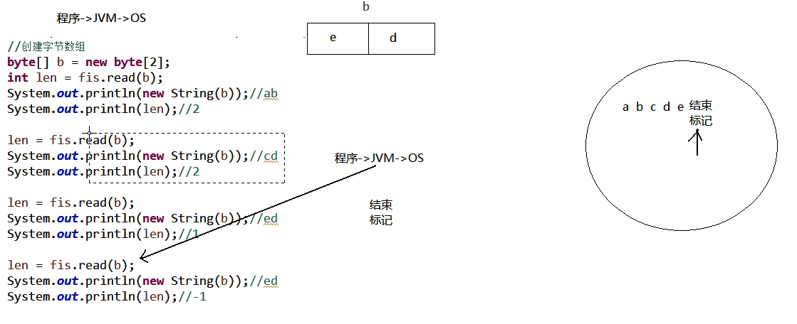
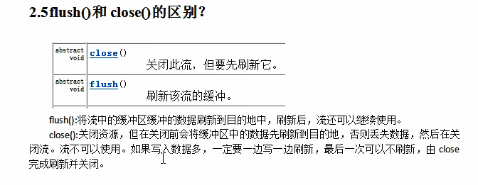
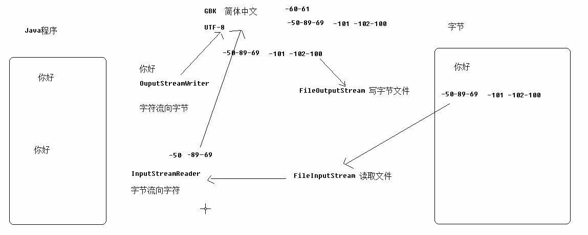
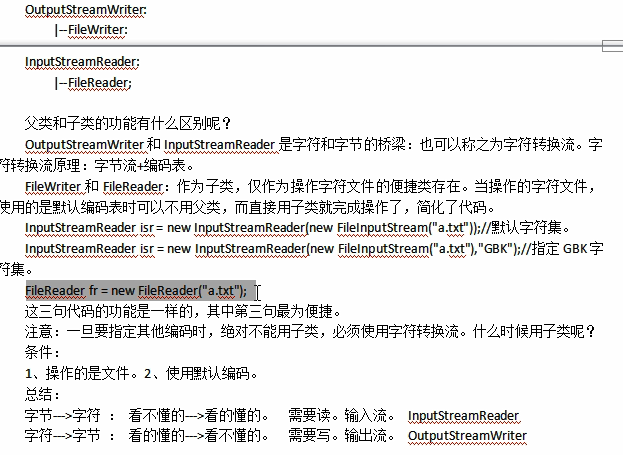
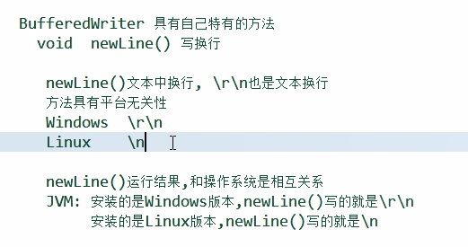
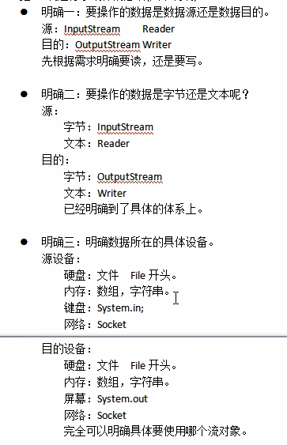
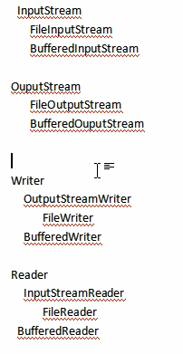
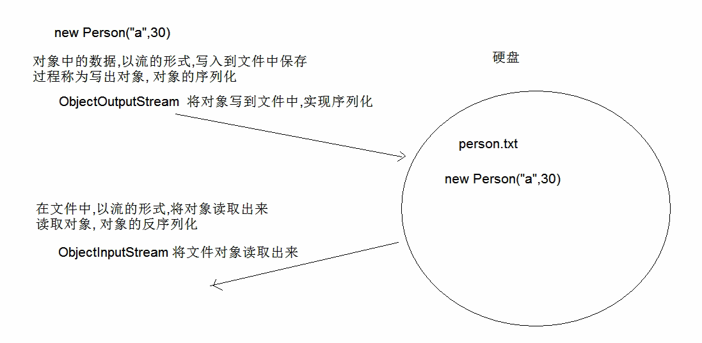
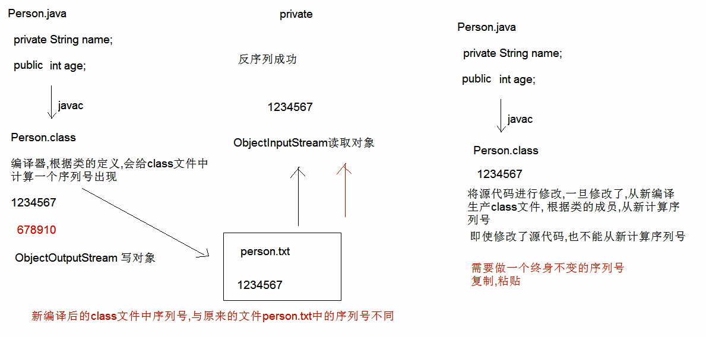
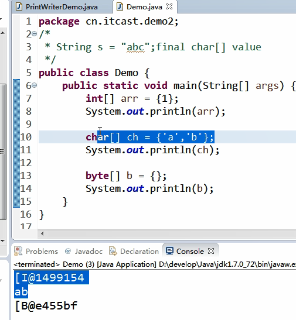

## File

将系统中的文件，目录，路径封装成File实例

### 常量

File.pathSeparator

结果为；路径分隔符，表示目录的分隔； 在linux中为：

File.separator

结果为\，表示目录名称的分隔，linux中为/

### File(String pathname)

传递路径名，可以写到目录或者文件，不管路径是否存在

c:\\\abc c\\\abc\\\Demo.java

打印出来为目录或者文件名

### File(String parent,String child)

传递路径，字符串的父路径和字符串的子路径

灵活性更高，可以单独操作父子路径

### File(File file,String child)

父路径为File类型，子路径为String

```java
System.out.println(File.pathSeparator);//结果为；路径分隔符，表示目录的分隔； 在linux中为：
System.out.println(File.separator);//结果为\，表示目录名称的分隔，linux中为/
File file = new File("w:\\work\\java");
System.out.println(file);
System.out.println(new File("w:","work"));
File fileparent = new File("w:");
System.out.println(new File(fileparent,"work\\java"));
;
\
w:\work\java
w:\work
w:\work\java
```

### boolean creatNewFile()

只用于创建文件，不创建文件夹，返回是否创建成功的布尔值

如果指定的文件已经存在，返回false

需要抛出声明IOException

```java
public static void main(String[] args) throws IOException{
    File file = new File("W:\\Work\\Java\\demo_learn\\learn_2019_9_53.go");
    System.out.println(file.createNewFile());
}
true
false//再次运行
```

### boolean mkdir()

用于创建文件夹，和上一个方法类似

### boolean mkdirs()

可以创建多级文件夹

```java
File filedir = new File("W:\\Work\\Java\\demo_learn\\learn_2019_9_53\\learn_2019_9_53");
System.out.println(filedir.mkdirs());
true
```

### boolean delete()

用于删除文件或者文件夹，返回是否删除成功

直接从硬盘中删除，无法还原

```java
System.out.println(file.delete());
System.out.println(filedir.delete());
```

### getName()

返回最后部分的文件名或者文件夹名字

### getPath()

和直接打印的toString()结果一样

### length()

返回文件的总字节数，对文件夹无效果

### String getAbsolutePath()

返回绝对路径的String对象

### File getAbsoluteFile()

返回绝对路径的File对象

如果写的时相对路径，则绝对路径为工程的根目录

```java
File file = new File("W:\\Work\\Java\\demo_learn\\learn_2019_9_53.go");
File filedir = new File("W:\\Work\\Java\\demo_learn\\learn_2019_9_53");
System.out.println(file.length());
System.out.println(filedir.length());
System.out.println(new File("src").getAbsoluteFile());
6
0
W:\Work\Java\Eclipse\learn_2019_9_5\src
```

### String getParent()

### String getParentFile()

获取父级路径

```java
File file = new File("W:\\Work\\Java\\demo_learn\\learn_2019_9_53.go");
System.out.println(file.getParentFile().getParentFile());//调用链
W:\Work\Java
```

### boolean exists()

返回此路径或文件是否存在

```java
System.out.println(new File("src").exists());
System.out.println(new File("ds").exists());
System.out.println("=======================");
true
false
```

### boolean isDirectory

判断File是不是目录

```java
File file = new File("W:\\Work\\Java\\demo_learn\\learn_2019_9_53.go");
File filedir = new File("W:\\Work\\Java\\demo_learn\\learn_2019_9_53");
System.out.println(file.isDirectory());
System.out.println(filedir.isDirectory());
false
true
```

### boolean isFile()

判断File是不是文件

### String[] list()

遍历目录获取所有的文件和目录名，并按ASCII码排序，隐藏的文件也可以遍历出来

### File[] listFiles()

遍历目录获取所有的文件和目录返回到File[]中，绝对路径,推荐用

### File[] File.listRoots()

获取系统中所有的根目录

```java
File file = new File("W:\\\\Work\\\\Java\\\\demo_learn");
String[] strarr= file.list();
for(String s:strarr) {
    System.out.println(s);
}
.idea
.vscode
ArrayDemo.class
ArrayDemo.java
CallName.class
CallName.java
ClassDemo.class
ClassDemo.java
Goods.class
Goods.java
GuestNumber.class
GuestNumber.java
learn_2019_9_53
learn_2019_9_53.go
Shop.class
Shop.java
Shopp.class
Shopp.java
Student.class
Student.java

File[] filearr = file.listFiles();
for(File fi:filearr) {
    System.out.println(fi);
}
W:\Work\Java\demo_learn\.idea
W:\Work\Java\demo_learn\.vscode
W:\Work\Java\demo_learn\ArrayDemo.class
W:\Work\Java\demo_learn\ArrayDemo.java
W:\Work\Java\demo_learn\CallName.class
W:\Work\Java\demo_learn\CallName.java
W:\Work\Java\demo_learn\ClassDemo.class
W:\Work\Java\demo_learn\ClassDemo.java
W:\Work\Java\demo_learn\Goods.class
W:\Work\Java\demo_learn\Goods.java
W:\Work\Java\demo_learn\GuestNumber.class
W:\Work\Java\demo_learn\GuestNumber.java
W:\Work\Java\demo_learn\learn_2019_9_53
W:\Work\Java\demo_learn\learn_2019_9_53.go
W:\Work\Java\demo_learn\Shop.class
W:\Work\Java\demo_learn\Shop.java
W:\Work\Java\demo_learn\Shopp.class
W:\Work\Java\demo_learn\Shopp.java
W:\Work\Java\demo_learn\Student.class
W:\Work\Java\demo_learn\Student.java

for(File fi:File.listRoots()) {
	System.out.println(fi);
}
C:\
D:\
E:\
P:\
S:\
W:\
```

### 文件过滤器

#### listFiles(FileFilter )

FileFilter默认没有实现类，需要自己构造实现类

```java
public class MyFilter implements FileFilter{

	@Override
	public boolean accept(File pathname) {
		
		String name = pathname.getName();
		return name.endsWith(".java");
	}

}
public static void main(String[] args) {
    File filedir = new File("W:\\Work\\Java\\demo_learn");
    File[] filearr = filedir.listFiles(new MyFilter());
    for(File file:filearr) {
        System.out.println(file);
    }
}
W:\Work\Java\demo_learn\ClassDemo.java
W:\Work\Java\demo_learn\Goods.java
W:\Work\Java\demo_learn\GuestNumber.java
W:\Work\Java\demo_learn\Shop.java
W:\Work\Java\demo_learn\Shopp.java
W:\Work\Java\demo_learn\Student.java
```

### 遍历全目录

```java
public static void function(File dir){
    System.out.println(dir);
    File[] filearr = dir.listFiles();
    for(File file:filearr) {
        if(file.isDirectory()) {
            function(file);//递归
        }else {
            System.out.println(file);
        }	
    }
}
File filedir = new File("W:\\Work\\Java\\demo_learn");
function(filedir);
W:\Work\Java\demo_learn
W:\Work\Java\demo_learn\.idea
W:\Work\Java\demo_learn\.idea\demo_learn.iml
W:\Work\Java\demo_learn\.idea\misc.xml
W:\Work\Java\demo_learn\.idea\modules.xml
W:\Work\Java\demo_learn\.idea\workspace.xml
W:\Work\Java\demo_learn\.vscode
W:\Work\Java\demo_learn\.vscode\launch.json
W:\Work\Java\demo_learn\ArrayDemo.class
W:\Work\Java\demo_learn\ArrayDemo.java
W:\Work\Java\demo_learn\CallName.class
W:\Work\Java\demo_learn\CallName.java
W:\Work\Java\demo_learn\ClassDemo.class
W:\Work\Java\demo_learn\ClassDemo.java
W:\Work\Java\demo_learn\Goods.class
W:\Work\Java\demo_learn\Goods.java
W:\Work\Java\demo_learn\GuestNumber.class
W:\Work\Java\demo_learn\GuestNumber.java
W:\Work\Java\demo_learn\learn_2019_9_53
W:\Work\Java\demo_learn\learn_2019_9_53\learn_2019_9_53
W:\Work\Java\demo_learn\learn_2019_9_53\learn_2019_9_53\learn_2019_9_53.go
W:\Work\Java\demo_learn\learn_2019_9_53\learn_2019_9_53.go
W:\Work\Java\demo_learn\learn_2019_9_53.go
W:\Work\Java\demo_learn\Shop.class
W:\Work\Java\demo_learn\Shop.java
W:\Work\Java\demo_learn\Shopp.class
W:\Work\Java\demo_learn\Shopp.java
W:\Work\Java\demo_learn\Student.class
W:\Work\Java\demo_learn\Student.java
```

一般方法的主体不变，但是参数有变化，可以使用递归

构造方法不能递归

## 字节流

### OutputStream所有字节输出流的超类

抽象类

作用：从java程序写出超类

每次操作文件中的一个字节

可以写任意文件

#### wirte(int b)

写入一个字节

#### wirte(byte[] b)

写入一个字节数组

#### wirte(byte[] b,int begin,int length)

写入字节数组从bgein开始写入length个

#### close()

关闭流对象，释放与此流相关的资源

```java
FileOutputStream fos = new FileOutputStream("W:\\Work\\Java\\demo_learn\\a.txt");
fos.write(50);
byte[] bytes= {10,50,90,79,95,3};
fos.write(bytes);
fos.write(bytes,1,2);
fos.write("hello".getBytes());
fos.close();
```

#### 文件续写

在构造方法的第二个参数加入true

换行\r\n

#### 异常处理

```java
public static void function() throws IOException{
		FileOutputStream fos = new FileOutputStream("W:\\Work\\Java\\demo_learn\\a.txt",true);
    fos.write("1111111111".getBytes());
    fos.write("1111111111".getBytes());
    fos.write("1111111111\r\n".getBytes());
    fos.write("1111111111".getBytes());
    fos.close();
}
public static void function1() {
    FileOutputStream fos =null;
    try {
        fos = new FileOutputStream("W:\\Work\\Java\\demo_learn\\c.txt",true);
        fos.write("22".getBytes());
    }catch(IOException ex){
        ex.printStackTrace();
        throw new RuntimeException("文件写入失败，请重试");
    }finally {
        try {
            if(fos != null) {
                fos.close();
            }
        }catch(IOException ex) {
            ex.printStackTrace();
            throw new RuntimeException("关闭资源失败");
        }
    }
}
```

### InputStream

#### int read()

读取返回一个字节

#### int read(byte[] b)

读取一定量的字节存到数组中,返回读取的有效字节数，如果到文件末尾返回-1




```java
//遍历整个文件
private static void function2() throws IOException{
    FileInputStream fis = new FileInputStream("W:\\Work\\Java\\demo_learn\\a.txt");
    byte[] b = new byte[1024];
    int len = 0;
    while((len=fis.read(b))!=-1) {
        System.out.print(new String(b,0,len));
    }
}

private static void function() throws IOException{
    FileInputStream fis = new FileInputStream("W:\\Work\\Java\\demo_learn\\a.txt");
    byte[] b = new byte[3];
    int len = fis.read(b);
    System.out.println(new String(b));
    System.out.println(len);
    System.out.println(fis.read());
    fis.close();
}
```

### 文件复制

多个文件流打开一般先开后关

```java
private static void function() throws IOException{
    FileInputStream fis = null;
    FileOutputStream fos = null;
    try {
        fis = new FileInputStream("W:\\Work\\Java\\demo_learn\\a.txt");
        fos = new FileOutputStream("W:\\Work\\Java\\demo_learn\\b.txt");
        int len =0;
        while((len = fis.read())!=-1) {
            fos.write(len);
        }
    } catch (Exception e) {
        e.printStackTrace();
        throw new RuntimeException("文件复制失败");
    }finally {
        try {
            if(fos != null) {
                fos.close();
            }				
        } catch (Exception e2) {
            e2.printStackTrace();
            throw new RuntimeException("资源关闭失败");
        }finally {
            try {
                if(fis != null) {
                    fis.close();
                }
            } catch (Exception e3) {
                e3.printStackTrace();
                throw new RuntimeException("资源关闭失败");
            }
        }
    }
}
//更高效的方法，数组缓冲
private static void function2() {
    long s = System.currentTimeMillis();
    FileInputStream fis = null;
    FileOutputStream fos = null;
    try {
        fis = new FileInputStream("W:\\Work\\Web\\xxcj.zip");
        fos = new FileOutputStream("W:\\Work\\Java\\demo_learn\\xxcj.txt");
        byte[] bytes = new byte[1024];
        int len=0;
        while((len=fis.read(bytes))!=-1) {
            fos.write(bytes,0,len);
        }
    } catch (Exception e) {
        e.printStackTrace();
        throw new RuntimeException("文件复制失败");
    }finally {
        try {
            if(fos != null) {
                fos.close();
            }				
        } catch (Exception e2) {
            e2.printStackTrace();
            throw new RuntimeException("资源关闭失败");
        }finally {
            try {
                if(fis != null) {
                    fis.close();
                }
            } catch (Exception e3) {
                e3.printStackTrace();
                throw new RuntimeException("资源关闭失败");
            }
        }
    }
    System.out.println(System.currentTimeMillis()-s);
}
```

### 字符输出流

java.io.Writer

所有输出类的超类

#### write(int c)

写一个字符

#### write(char[] c)

写字符数组

#### write(char[] c,int index,int length)

写入字符数组的一部分

#### write(String s)

写入字符串

#### flush()

刷新该流的缓冲，close()中也有刷新，刷新后写入操作才能成功写入，只有写入文件需要刷新



### 读取文本文件

java.io.Reader

所有字符输入流的超类

#### int read()

#### int read(char[] c)

```java
private static void function3()throws IOException {
    FileReader fr=null;
    FileWriter fw=null;
    try {
        fr = new FileReader("W:\\Work\\Java\\demo_learn\\b.txt");
        fw = new FileWriter("W:\\Work\\Java\\demo_learn\\d.txt");
        char[] ch = new char[1024];
        int len=0;
        while((len=fr.read(ch))!=-1) {
            fw.write(ch, 0, len);
            fw.flush();
        }
    } catch (Exception e) {
        e.printStackTrace();
        throw new RuntimeException("文件错误");
    }finally {
        try {
            if(fw!=null)fw.close();

        } catch (Exception e2) {
            e2.printStackTrace();
            throw new RuntimeException("错误");
        }finally {
            try {
                if(fr!=null)
                    fr.close();
            } catch (Exception e3) {
                e3.printStackTrace();
                throw new RuntimeException("错误");
            }
        }
    }
}

private static void function2() throws IOException{
    FileReader fr = new FileReader("W:\\Work\\Java\\demo_learn\\b.txt");
    char[] ch = new char[1024];
    int len=0;
    while((len = fr.read(ch))!=-1) {
        System.out.println(new String(ch,0,len));
    }
    fr.close();
    System.out.println("===============");
}

private static void function1() throws IOException{
    FileReader fr = new FileReader("W:\\Work\\Java\\demo_learn\\b.txt");
    int len =0;
    while((len = fr.read())!=-1) {
        System.out.print((char)len);
    }
    fr.close();
    System.out.println("===============");
}

private static void function() throws IOException{
    FileWriter fw = new FileWriter("W:\\Work\\Java\\demo_learn\\b.txt");
    fw.write(48);
    fw.flush();
    char[] c = {'1','c','d'};
    fw.write(c);
    String s = "\r\nfshakx桑拿陈asfasfasff飞洒kz";
    fw.write(s);
    fw.close();
    System.out.println("===============");
}
```

### 转换流



用于编码的操作

java.io.OutputStreamWriter

继承于Writer

可以将字符流转换成字节流

构造方法

OutputStreamWrtiter(OutputStream out)

接收所有的字节输出流

OutputStreamWrtiter(OutputStream out,String charsetName)

charsetName编码表名字 GBK UTF-8,不区分大小写

InputStreamReader(InputStream in)

接收所有的字节输出流

InputStreamReader(InputStream in,String charsetName)

charsetName编码表名字 GBK UTF-8,不区分大小写



```java
private static void function3() throws IOException{
    FileInputStream fis = new FileInputStream("W:\\Work\\Java\\demo_learn\\f.txt");
    InputStreamReader isr = new InputStreamReader(fis,"utf-8");
    char[] c = new char[1024];
    int len = isr.read(c);
    System.out.println(new String(c,0,len));
    isr.close();
}

private static void function2()throws IOException  {
    FileOutputStream fos = new FileOutputStream("W:\\Work\\Java\\demo_learn\\f.txt");
    OutputStreamWriter osw = new OutputStreamWriter(fos,"UTF-8");
    osw.write("dsha你很撒尼森撒");
    osw.close();
}

private static void function()throws IOException {
    FileOutputStream fos = new FileOutputStream("W:\\Work\\Java\\demo_learn\\f.txt");
    OutputStreamWriter osw = new OutputStreamWriter(fos);
    osw.write("dsha你很撒尼森撒");
    osw.close();
}
```

## 缓冲流

### 字节流缓冲区

### BufferedOutputStream

继承于OutputStream

### BufferedOutputStream(OutputStream out)

写入字节更高效

### BufferedInputStream(InputStream in)

字节输入流的缓冲流

```java
/*
* 文件复制
*/
private static void function2(File src,File desc) throws IOException{
    BufferedInputStream fis = new BufferedInputStream(new FileInputStream(src));
    BufferedOutputStream fos = new BufferedOutputStream(new FileOutputStream(desc));
    int len = 0;
    byte[] b = new byte[1024];
    while((len = fis.read(b))!=-1) {
        fos.write(b, 0, len);
    }
    fos.close();
    fis.close();	
}

private static void function1()throws IOException {
    BufferedInputStream bis = new BufferedInputStream(new FileInputStream("W:\\Work\\Java\\demo_learn\\a.txt"));
    byte[] b = new byte[100];
    int len =0;
    while((len=bis.read(b))!=-1) {
        System.out.println(new String(b,0,len));
    }
    bis.close();
}

private static void function() throws IOException{
    BufferedOutputStream bos = new BufferedOutputStream(new FileOutputStream("W:\\Work\\Java\\demo_learn\\a.txt"));
    bos.write(25);
    byte[] bytes = "dhskqnfsjfkasfwq".getBytes();
    bos.write(bytes, 0, bytes.length);
    bos.close();
}
```

### 字符流缓冲区

### BufferedWriter(Writer w)

newLine()新写一行

### BufferedReader(Reader r)

String readLine()读取一行，不包含换行符



```java
private static void function2()throws IOException {
    BufferedReader r = new BufferedReader(new FileReader("W:\\Work\\Java\\demo_learn\\b.txt"));
    BufferedWriter w = new BufferedWriter(new FileWriter("W:\\Work\\Java\\demo_learn\\h.txt"));
    String line=null;
    while((line=r.readLine())!=null) {
        w.write(line);
        w.newLine();
    }
    w.close();
    r.close();
}

private static void function1()throws IOException {
    BufferedReader r = new BufferedReader(new FileReader("W:\\Work\\Java\\demo_learn\\b.txt"));
    String s = "";
    while((s=r.readLine())!=null) {
        System.out.println(s);
    }
    r.close();
}

private static void function() throws IOException{
    FileWriter fw = new FileWriter("W:\\Work\\Java\\demo_learn\\b.txt");
    BufferedWriter bfw = new BufferedWriter(fw);
    bfw.write(100);
    bfw.write("你好大".toCharArray());
    bfw.newLine(); //用于文本中的换行
    bfw.write("肯撒飞洒");
    bfw.flush();
    bfw.close();
}
```

## 使用规律






## ProPerties

Hashtable的子类，map集合中的方法都可以使用

集合没有泛型，键和值都是字符串

是一个持久化的属性集，键值可以存储到集合中，也可以存储到持久化的设备（硬盘，u盘，光盘）。键值的来源也可以是设备

#### setProperty(String key, String value)

存入键值对和map中的put一致

#### getProperty(String key)

获取键对应的值

#### Set<String> StringPropertyNames()

返回属性列表中的键集

#### load(InputStream in)

#### load(Reader r)

传递任意的字节或者字符输入流

流对象读取文件中的键值对，保存到集合 

在键值对中注释用#

#### store(OutputStream out,String commits)

#### store(Writer w,String commits)

接收所有的字节或者字符输出流，将集合中的键值对，写会文件中保存

```java
private static void function2() throws IOException{
    Properties pro = new Properties();
    pro.setProperty("name", "Lisa");
    pro.setProperty("age", "23");
    FileWriter fw = new FileWriter("W:\\\\Work\\\\Java\\\\demo_learn\\\\pro.properties");
    pro.store(fw,"1你好");//第二个参数写为什么修改文件，写中文会以unicode保存，一般不写或者写英文
    fw.close();
}

private static void function1() throws IOException{
    FileReader fr = new FileReader("W:\\Work\\Java\\demo_learn\\pro.properties");
    Properties pro = new Properties();
    pro.load(fr);
    System.out.println(pro);
    fr.close();
}
{age=23, name=Lisa}
private static void function() {
    Properties pro = new Properties();
    pro.setProperty("a","1");
    pro.setProperty("b", "2");
    pro.setProperty("c", "3");
    System.out.println(pro.getProperty("c"));
    Set<String> set=pro.stringPropertyNames();
    for(String key :set) {
        System.out.println(key+' '+pro.getProperty(key));
    }
    System.out.println("===============================");
}
3
b 2
a 1
c 3
```



### ObjectOutputStream

#### ObjectOutputStream(OutputStream out)

#### void writeObject(Object obj)

写入一个对象,写入的对象需要实现Serializable接口，这个接口为标记型接口，没有实际内容

### ObjectInputStream

#### ObjectInputStream(InputStream In)

#### Object readObject()

读取对象,对象中的静态成员不能序列化，因为静态成员属于类，不属于对象,JDK1.8没有这个特性

成员变量前加上transient将不可被序列化

如果将对象序列化了之后，修改了类的内容，将不可反序列化，因为序列号改变了

static final long serialVersionUID = 42L;可以固定序列号

固定了序列号之后只保存一次，之后修改了也可以直接读取，新增的成员会以默认值出现



```java
public class Person implements Serializable{
	private String name;
	private transient int age;
	static final long serialVersionUID = 42L;
	public Person() {
		super();
	}
	public Person(String name, int age) {
		super();
		this.name = name;
		this.age = age;
	}
	public String getName() {
		return name;
	}
	public void setName(String name) {
		this.name = name;
	}
	public int getAge() {
		return age;
	}
	public void setAge(int age) {
		this.age = age;
	}
	@Override
	public String toString() {
		return "Person [name=" + name + ", age=" + age + "]";
	}
}
private static void function1() throws IOException,ClassNotFoundException{
    ObjectInputStream ois = new ObjectInputStream(new FileInputStream("W:\\Work\\Java\\demo_learn\\person.txt"));
    Object obj=ois.readObject();//如果没有改类的class文件，则会抛出ClassNotFoundException异常
    System.out.println(obj);
    ois.close();
}

private static void function()throws IOException {
    ObjectOutputStream oos = new ObjectOutputStream(new FileOutputStream("W:\\Work\\Java\\demo_learn\\person.txt"));
    Person p = new Person("LUU",1);
    oos.writeObject(p);
}
```

## 打印流

特点

1. 不负责数据源，只负责数据目的
2. 为其他输出流添加功能
3. 永远不会抛出IO异常，但可能会有其他异常

PrintStream

PrintWriter

两个打印流方法一致

构造方法就是打印流的输出目的端

#### PrintStream()

接收File,字符串文件名,OutputStream

#### println()

原样输入，里面是什么就写入什么，和打印的时候一样，和write()依据编码表不同

#### PrintWriter()

接收File,字符串文件名,OutputStream,接收Writer



自动刷新功能

1. 数据目的必须为流对象
2. 必须调用println,printf,format才能

PrintWriter(OutputStream out,Boolean autoflush)

需要开启

```java
private static void function3() throws IOException{
    PrintWriter pw = new PrintWriter(new FileOutputStream("w:\\work\\java\\demo_learn\\j.txt"),true);
    pw.print("ds");//没有下面的println,没有
    pw.println("dsa");
}

private static void function2()throws IOException{
    PrintWriter pw = new PrintWriter(new FileOutputStream("w:\\work\\java\\demo_learn\\j.txt"));
    pw.println("dsa你好");//没有下面的close，没有
    pw.close();
}

private static void function1() throws FileNotFoundException{
    PrintWriter pw = new PrintWriter("w:\\work\\java\\demo_learn\\j.txt");
    pw.println(true);
    pw.close();

}

private static void function() throws FileNotFoundException{
    File file = new File("w:\\work\\java\\demo_learn\\a.txt");
    PrintWriter pw = new PrintWriter(file);
    pw.println(100);
    pw.write(100); 
    pw.flush();
}

//文件复制
public static void main(String[] args) throws FileNotFoundException,IOException{
    BufferedReader bfr = new BufferedReader(new FileReader("w:\\work\\java\\demo_learn\\a.txt"));
    PrintWriter pw = new PrintWriter(new File("w:\\work\\java\\demo_learn\\x.txt"));
    String line = null;
    while((line = bfr.readLine())!=null) {
        pw.println(line);
    }
    pw.close();
    bfr.close();	
}
```

### commons-io

#### static String FileUtils.readFileToString()

将文件内容读取返回

#### static voidFileUtils.writeStringToFile(String s)

写string进入file

#### static void copyFile(File src,File desc)

复制文件

#### static void copyDirectoryToDirectory(File src,File desc)

复制文件夹，好像没用