### 引入Scanner Class

```java
	import java.util.Scanner;
	
	Scanner sc = new Scanner(System.in);
	int i = sc.nextInt(); //定义变量i接受整形输入
	
	sc.next(); // 接受字符串
	
	
```

### 引入Random Class

```java
	import java.util.Random;
	
	Random ran = new Rabdon();
	ran.nextInt(100)  //范围在0-99 /int
	
	nextDouble()  //范围固定在  0.0-1.0  //double
```

### 数组的定义

```java
	int [] arr =new int[3];
    默认不设置值时所有为0
	1.类型[] 变量名 = new 类型 [大小]
	2.类型[] 变量名 = new 类型 []{1,2,3,4,5,6} //[]内不允许写内容
	3.类型[] 变量名 = {1,2} 
    两个常见异常 数组越界 空指针
    二维数组
    1.int[][] arr = new int[3][4]
    2.int[][] arr = new int[3][] //不推荐
    3.int[][] arr = {{1},{2},{3}}
    
```

### JVM内存分配

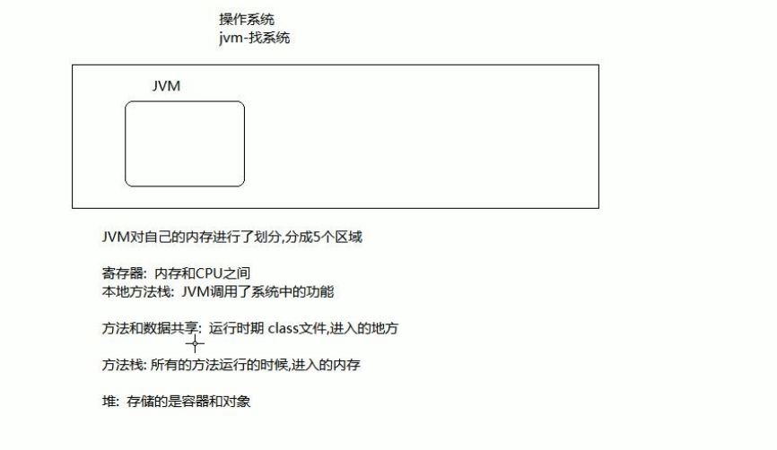

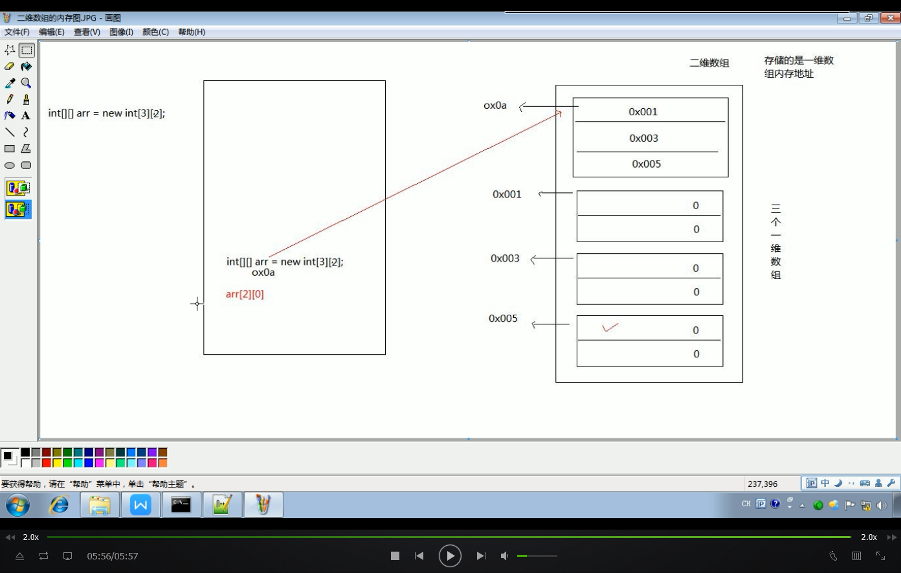

### 运行机制

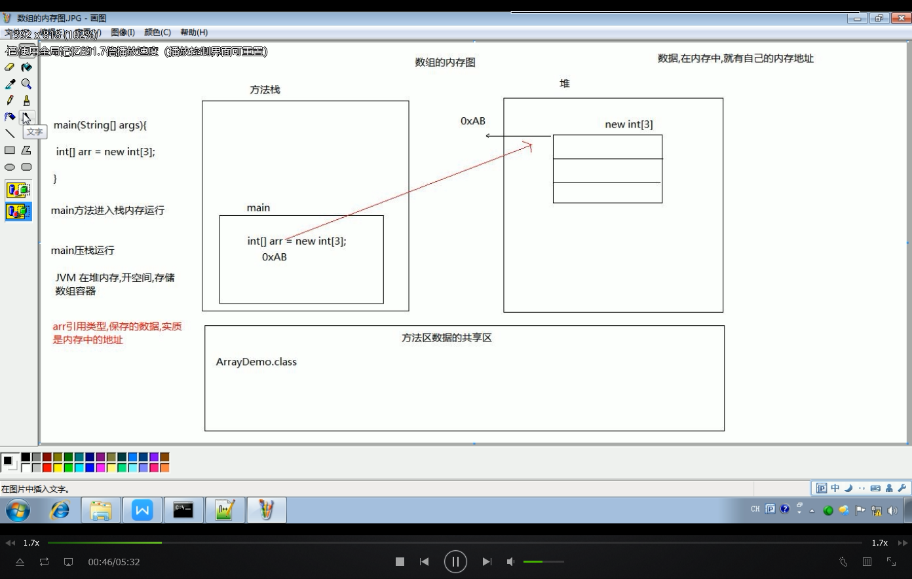

```Java
long l=2445484848L  //long 和float 要加后缀
float f=45454512454.12F
被转后的数据类型 变量名=(被转后的数据类型)要被转的数据

'a' +1 =98 //类型提升
char 类型 0-65535
short -32768 - 32767
char 类型二进制全是数值位
short 第一位为符号位
```

### 自定义类

```java
public calss 类名{
    属性定义
        修饰符 数据类型 属性名 = 值
    方法定义
        修饰符 返回值类型 方法名（参数列表）{
        
    }
}
类名 变量名 = new 类名();
```

1. 导入包，类在一个文件夹，不需要导入包
2. 创建引用类型的变量
3. 变量.类型中的功能

### ArrayList

```java
/*
导入java.util
数据类型<集合存储的数据类型> array = new 数据类型<集合存储的数据类型>()
ArrayList<String> array =new ArrayList<String>();
注意：集合存储的数据，8个基本类型对应8个引用类型，
存储引用类型，不存储基本类型,也可以是自定义的类型
*/
import java.util.ArrayList
ArrayList<String> array = new ArrayList<String>();
ArrayList<Integer> array2 = new ArrayList<Integer>();
```

| 基本数据类型 | 对应的引用数据类型 |
| :------------ | :------------------ |
| byte         | Byte               |
| short        | Short              |
| int          | Integer            |
| long         | Long               |
| float        | Float              |
| double       | Double             |
| char         | Character          |
| boolean      | Boolean            |

#### 集合中的方法

```java
//obj为集合定义的类型
add(obj)

//取出集合中的元素
get(int index)

//返回集合的长度，集合存储的个数
size()

//将元素添加到指定的位置
add(int index,obj)

//修改指定索引的元素
set(int index,obj)

//删除指定索引上的元素
remove(int index)

//清空容器里的元素
clear()
```


alt + / eclipse的自动补全

syso System.out.println

类名

ctrl + shift + f //格式化

ctrl + shift + /多行注释

ctrl + shift + \解除多行注释

ctrl + shift + o 导包

alt + 上下箭头 移动当前行

ctrl + shift +上下箭头 复制多行

ctrl + d 删除当前行

ctrl +1 意见提示

ctrl + t 查看继承关系

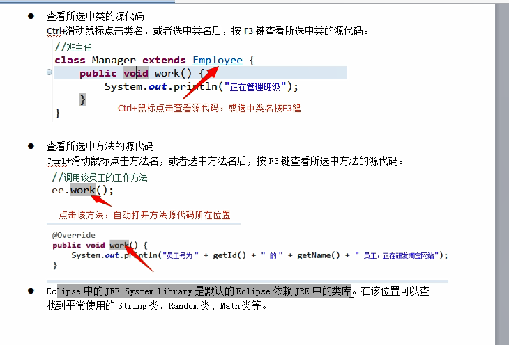

成员变量有默认值，局部变量没有

成员变量跟随对象在堆内存

局部变量跟随方法在占内存

成员变量的生命周期相对较长，等待jvm来释放内存

局部变量的生命周期相对较短

同一个类的情况下，用函数传过来的实参可以直接访问私有熟悉

### 对象的继承

使用extends关键字

private 不会被继承

```java
public class classname extends fclass{
    
}
```

子类可以直接调用父类成员

spuer.attr  可以调用父类成员

子类重写父类发方法时，要保证子类方法的权限大于等于父类的方法的权限加 public比不加高

提高了代码复用性，可维护性

类与类之间耦合度高

### 抽象类

提取特征的父类无法具体描述某个方法，只能定义

用abstract关键字来修饰

抽象类不能new 

用子类继承重写方法

抽象类的子类必须重写抽象类的方法

抽象类也可以写非抽象方法，子类可以直接用这个方法

抽象方法不能用private，final，static

```java
public abstract class classname{
    public abstract void function();
}
public class chile extends{
    public void funciont(){
        
    }
}
```

### 接口的定义

还是.java文件

接口名类似于类名

只能定义抽象方法：固定格式  public abstract 返回值类型 函数名();

public 不写  默认为public

无法定义普通的成员变量

接口中只能定义常量	public static final 数据类型 变量名 = 值

public static final 不写默认public static final 

只有public

public 权限

static 可以被类名/接口名直接调用

final   无法修改

```java
public interface myinterface{
    public abstract void function();
    public static final int a =1;
}
```

#### 类实现接口

和继承类似

重写接口中的public方法必须写public(权限不能低于父类)

```java
public class interfacetemp implements myinterface{
	public void function() {
		System.out.println("实现类重写接口方法");
	}
}

public class Test {

	public static void main(String[] args) {
		interfacetemp my = new interfacetemp();
		my.function();
		System.out.println(interfacetemp.a+" "+my.a+" "+myinterface.a);
        //成员变量可以直接访问
	}

}
```

实现类实现接口必须重写全部的接口抽象方法

如果实现类只重写了一部分方法，实现类则为抽象类

多实现没有安全问题

#### 多实现接口

```java
public interface A {
	public static final int a=1;
	public abstract void show();
}
public interface B {
	public static final int a=2;
	public abstract void show();
}
public class myface implements A,B{
	public int a=3;
	public void show() {
		System.out.println("1");
	}
}
//如果多个接口有冲突，选择不实现
```

可以继承一个类，实现多个接口

#### 接口的多继承

```java
public interface A {
	public abstract void a();
}
public interface B {
	public abstract void b();
}
public interface C extends A,B{
	public abstract void c();
}
public class D implements C{
	public void a() {
		System.out.println("a接口的重写");
	}
	public void b() {
		System.out.println("b接口的重写");
	}
	public void c() {
		System.out.println("c接口的重写");
	}
}
public class Test {
	public static void main(String[] args) {
		D d = new D();
		d.a();
		d.b();
		d.c();
	}
}
```

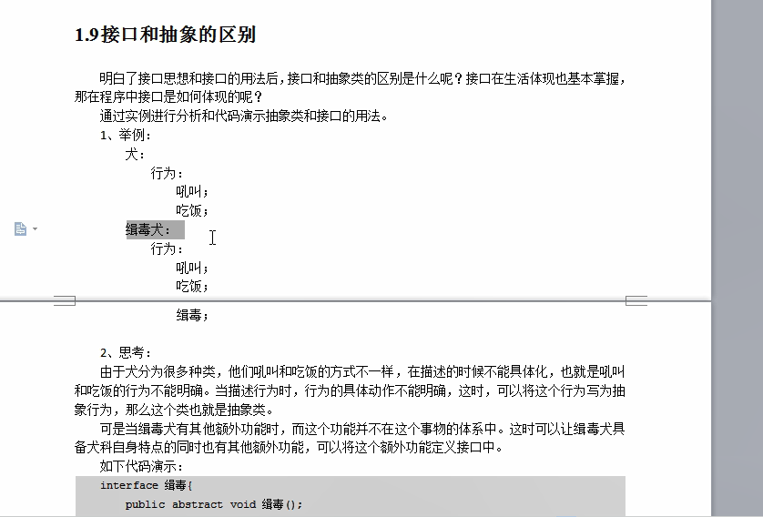

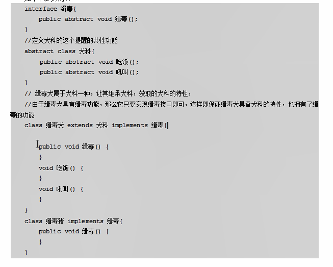

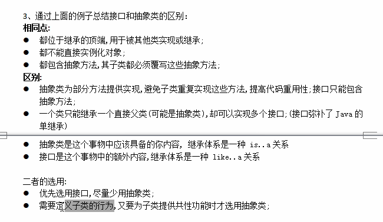

### 对象多态

必须有继承或者接口实现

父类引用可以指向子类的对象，调用方法使用的是子类重写的方法


```java
Student s = new Student()
Person p =new Student() //这里p引用的是子类对象，调用的方法是子类的方法
    
public class Fu {
	public void show() {
		System.out.println("父类的方法");
	}
}

public class Zi extends Fu{
	public void show() {
		System.out.println("子类的方法");
	}
}

public abstract class A {
	public abstract void show();
}

public class B extends A{
	public void show() {
		System.out.println("子类B的方法");
	}
}

public interface C {
	public abstract void show();
}

public class D implements C{
	public void show() {
		System.out.println("子类D的方法");
	}
}

public class Test {
	public static void main(String[] args) {
		Fu f = new Zi();
		f.show();
		A a = new B();
		a.show();
		C c = new D();
		c.show();
	}	
}

子类的方法
子类B的方法
子类D的方法
```

多态中，编译是看父类中是否有这个变量，且使用时用父类的成员,方法用子类的，但是是子父类的共有方法

如果子类用父类没有的方法则编译失败

运行时用子类的重写方法

```java
public class Fu {
	int a=1;
	public void show() {
		System.out.println("父类的方法");
	}
}
public class Zi extends Fu{
	int a = 2;
	public void show() {
		System.out.println("子类的方法");
	}
}
public class Test {
	public static void main(String[] args) {
		Fu z = new Zi();
		System.out.println(z.a);
		z.show();
	}
}
1
子类的方法
```

#### instanceof

判断一个引用类型的对象是否是某个对象

只对有实现关系或者继承关系有效

```java
public abstract class Person {
	public abstract void sleep();
}
public class Student extends Person{
	public void sleep() {
		System.out.println("学生睡觉");
	}
}
public class Teacher extends Person{
	public void sleep() {
		System.out.println("老师睡觉");
	}
}
public class Test {

	public static void main(String[] args) {
		Person p = new Student();//自动类型提升，提升为父类类型
		p.sleep();
		System.out.println(p instanceof Teacher);
		System.out.println(p instanceof Student);
		System.out.println(p instanceof Person);
	}

}

学生睡觉
false
true
true
```

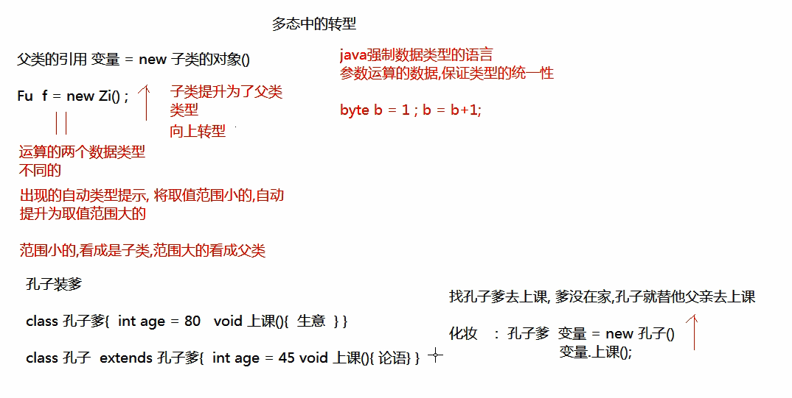

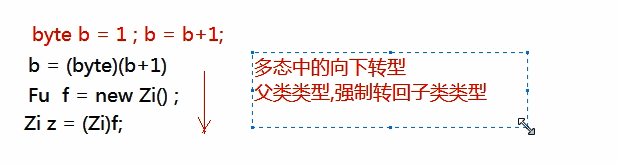

向下转型后可以调用子类的特有功能，不然只能用父类的

向下转型只能在子父类转化

```java
public class Student extends Person{
	public void sleep() {
		System.out.println("学生睡觉");
	}
	public void game() {
		System.out.println("玩游戏");
	}
}

Student z = (Student) p;
z.game();


--------------------------------------------------------------------
public abstract class Animal {
	public abstract void eat();
}

public class Cat extends Animal{
	public void eat() {
		System.out.println("猫吃");
	}
	public void work() {
		System.out.println("猫捉老鼠");
	}
}

public class Dog extends Animal{
	public void eat() {
		System.out.println("狗吃");
	}
	public void work() {
		System.out.println("狗看家");
	}
}

public class Test {

	public static void main(String[] args) {
		Animal a1 = new Cat();
		Animal a2 = new Dog();
		Animal a3 = new Cat();
		a1.eat();//猫吃
		a2.eat();//狗吃
		if(a1 instanceof Cat) {
			Cat b1 = (Cat) a1;
			b1.work();//猫捉老鼠
			Animal c1 = (Animal) b1;
			c1.eat();//猫吃
		}
		if(a2 instanceof Dog) {
			Dog b2 = (Dog) a2;
			b2.work();//狗看家
		}
		if(a3 instanceof Dog) { //false
			Dog b3 = (Dog) a3;
			b3.work();
		}
	}

}

猫吃
狗吃
猫捉老鼠
猫吃
狗看家
```

demo

电脑使用usb

```java
public interface USB {
	public abstract void open();
	public abstract void close();
}

public class Keyboard implements USB{
	public void open() {
		System.out.println("键盘开启");
	}
	public void close() {
		System.out.println("键盘关闭");
	}
}

public class Mouse implements USB{
	public void open() {
		System.out.println("开启鼠标");
	}
	public void close() {
		System.out.println("关闭鼠标");
	}
}

public class Computer {
	public void openpc() {
		System.out.println("笔记本开机");
	}
	public void closepc() {
		System.out.println("笔记本关机");
	}
	public void usesub(USB usbdevice) {
		usbdevice.open();
		usbdevice.close();
	}
}

public class Test {
	public static void main(String[] args) {
		Computer c = new Computer();
		USB m = new Mouse();
		Mouse m1 = new Mouse();
		USB k = new Keyboard();
		c.openpc();
		c.usesub(m);
		c.usesub(new Mouse());
		c.usesub(m1);
		c.usesub(k);
		c.usesub(new Keyboard());
		c.closepc();
	}
}

笔记本开机
开启鼠标
关闭鼠标
开启鼠标
关闭鼠标
开启鼠标
关闭鼠标
键盘开启
键盘关闭
键盘开启
键盘关闭
笔记本关机
```

### 类的构造方法

作用：在new的同时对成员变量进行赋值

方法名和类名一致

在new时自动执行构造方法，只运行一次

没手动写构造方法则默认一个空的构造方法，如果写了则不会添加默认的构造方法

可以重载

私有构造方法无法使用

```java
权限 方法名（参数列表）{
    
}//没有返回值，也不能写void

public class Person {
	private String name;
	private int age;
	public String getName() {
		return name;
	}
	public void setName(String name) {
		this.name = name;
	}
	public int getAge() {
		return age;
	}
	public void setAge(int age) {
		this.age = age;
	}
	public Person(String name,int age) {
		this.name=name;
		this.age=age;
		System.out.println("名字："+name+"年龄："+age);
	}
}

public class Test {

	public static void main(String[] args) {
		Person p = new Person("Tree", 1);
	}

}
名字：Tree年龄：1

```

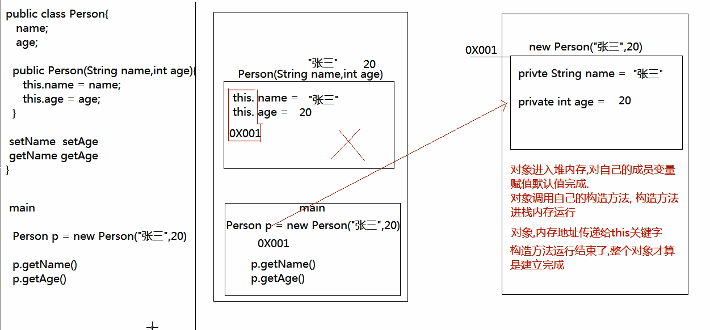

### this关键字

this()可以在构造函数中调用其他的构造函数

```java
public Person() {
    this("lisa",10);//必须写在构造函数的第一行
}
public Person(String name,int age) {
    this.name=name;
    this.age=age;
}
```

super()

调用父类的构造方法，默认执行

```java
public class Person {
	private String name;
	private int age;
	public Person() {	
		this("lisa",10);

	}
	public Person(String name,int age) {
		this.name=name;
		this.age=age;
		System.out.println("姓名："+this.name+"年龄："+this.age);
	}
	public String getName() {
		return name;
	}
	public void setName(String name) {
		this.name = name;
	}
	public int getAge() {
		return age;
	}
	public void setAge(int age) {
		this.age = age;
	}
	public void show() {
		System.out.println("父类的方法show");
	}
}

public class Student extends Person{
	public Student(){
		super.show();
	}
}

public class Test {

	public static void main(String[] args) {
		Person p = new Person();
		System.out.println(p.getAge());
		System.out.println(p.getName());
		System.out.println("==============================================");
		Student s = new Student();
		
	}

}

姓名：lisa年龄：10
10
lisa
==============================================
姓名：lisa年龄：10
父类的方法show
//如果父类构造函数只有加参数的，子类构造函数必须重写，且加函数，因为java会添加默认的一个super()
//子类的所有构造函数第一行必须是super()
//子类可以调用任意一个父类的构造器
//构造方法不可继承
//this 和 super 不能同时存在
```

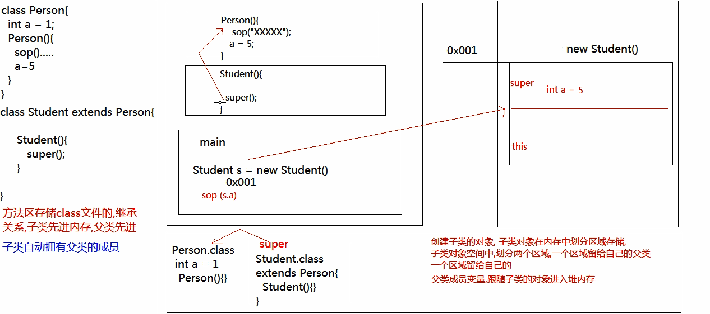demo

```java
public class Person {
	private String name;
	private int age;
	public String getName() {
		return name;
	}
	public void setName(String name) {
		this.name = name;
	}
	public int getAge() {
		return age;
	}
	public void setAge(int age) {
		this.age = age;
	}
	public Person() {
		
	}
	public Person(String name,int age) {
		this.age=age;
		this.name=name;
	}
}

public class Student extends Person{
	public Student() {
		super();
	}
	public Student(String name,int age) {
		super(name,age);
	}
}

public class Worker extends Person{
	public Worker(String name,int age) {
		super(name,age);
	}
}

public class Test {

	public static void main(String[] args) {
		Worker w = new Worker("Mark",25);
		Student s = new Student("Lisa",10);
		System.out.println(s.getName()+""+s.getAge());
		System.out.println(w.getName()+""+w.getAge());
	}

}

Lisa10
Mark25
```

demo

```java
public abstract class Employee {
	private String name;
	private int Id;
	public Employee(String name,int Id) {
		this.name =name;
		this.Id=Id;
	}
	public String getName() {
		return name;
	}
	public void setName(String name) {
		this.name = name;
	}
	public int getId() {
		return Id;
	}
	public void setId(int id) {
		Id = id;
	}
	
	public abstract void work();
}

public abstract class Develop extends Employee{
	public Develop(String name, int Id) {
		super(name,Id);
	}
}

public abstract class Maintainer extends Employee{
	public Maintainer(String name, int Id) {
		super(name,Id);
	}
}

public class JavaEE extends Develop{
	public JavaEE(String name,int Id) {
		super(name, Id);
	}
	public void work() {
		System.out.println("javaee工程师在研发网站"+this.getName()+""+this.getId());
	}
}

public class Net extends Maintainer {

	public Net(String name, int Id) {
		super(name, Id);
	}

	public void work() {
		System.out.println("Net工程师在检查网络是否畅通" + this.getName() + "" + this.getId());
	}

}

public class Test {

	public static void main(String[] args) {
		Net m = new Net("Mark",10);
		JavaEE j = new JavaEE("Lisa",20);
		m.work();
		j.work();
	}

}

Net工程师在检查网络是否畅通Mark10
javaee工程师在研发网站Lisa20
```

### final

意为不可变

如果在class 前加final则不可被继承

final 修饰的方法不可以被子类重写

final 修饰变量不可以改变

final 修饰一个引用类型，则变量的地址不可改变

final 修饰的成员变量，固定的是成员的第一次手动赋值,需要在构造对象前赋值，否则报错

```java
public class A{
    final int a;
    public A(){
        a=10;
    }
    public void set(){
        a=10;//错误
    }
}
```

### static 

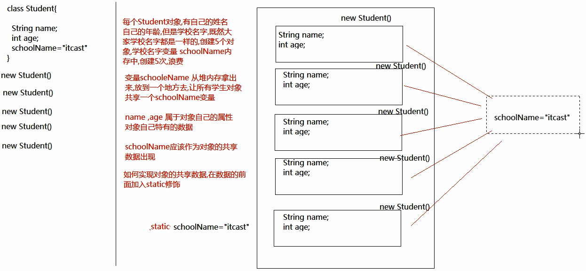

属于静态的共享数据

可以用类直接访问

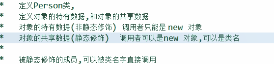

```java
public class Person {
	String name;
	static String classname;
}

public class Test {

	public static void main(String[] args) {
        System.out.println(Person.classname);
		Person p1 = new Person();
		Person p2 = new Person();
		p1.name="Mark";
		p1.classname="基础班";
		System.out.println(p2.name+"\n"+p2.classname+'\n'+Person.classname);
	}

}

null
null
基础班
基础班
```

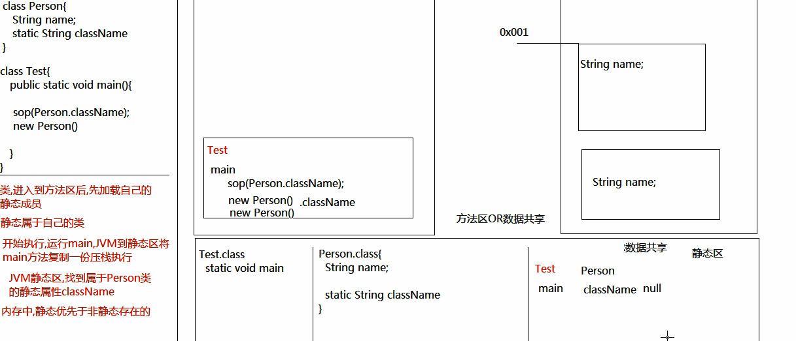

在多态中，编译看左边的父类， 运行时静态方法运行父类方法，非静态方法运行子类的重写方法，成员变量是否静态都执行父类的变量

因为静态属于类，不属于对象

固定不变的值定义为静态常量

### 匿名对象

只能使用一次

可以当作参数传递

可以当作方法的返回值

```java
new Person();
method(new Person())
return new Person()
```

### 内部类

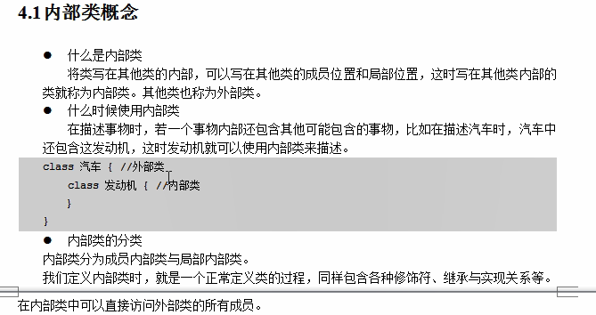

可以写在成员变量或者方法内

成员内部类可以使用成员修饰符public , static，可以继承，可以实现接口

内部类可以使用外部类的成员包括私有，外部类使用内部类成员需要构造实例

编译名字为Outer$Inner.class

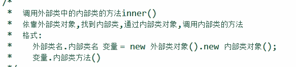

demo

```java
public class Outer {
	int i =1;
	class Inner{
		int i =2;
		public void inner() {
			int i =3;
			System.out.println(i+" "+this.i+" "+Outer.this.i);
		}
	}
}

public class Test {

	public static void main(String[] args) {
		Outer.Inner i = new Outer().new Inner();
		i.inner();
	}

}

3 2 1
```

局部内部类

只能依靠局部方法来调用

命名为Outer$1Inner.class

```java
public class Outer {
	public void out() {
		class Inner{
			public void inner() {
				System.out.println("局部内部类的方法");
			}
		}
		Inner in = new Inner();
		in.inner();
	}
}

public class Test {

	public static void main(String[] args) {
		Outer o = new Outer();
		o.out();
	}

}
局部内部类的方法
```

匿名内部类

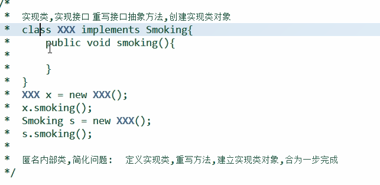

命名为Outer$1.class

```java
public interface Smoking {
	public abstract void smoking();
}

public abstract class Person {
	public abstract void eat();
	public abstract void sleep();
}

public class Test {

	public static void main(String[] args) {
		//匿名内部类实现功能
		new Smoking( ) {	
			@Override
			public void smoking() {
				System.out.println("人在吸烟");
			}
		}.smoking();//只使用一次
		Person p = new Person() {
			public void eat() {
				System.out.println("人吃饭");
			}
			public void sleep() {
				System.out.println("人睡觉");
			}
		};
		p.eat();
		p.sleep();
	}

}

人在吸烟
人吃饭
人睡觉
```

包名一般采用公司网址反写

导入包必须导入到根目录

类的全名前面有包名

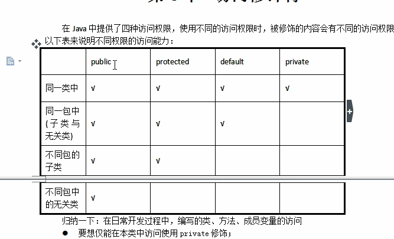

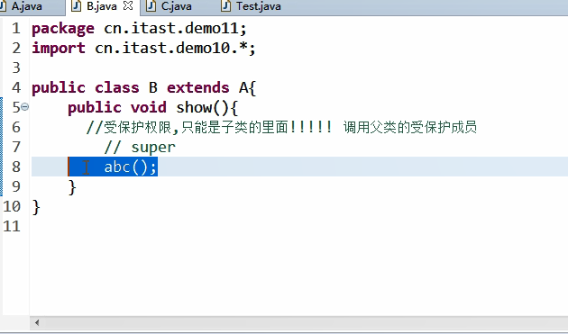

代码块限制作用域

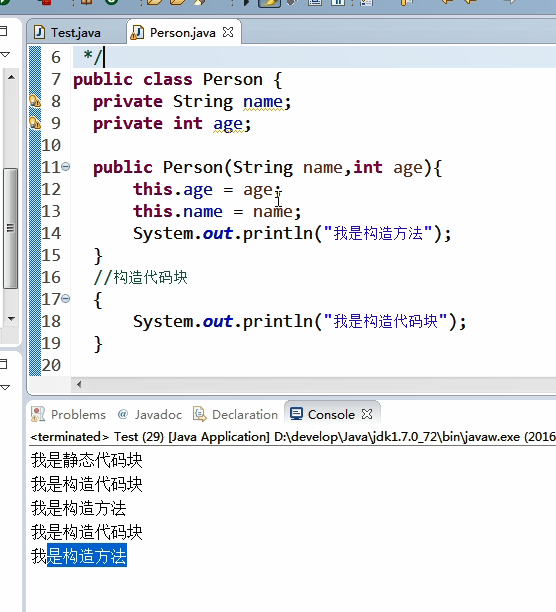

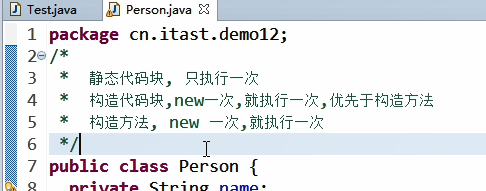

### 文档格式

```java
/**
*实现
*@author
*@version
*/

/**
*方法功能
*方法传参
*@param a
*@param b
*@return 
*
*/
```

可以用javadoc自动导出

导入jar

```java
在cmd中打入 set classpath = path;//.jar文件的位置
在eclipse
```

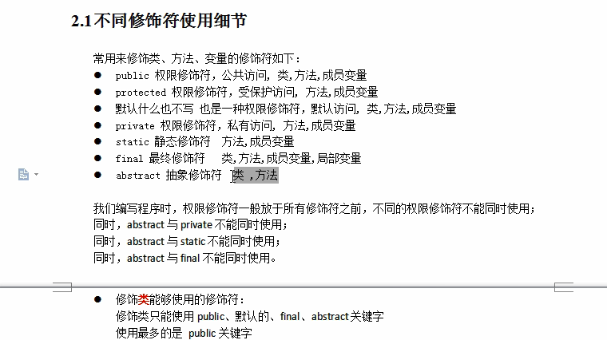

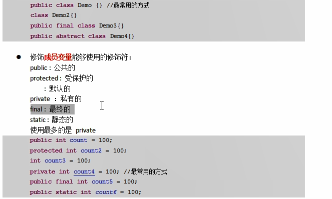

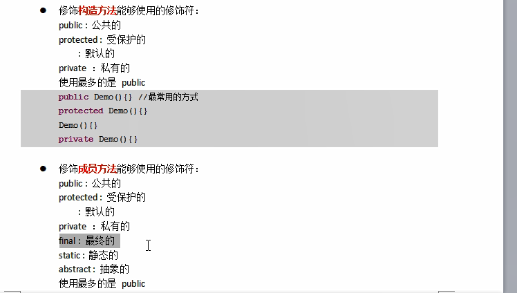

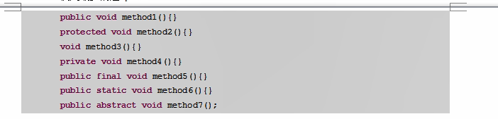

如果抽象类作为方法的参数，那传参只能传抽象类的子类(多态调用)，因为抽象类不能new

抽象类作为方法的返回值，那只能返回抽象类的子类

体现了多态的扩展性，因为可以操作任意的子类

如果接口作为方法的参数，那传参只能传接口的实现类，也可以传多态类型

接口作为方法的返回值，那只能返回接口的实现类

```java
public abstract class Animal {
	public abstract void eat();
	public static Animal getInstance() {
		return new Cat();
	}
}

public class Cat extends Animal{
	public void eat() {
		System.out.println("猫吃");
	}
}

public class Test {
/**
 * 抽象类的静态方法返回子类对象
 * 不需要关注子类是谁
 */
	public static void main(String[] args) {
		Animal a =Animal.getInstance();
		a.eat();
	}

}

猫吃
```

demo

```java
public abstract class Employee {
	private String name;
	private int id;
	public Employee() {
		super();
	}
	public Employee(String name,int id) {
		this.name=name;
		this.id=id;
	}
	public abstract void work();
	public String getName() {
		return name;
	}
	public void setName(String name) {
		this.name = name;
	}
	public int getId() {
		return id;
	}
	public void setId(int id) {
		this.id = id;
	}
	
}

public interface VIP {
	public abstract void services();
}

public class Manager extends Employee{

	private int jiangjin;
	
	public void work() {
		System.out.println("经理监督");
	} 
	
	public Manager() {
		super();
		
	}

	public int getJiangjin() {
		return jiangjin;
	}

	public void setJiangjin(int jiangjin) {
		this.jiangjin = jiangjin;
	}

	public Manager(String name, int id,int jiangjin) {
		super(name, id);
		this.jiangjin=jiangjin;
		
	}
	
}

public abstract class Employee {
	private String name;
	private int id;
	public Employee() {
		super();
	}
	public Employee(String name,int id) {
		this.name=name;
		this.id=id;
	}
	public abstract void work();
	public String getName() {
		return name;
	}
	public void setName(String name) {
		this.name = name;
	}
	public int getId() {
		return id;
	}
	public void setId(int id) {
		this.id = id;
	}
	
}

public class Waiter extends Employee implements VIP{
	public void work() {
		System.out.println("服务员在上菜");
	}
	public void services() {
		System.out.println("服务员给谷歌倒酒");
	}
	public Waiter() {
		
	}
	public Waiter(String name,int id) {
		super(name,id);
	}
}

public class Test {

	public static void main(String[] args) {
		Manager m = new Manager("adsa",100,100);
		m.work();
		Waiter w = new Waiter("mark",1);
		w.work();
		w.services();
		Cook c = new Cook("Lisa",10);
		c.work();
		c.services();
		System.out.println(w.getName()+""+w.getId());
		System.out.println(c.getName()+""+c.getId());
		System.out.println(m.getName()+""+m.getId()+""+m.getJiangjin());
	}

}

经理监督
服务员在上菜
服务员给谷歌倒酒
厨师在炒菜
厨师做菜加量
mark1
Lisa10
adsa100100
```

