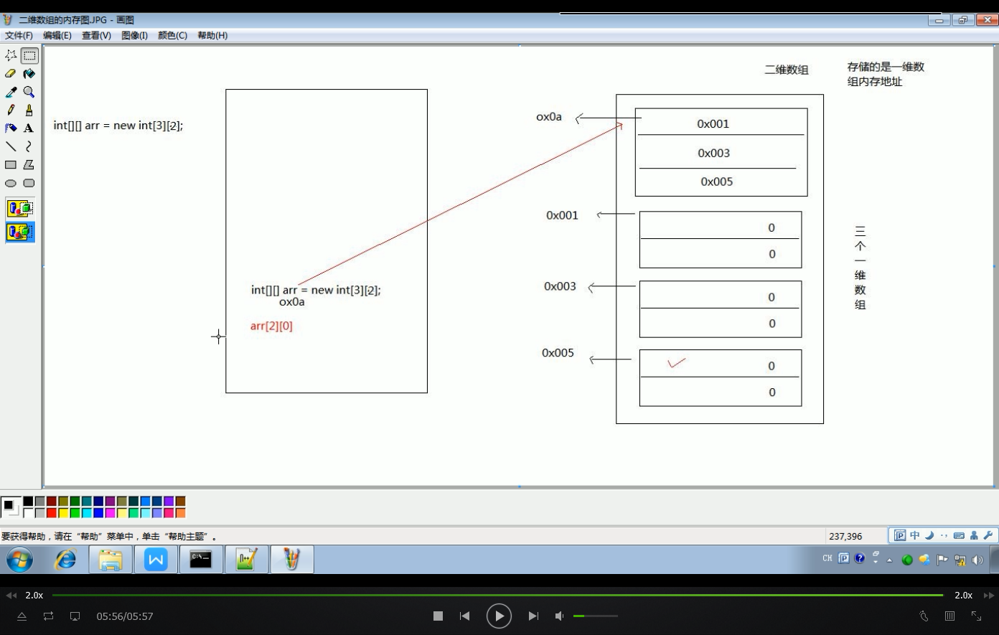

###引入Scanner Class

```java
	import java.util.Scanner;
	
	Scanner sc = new Scanner(System.in);
	int i = sc.nextInt(); //定义变量i接受整形输入
	
	sc.next(); // 接受字符串
	
	
```

###引入Random Class 
```java
	import java.util.Random;
	
	Random ran = new Rabdon();
	ran.nextInt(100)  //范围在0-99 /int
	
	nextDouble()  //范围固定在  0.0-1.0  //double
```

### 数组的定义

```java
	int [] arr =new int[3];
    默认不设置值时所有为0
	1.类型[] 变量名 = new 类型 [大小]
	2.类型[] 变量名 = new 类型 []{1,2,3,4,5,6} //[]内不允许写内容
	3.类型[] 变量名 = {1,2} 
    两个常见异常 数组越界 空指针
    二维数组
    1.int[][] arr = new int[3][4]
    2.int[][] arr = new int[3][] //不推荐
    3.int[][] arr = {{1},{2},{3}}
    
```

### JVM内存分配




### 运行机制


```Java
long l=2445484848L  //long 和float 要加后缀
float f=45454512454.12F
被转后的数据类型 变量名=(被转后的数据类型)要被转的数据

```