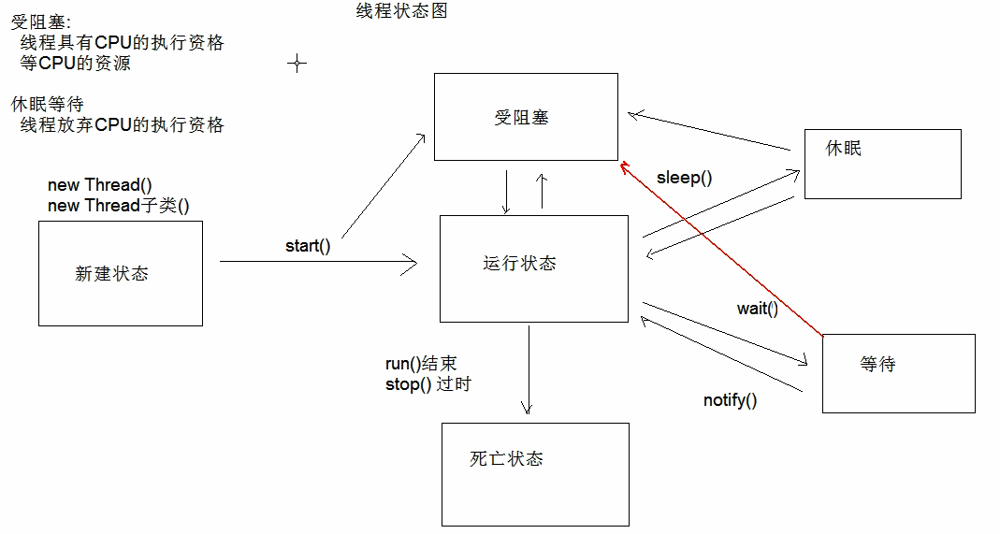
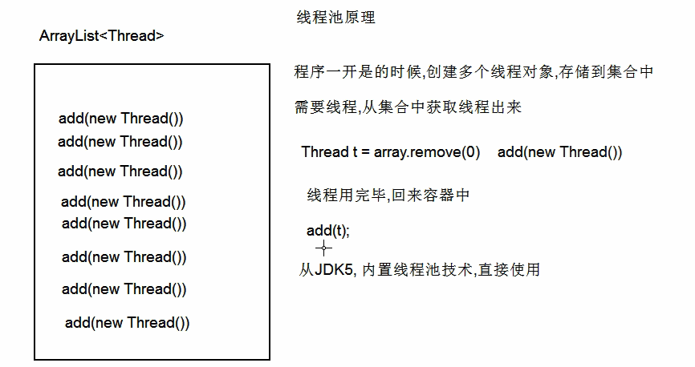
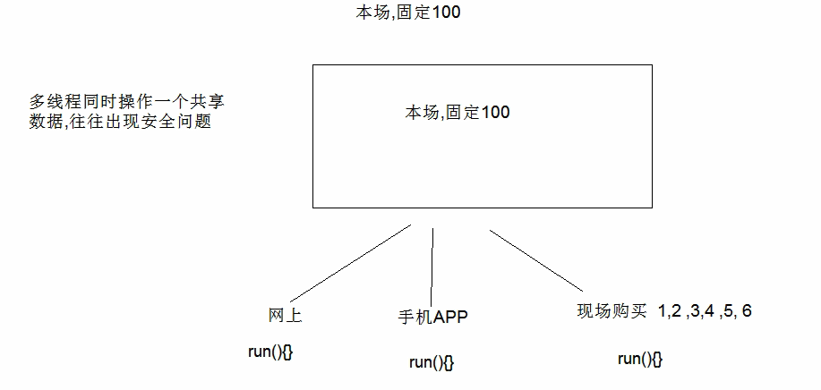
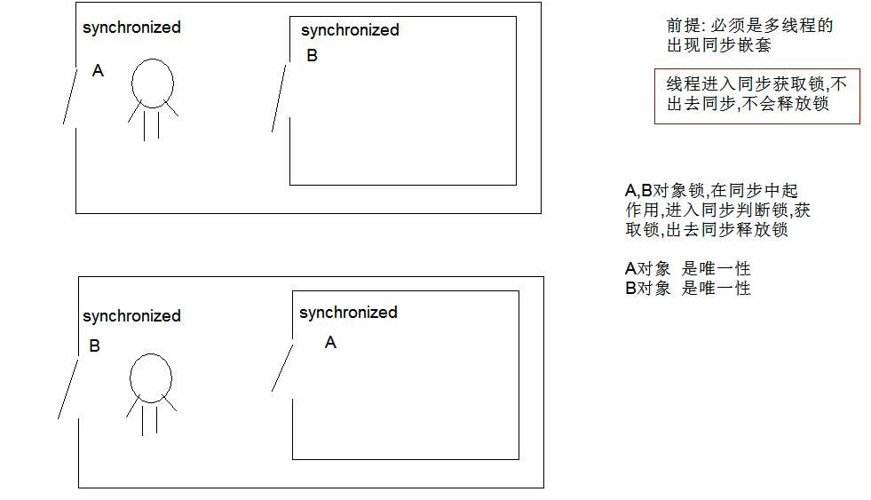
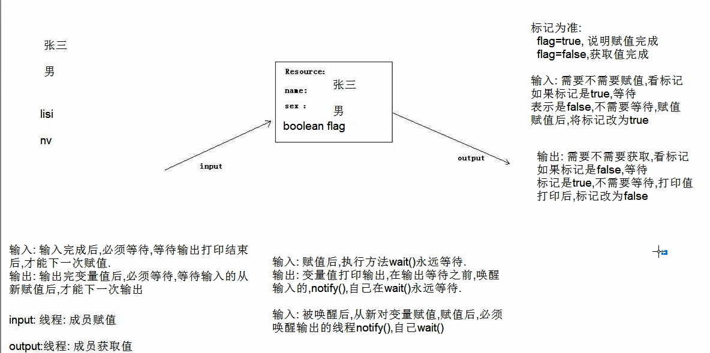

一个程序中有多个执行路线

## Thread

### start()

线程开始执行，JVM调用该线程的run()方法

只能用一次

CPU随机执行多个线程

创建方法一

```java
public class SubThread extends Thread{
	public void run() {
		for(int i =0;i<50;i++) {
			System.out.println("run"+" "+i);
		}
	}
}
private static void function() {
    SubThread s = new SubThread();
    s.start();
    for(int i =0;i<50;i++) {
        System.out.println("main"+" "+i);
    }
}
public static void main(String[] args) {
    function();
}
```

线程的默认名为Thread-0,Thread-1…

### String getName()

返回该线程的名字

### Thread currentThread()

返回当前的线程

```java
Thread t = Thread.currentThread().getName()//用于获得线程的名字
```

### setName(String)

可以修改线程名字

### Thread(String)

也可以修改线程名字，需要重构构造器，super(“name”)

### static Thread.sleep(long ms)

线程休眠ms毫秒，不过需要抛出Excepiton异常

## Runnable

和Thread，一样重写run(),Runnable是接口

然后创建Thread类，构造方法中传递Runnable接口实现类

调用Thread的start方法

匿名内部类实现

```java
new Thread() {
    public void run() {
        System.out.println("匿名内部类");
    }
}.start();
Runnable r =new Runnable() {
    public void run() {
        System.out.println("接口");
    }
};
new Thread(r).start();

new Thread(new Runnable() {
    public void run() {
        System.out.println("接口");
    }
}).start();
```





## 线程池

```java
public class ThreadPoolRunnable implements Runnable{
	public void run() {
		System.out.println(Thread.currentThread().getName()+" 提交任务");
	}
}
public static void main(String[] args) {
    ExecutorService es = Executors.newFixedThreadPool(2);//创建的线程数
    es.submit(new ThreadPoolRunnable());
    es.submit(new ThreadPoolRunnable());
    es.submit(new ThreadPoolRunnable());
    es.submit(new ThreadPoolRunnable());
}
pool-1-thread-2 提交任务
pool-1-thread-1 提交任务
pool-1-thread-2 提交任务
pool-1-thread-1 提交任务
```

### Callable中的call可以有返回值

和run的用法一样

submit后用Future<T>对象接受然后用get方法获取返回的对象

```java
public class ThreadPoolCallable implements Callable{
	public String call() {
		return Thread.currentThread().getName();
	}
}
public class ThreadPoolDemo1 {
	public static void main(String[] args) throws InterruptedException, ExecutionException {
		ExecutorService es= Executors.newFixedThreadPool(2);
		Future<String> f=es.submit(new ThreadPoolCallable());
		String s = f.get();
		System.out.println(s);
	}
}
pool-1-thread-1
```

异步计算

```java
public class GetSumable implements Callable{
	private int a;
	public GetSumable(int a) {
		this.a=a;
	}
	public Integer call() {
		int sum=0;
		for(int i=1;i<a;i++) {
			sum+=i;
		}
		return sum;
	}
}
public static void main(String[] args) throws InterruptedException, ExecutionException {
    ExecutorService es = Executors.newFixedThreadPool(2);
    Future<Integer> i1=es.submit(new GetSumable(100));
    Future<Integer> i2=es.submit(new GetSumable(200));
    System.out.println(i1.get()+" "+i2.get());
    es.shutdown();
}
4950 19900
```

## 线程安全



来源于CPU资源分配的随机性

当一个线程进入了数据操作时，无论是否休眠。其他线程只能等待

利用同步解决，速度变慢

synchronized(任意对象){

​	线程要操作的共享数据

}

```java
public class Tickets implements Runnable{
	private int tickets = 100;
	private Object obj = new Object();
	public void run() {
		while(true) {
			synchronized(obj) {
				///共享数据
				if(tickets>0) {
					try {
						Thread.sleep(10);
					} catch (InterruptedException e) {
						e.printStackTrace();
					}
					System.out.println(Thread.currentThread().getName()+"出售第"+tickets--+"张票");
				}
				///
			}	
		}
	}
}

public static void main(String[] args) {
		Tickets t = new Tickets();
		Thread t1 = new Thread(t);
		Thread t2 = new Thread(t);
		Thread t3 = new Thread(t);
		t1.start();
		t2.start();
		t3.start();
	}
```

```java
public class Tickets implements Runnable{
	private int tickets = 100;
	public void run() {
		while(true) {
			paytickets();
		}
	}
	//同步方法的对象锁为this
	public synchronized void paytickets() {
		
			///共享数据
			if(tickets>0) {
				try {
					Thread.sleep(10);
				} catch (InterruptedException e) {
					e.printStackTrace();
				}
				System.out.println(Thread.currentThread().getName()+"出售第"+tickets--+"张票");
			}
			///
		
	}
}
//synchronized关键字可以构造同步方法，不需要对象，对象为this
//如果是静态方法，则对象锁是本类.class
```

### Lock

比synchronized更灵活，

```java
public class Tickets implements Runnable{
	private int tickets = 100;
	private Lock lock = new ReentrantLock();
	public void run() {
		while(true) {
			paytickets();
		}
	}
	//同步方法的对象锁为this
	public synchronized void paytickets() {
			lock.lock();
			///共享数据
			if(tickets>0) {
				try {
					Thread.sleep(10);
					System.out.println(Thread.currentThread().getName()+"出售第"+tickets--+"张票");
				} catch (InterruptedException e) {
					e.printStackTrace();
				}finally {
					lock.unlock();
				}
				
			}
			///
			
	}
}
```

### 同步锁的弊端

死锁



```java
public class LockA {
	private LockA() {}
	public final static LockA locka = new LockA();
}
public class LockB {
	private LockB(){}
	public static final LockB lockb = new LockB();
}
public class ThreadDemo implements Runnable{
	private int i =0;
	public void run() {
		while(true) {
			if(i%2==0) {
				synchronized (LockA.locka) {
					System.out.println("if-locka锁");
					synchronized (LockB.lockb) {
						System.out.println("if-lockb锁");
					}
				}
			}else {
				synchronized (LockB.lockb) {
					System.out.println("else-lockb锁");
					synchronized (LockA.locka) {
						System.out.println("else-locka锁");
					}
				}
			}
			i++;
		}
	}
}
public class DeadLock {

	public static void main(String[] args) {
		ThreadDemo d = new ThreadDemo();
		Thread t1 = new Thread(d);
		Thread t2 = new Thread(d);
		t1.start();
		t2.start();
	}
}
if-locka锁
if-lockb锁
else-lockb锁
if-locka锁
```

等待唤醒机制

wait()等待

notify()唤醒一个线程

案例



```java
public class Resource {
	public String name;
	public String sex;
	public boolean flag = false;
}
public class Input implements Runnable {
	private Resource r = new Resource();
	public Input(Resource r) {
		this.r=r;
	}
	@Override
	public void run() {
		int i=0;
		while(true) {
			synchronized (r) {
				if(r.flag) {
					try {
						r.wait();
					} catch (Exception e) {

					}	
				}
				if(i%2==0) {
					r.name="Mark";
					r.sex="男";
				}else {
					r.name="Lisa";
					r.sex="女";
				}
				r.flag=true;//将对方线程唤醒
				r.notify();
			}	
			i++;
		}
	}
}
public class Ouput implements Runnable{
	private Resource r = new Resource();
	public Ouput(Resource r) {
		this.r=r;
	}
	public void run() {
		while(true) {
			synchronized (r) {
				if(!r.flag) {
					try {
						r.wait();
					} catch (Exception e) {

					}	
				}
				System.out.println(r.name+" "+r.sex);
				r.flag=false;
				r.notify();
			}
		}
	}
}
public class Demo {
	public static void main(String[] args) {
		Resource r = new Resource();
		Input i = new Input(r);
		Ouput o = new Ouput(r);
		Thread tin = new Thread(i);
		Thread tou = new Thread(o);
		tin.start();
		tou.start();
	}
}
Mark 男
Lisa 女
Mark 男
Lisa 女
Mark 男
Lisa 女
Mark 男
Lisa 女
Mark 男
```

