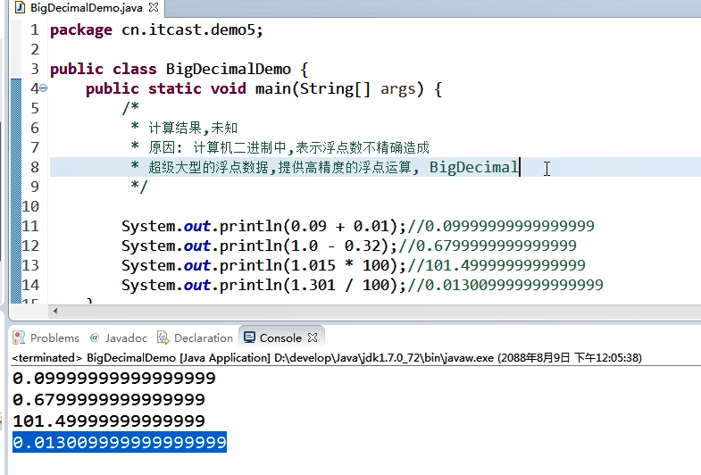

# 常用类

## Object

接口不属于object

### equals(Object obj)

* 返回调用的对象是否与传入参数一致
* 比较两个对象的内存地址

```java
public class Person {
	private String name;
	private int age;
	public String getName() {
		return name;
	}
	public void setName(String name) {
		this.name = name;
	}
	public int getAge() {
		return age;
	}
	public void setAge(int age) {
		this.age = age;
	}
	public boolean equals(Object obj) {
		return this == obj;
	}//和java源码一致
}

public class Test {

	public static void main(String[] args) {
		Person p = new Person();
		System.out.println(p.equals(new Person()));
		System.out.println(p.equals(p));
	}

}

false
true
    
重写equal
public class Person {
	private String name;
	private int age;
	public String getName() {
		return name;
	}
	public Person() {
		super();
		
	}
	public Person(String name, int age) {
		super();
		this.name = name;
		this.age = age;
	}
	public void setName(String name) {
		this.name = name;
	}
	public int getAge() {
		return age;
	}
	public void setAge(int age) {
		this.age = age;
	}
	public boolean equals(Object obj) {
		if(obj == null) {
			return false;
		}
		if(this == obj) {
			return true;
		}
		if(obj instanceof Person) {
			Person p=(Person)obj;
			return this.name == p.name;
		}
		return false;
	}
}

public class Test {

	public static void main(String[] args) {
		Person p = new Person();
		p.setName("Mark");
		System.out.println(p.equals(new Person()));
		System.out.println(p.equals(new Person("Mark",1)));
		System.out.println(p.equals(new String()));
	}

}

false
true
false
```


### toString()

```java
System.out.println(p.toString());
System.out.println(p);
//以上两个一样，sop默认调用toString()
learn_2019_9_219.Person@15db9742
learn_2019_9_219.Person@15db9742
    
public String toString() {
	return this.name+""+this.age;
}
//重写toString()
```

## String

所有字符串都是String对象

String str =“value”

字符串是一个常量，一旦声明不可改变


引用变量str的指向内存的变化


```java
public class StringDemo {
	public static void main(String[] args) {
		String str1 = new String("111");
		String str2 = "111";
		System.out.println(str1);
		System.out.println(str2);
		System.out.println(str1==str2);
		System.out.println(str1.equals(str2));
		System.out.println("c"=="c");
		System.out.println("你"=="你");//true
		System.out.println("你"==new String("你"));//false体现了不可修改
	}
}

111
111
false
true
true
true
false
```


### String(byte[] bytes) //会查询编码表

### String(byte[] bytes,int offset,int length) //offset开始索引，长度

### String(char[] c) //不会查询编码表

### String(char[] c,int offset,int length) //offset开始索引，长度

```java
public class StringDemo {

	public static void main(String[] args) {
		function();
	}
	public static void function() {
		byte bytes[] = {97,98,68,100,69};
		String s = new String(bytes);
		System.out.println(s);
		System.out.println(new String(bytes,1,2));
		char[] c = {'1','2','3','4','a'};
		System.out.println(new String(c));
		System.out.println(new String(c,1,1));
	}
}

abDdE
bD
1234a
2
```

### length()

返回字符串的长度

```java
String s = new String("11");
s.length()
2
```

### substring(int beginindex,int endindex)

### substring(int beginindex) 

返回一个新字符串,包含头不包含尾

没有end则返回begin开始到结尾

### boolean startwith(String prefix)

判断是否以某个字符串开头

### boolean endwith(String prefix)

判断是否以某个字符串结尾

### boolean contains(String prefix)

判断一个字符床中是否有另一个字符串

### int indexOf(char ch)

返回一个字符第一次出现的位置，不存在返回-1

### byte[] getBytes()

返回一个byte[]
### char[] toCharArray()
返回一个char[]
### equals(String str)
返回字符串中的值是否相同
### equalsIgnoreCase(String str)
返回字符串中的值是否相同,不考虑大小写

### s.charAt(i)

获取i位置的元素，并以char返回

###　s.toUpperCase()

让字符串变成大写

### s.toLowerCase()

让字符串变成小写

```java
{
String str = "2dsiabfini1nfdsau2ukfdz214314";
System.out.println(str.length());
System.out.println(str.substring(1,2));
System.out.println(str.substring(1));
29
d
dsiabfini1nfdsau2ukfdz214314
}

{
String s="12nfsia13f";
System.out.println(s.startsWith("12"));
System.out.println(s.startsWith("2"));
true
false

System.out.println(s.endsWith("f"));
System.out.println(s.endsWith("1"));
true
false
}

{
String s = "123456789";
System.out.println(s.contains("23"));
System.out.println(s.contains("13"));
true
false
    
System.out.println(s.indexOf("3"));
System.out.println(s.indexOf("12"));
2
0
}

{
String s = "12345679";
byte[] byte4 = s.getBytes();
System.out.println(byte4.length);
for(int i =0;i<byte4.length;i++) {
System.out.print(byte4[i]+" ");
}
8
49 50 51 52 53 54 55 57 //查编码表

System.out.println();
char[] c = s.toCharArray();
for(int i =0;i<c.length;i++) {
System.out.print(c[i]+" ");
}
1 2 3 4 5 6 7 9 
}

{
String s="abcs";
System.out.println(s.equals("ABCS"));
System.out.println(s.equalsIgnoreCase("ABCS"));
false
true
}
    
```

## StringBuffer

可变字符

字符串的的缓冲区对象

内部是可变数组，默认容量为16个字符，比String更节省内存，永远只有一个数组，String一个双引号一个数组

### append()

往StringBuffer中添加内容

### delete(int begin,int end)

将开始索引到结束索引(不包含)删除

delete(0,buffer.length())可以全部删除

### replace(int begin,int end,String str)

将范围内替换为str

### reverse()

将字符串缓冲区翻转
### toString()
将缓冲区中的字符变成字符串

将可变的缓冲区对象变成不可变的字符串对象

System.out.println(buffer)也是调用toString()

```java
{
StringBuffer buffer = new StringBuffer();
buffer.append("dsa").append(false);
System.out.println(buffer);
dsafalse

buffer.delete(1, 5);
System.out.println(buffer);
dlse
}

{
StringBuffer buffer = new StringBuffer();
buffer.append("dsa").append(false);
buffer.insert(2, 02654);
System.out.println(buffer);
ds1452afalse

buffer.replace(1, 2, "wdss");
System.out.println(buffer);
dwdss1452afalse    
}

{
StringBuffer buffer = new StringBuffer();
buffer.append("dsa").append(false);
buffer.reverse();
System.out.println(buffer);
eslafasd

String s = buffer.toString();
System.out.println(s);
eslafasd
}
```

### StringBuilder

和StringBuffer一样使用，API一样，但是线程不安全，效率比StringBuffer高

```java
public static void function3(int[] arr) {
    StringBuffer buffer = new StringBuffer();
    buffer.append("[");
    for(int i =0;i<arr.length;i++) {
        if(i==arr.length-1) {
            buffer.append(arr[i]).append("]");
        }else {
            buffer.append(arr[i]).append(",");
        }
    }
    System.out.println(buffer);
}
int[] arr = {1,2,3,4};
function3(arr);
[1,2,3,4]
```

## Date

日期类

System.currentTimeMillis();

返回离1970.0.0.0.0过去的毫秒值

### Date()

空参数构造方法

可以获取系统的时间

### Date(long date)

有参数构造方法

传入一个毫秒值构造时间对象

### getTime()

获取当前时间对象的毫秒值

### setTime(long mtime)

将当前时间的对象设置毫秒值

### SimpleDateFormat

格式化

yyyy-MM-dd HH:mm:ss

年-月-日 时：分：秒

依据字符判定，不是位置

```java
SimpleDateFormat sdf = new SimpleDateFormat("yyyy-MM-dd HH:mm:ss");
System.out.println(sdf.format(new Date()));
//时间的格式化输出
```


```java
long time = System.currentTimeMillis();
System.out.println(time);
1567474595786	

Date date = new Date();
System.out.println(date);
Tue Sep 03 09:36:35 CST 2019

Date date = new Date(0);
System.out.println(date);
Thu Jan 01 08:00:00 CST 1970

Date date = new Date();
System.out.println(date.getTime());
date.setTime(100);
System.out.println(date);
SimpleDateFormat sdf = new SimpleDateFormat("yyyy-MM-dd HH:mm:ss");
System.out.println(sdf.format(new Date()));
1567474595803
Thu Jan 01 08:00:00 CST 1970
2019-09-03 09:36:35

SimpleDateFormat sdf = new SimpleDateFormat("yyyy-MM-dd");
String sdate="1998-6-20";
Date date=sdf.parse(sdate);
System.out.println(date);
Sat Jun 20 00:00:00 CST 1998
```

### Calendar

Calendar cal = Calendar.getInstance();

获取一个格林威治日历类

月份要+1【0-11】

星期要-1

### int get(int )

获取日历的哪个字段cal.get(Calendar.Year)

### cal.set(int year,int month,int day)

设置日历的时间

### cal.set(Calendar.MONTH,10)

设置单个参数

### cal.add(int field,int value)

设置某个量偏移value

### cal.getTime()

将日历对象变成日期对象

```java
public static void printdate(Calendar cal) {
    int year = cal.get(Calendar.YEAR);
    int month = cal.get(Calendar.MONTH) + 1;
    int day = cal.get(Calendar.DATE);
    System.out.println(year + "-" + month + "-" + day);
    System.out.println("============================================");
}

Calendar cal = Calendar.getInstance();
System.out.println(cal);
printdate(cal);
java.util.GregorianCalendar[time=1567476022993,areFieldsSet=true,areAllFieldsSet=true,lenient=true,zone=sun.util.calendar.ZoneInfo[id="Asia/Shanghai",offset=28800000,dstSavings=0,useDaylight=false,transitions=29,lastRule=null],firstDayOfWeek=2,minimalDaysInFirstWeek=4,ERA=1,YEAR=2019,MONTH=8,WEEK_OF_YEAR=36,WEEK_OF_MONTH=1,DAY_OF_MONTH=3,DAY_OF_YEAR=246,DAY_OF_WEEK=3,DAY_OF_WEEK_IN_MONTH=1,AM_PM=0,HOUR=10,HOUR_OF_DAY=10,MINUTE=0,SECOND=22,MILLISECOND=993,ZONE_OFFSET=28800000,DST_OFFSET=0]
2019-9-3

Calendar cal = Calendar.getInstance();
cal.set(1668, 10, 1);
printdate(cal);
1668-11-1

cal.set(Calendar.DATE, 20);
printdate(cal);
1668-11-20

cal.add(Calendar.DATE, -10);
printdate(cal);
1668-11-10

Calendar cal = Calendar.getInstance();
Date date = cal.getTime();
System.out.println(date);
Tue Sep 03 10:00:23 CST 2019
```

活了多少年

```java
System.out.println("请输入你的生日，格式为YYYY-MM-DD");
Scanner sc = new Scanner(System.in);
String s =sc.next(); 
SimpleDateFormat sdf = new SimpleDateFormat("yyyy-MM-dd");
Date date = sdf.parse(s);
Date cur = new Date();
if(cur.getTime()>=date.getTime()) {
	System.out.println(((cur.getTime()-		date.getTime())/(1000*3600*24))+"天");
}else {
	System.out.println("错误");
}
7745天
```

计算闰年

```java
public static void main(String[] args) {
    isrup(2001);
    isrup(6054);
    isrup(200);
    isrup(1800);
}
public static void isrup(int year) {
    Calendar c = Calendar.getInstance();
    c.set(year,2,1);
    c.add(Calendar.DATE, -1);
    int day=c.get(Calendar.DATE);
    System.out.println(day);
    if(day==29) {
        System.out.println("闰年");
    }else {
        System.out.println("平年");
    }
}
28
平年
28
平年
29
闰年
28
平年
```

## 基本类型的包装类

| 基本数据类型 | 对应的引用数据类型 |
| :----------- | :----------------- |
| byte         | Byte               |
| short        | Short              |
| int          | Integer            |
| long         | Long               |
| float        | Float              |
| double       | Double             |
| char         | Character          |
| boolean      | Boolean            |

在基本数据类型和字符串之间切换

### Integer

转成int

### Integer.parseInt(String str)  //str里必须为数字

### Integer.parseInt(String str, int i); //i表示进制

返回int值（10进制）

String s = i +“”可以int转String

### toString(int i)

### toString(int i,int radix)

返回一个字符串

```java
int i =Integer.parseInt("256");
System.out.println(i);
i=Integer.parseInt("100", 3);
System.out.println(i);
System.out.println(Integer.toString(12686));
System.out.println(Integer.toString(12686,16));//最高支持36进制a-z0-9
256
9
12686
318e
```

### Integer(int i)

### Integer(String s)

返回integer对象

integer对象里面保存的是字符串

```java
Integer i = new Integer("15262");
System.out.println(i);
int inti = i.intValue();
System.out.println(++inti);
15262
15263
```

### MAX_VALUE

2^-31-1

### MIN_VALUE

-2^-31

### toBinaryString(int )

10进制转2进制

### toOctalString(int)

10进制转8进制

### toHexString(int )

10进制转16进制

返回类型均为String

### 自动装箱（>JDK1.5）

基本数据类型变成对象

```java
Integer in =1;//Integet in = new INteger(1)
```

ArrayList<Integer> ar=new ArrayList<Integer>

ar.add(1)  //装箱

### 自动拆箱（>JDK1.5）

对象中的数据变成基本类型

```java
Integer in =1;//Integet in = new INteger(1)
in +=1; //  in.inValue()+=1  自动拆箱与装箱
```

将引用类型和基本类型进行计算

弊端

Integer in = null;

in+=1; error

```java
Integer i = new Integer(1);
Integer j = new Integer(1);
System.out.println(i==j);
System.out.println(i.equals(j));//比较对象数据
System.out.println("==================================");
false
true

Integer a =500;
Integer b =500;
System.out.println(a==b);
System.out.println(a.equals(b));
System.out.println("==================================");
false
true

//数据在byte范围内,JVM不会重新new对象
Integer c =-128; //Integer c = new Integer(-128)
Integer d =-128; //Integer d = c;
System.out.println(c==d);
System.out.println(c.equals(d));
true
true
```

## System

### System.currentTimeMillis()

获取当前的时间戳

可以用来计算程序运行时间

```java
long time = System.currentTimeMillis();
for(int i =0;i<10000;i++) {
    System.out.println(i);
}
System.out.println(-(time-System.currentTimeMillis()));
```

### System.exit(0)

传非0表示异常终止

### System.gc()

一般回收匿名对象

```java
public class Person {
	public void finalize() {  //回收时候执行
		System.out.println("垃圾回收");  
	}
}
new Person();
new Person();
new Person();
new Person();
System.gc();
垃圾回收
垃圾回收
垃圾回收
垃圾回收
```

### System.getProperties()

返回计算机的信息（String）

```java
System.out.println(System.getProperties());
{java.runtime.name=Java(TM) SE Runtime Environment, sun.boot.library.path=W:\develop\Java\jre1.8.0_211\bin, java.vm.version=25.211-b12, user.country.format=GB, java.vm.vendor=Oracle Corporation, java.vendor.url=http://java.oracle.com/, path.separator=;, java.vm.name=Java HotSpot(TM) 64-Bit Server VM, file.encoding.pkg=sun.io, user.country=CN, user.script=, sun.java.launcher=SUN_STANDARD, sun.os.patch.level=, java.vm.specification.name=Java Virtual Machine Specification, user.dir=W:\Work\Java\Eclipse\learn_2019_9_3, java.runtime.version=1.8.0_211-b12, java.awt.graphicsenv=sun.awt.Win32GraphicsEnvironment, java.endorsed.dirs=W:\develop\Java\jre1.8.0_211\lib\endorsed, os.arch=amd64, java.io.tmpdir=C:\Users\13298\AppData\Local\Temp\, line.separator=
, java.vm.specification.vendor=Oracle Corporation, user.variant=, os.name=Windows 10, sun.jnu.encoding=GBK, java.library.path=W:\develop\Java\jre1.8.0_211\bin;C:\WINDOWS\Sun\Java\bin;C:\WINDOWS\system32;C:\WINDOWS;W:/develop/Java/jre1.8.0_211/bin/server;W:/develop/Java/jre1.8.0_211/bin;W:/develop/Java/jre1.8.0_211/lib/amd64;C:\Program Files (x86)\Common Files\Oracle\Java\javapath;S:\programming\XFtp\;S:\programming\XShell\;C:\Windows\system32;C:\Windows;C:\Windows\System32\Wbem;C:\Windows\System32\WindowsPowerShell\v1.0\;C:\Windows\System32\OpenSSH\;C:\Program Files (x86)\NVIDIA Corporation\PhysX\Common;W:\develop\Java\jdk1.8.0_211\bin;W:\develop\Java\jre1.8.0_211\bin;S:\programming\node\;C:\Program Files\Common Files\Autodesk Shared\;S:\programming\Git\cmd;S:\programming\MinGW\bin;C:\Program Files\MySQL\MySQL Server 8.0\bin;S:\programming\sql\sqlite3\sqlite-dll-win64-x64;S:\programming\terminal\cmder;S:\programming\go\bin;C:\Program Files\dotnet\;C:\Program Files\Microsoft SQL Server\130\Tools\Binn\;C:\Program Files\Microsoft SQL Server\Client SDK\ODBC\170\Tools\Binn\;S:\programming\opencv\opencv\build\x64\vc14\bin;S:\programming\node\node_global;S:\programming\MongoDB\Server\4.0\bin;C:\WINDOWS\system32;C:\WINDOWS;C:\WINDOWS\System32\Wbem;C:\WINDOWS\System32\WindowsPowerShell\v1.0\;C:\WINDOWS\System32\OpenSSH\;S:\programming\matlab\runtime\win64;S:\programming\matlab\bin;S:\programming\PowerShell\7-preview\preview;S:\programming\Qt\Qt5.12.3\5.12.3\mingw73_64\bin;C:\Program Files (x86)\WinSCP;;C:\Program Files\NVIDIA Corporation\NVIDIA NvDLISR;S:\programming\Python\Python37\Scripts\;S:\programming\Python\Python37\;C:\Users\13298\AppData\Local\Programs\Python\Launcher\;C:\Program Files\MySQL\MySQL Shell 8.0\bin\;S:\programming\PhpStorm 2019.1.1\bin;;S:\programming\Microsoft VS Code\bin;C:\Users\13298\go\bin;C:\Users\13298\AppData\Local\Microsoft\WindowsApps;C:\WINDOWS\system32;;., java.specification.name=Java Platform API Specification, java.class.version=52.0, sun.management.compiler=HotSpot 64-Bit Tiered Compilers, os.version=10.0, user.home=C:\Users\13298, user.timezone=, java.awt.printerjob=sun.awt.windows.WPrinterJob, file.encoding=GBK, java.specification.version=1.8, java.class.path=W:\Work\Java\Eclipse\learn_2019_9_3\bin, user.name=yuki, java.vm.specification.version=1.8, sun.java.command=learn_2019_9_310.Test, java.home=W:\develop\Java\jre1.8.0_211, sun.arch.data.model=64, user.language=zh, java.specification.vendor=Oracle Corporation, user.language.format=en, awt.toolkit=sun.awt.windows.WToolkit, java.vm.info=mixed mode, java.version=1.8.0_211, java.ext.dirs=W:\develop\Java\jre1.8.0_211\lib\ext;C:\WINDOWS\Sun\Java\lib\ext, sun.boot.class.path=W:\develop\Java\jre1.8.0_211\lib\resources.jar;W:\develop\Java\jre1.8.0_211\lib\rt.jar;W:\develop\Java\jre1.8.0_211\lib\sunrsasign.jar;W:\develop\Java\jre1.8.0_211\lib\jsse.jar;W:\develop\Java\jre1.8.0_211\lib\jce.jar;W:\develop\Java\jre1.8.0_211\lib\charsets.jar;W:\develop\Java\jre1.8.0_211\lib\jfr.jar;W:\develop\Java\jre1.8.0_211\classes, java.vendor=Oracle Corporation, file.separator=\, java.vendor.url.bug=http://bugreport.sun.com/bugreport/, sun.io.unicode.encoding=UnicodeLittle, sun.cpu.endian=little, sun.desktop=windows, sun.cpu.isalist=amd64}
```

### System.arraycopy(Object src,int srcPos,Object dest,int destPos,int length)

源 源索引 目标 目标索引 长度

其实是替换好吗

在native 本地方法栈，无法查看源代码

```java
int[] arri = {1,2,3,4,6,9,8};
int[] arr2 = {4,89,42,5,9,7,52,745,6,57,9,54,6};
System.arraycopy(arri, 1, arr2, 2, 5);
for(int i =0;i<arr2.length;i++) {
    System.out.print(arr2[i]+" ");
}
4 89 2 3 4 6 9 745 6 57 9 54 6 
```

## Math

### abs()

返回绝对值

### max(int a,int b)

返回a,b中大的

### min(int a, int b)

返回小的

### ceil(double d)

返回大于等于d的最小整数

### floor(double d)

返回小于等于d的最大整数

### pow(double a,double b)

返回a的b次方

### sqrt(double a)

返回a的算术平方根，负数返回nan

### random()

返回随机数0.0-1.0

### round(double d)

返回参数d第四舍五入的整数

## Arrays

### sort(arr)

对数组进行升序排序

### binarySearch(arr,key)

返回元素在数组中出现的位置，如果没有返回（-插入点-1）//插入点为key可以在数组中的位置

### toString(arr)

把数组变成字符串返回，[1,2,3,4,5] 如型

## BigInteger

给超过long的范围的大数据用

### BigInteger(String str)

str中为数字

### b.add(BigInteger a)

做BigInteger之间的加法，并把结果作为返回值返回

### b.subtract(BigInteger a)

做b-a的减法，并把结果作为返回值返回

### b.multiply(BigInteger a)

计算b*a，并把结果作为返回值返回

### b.divide(BigInteger a)

计算b/a，并把结果作为返回值返回

以上返回结果都是BigInteger类型

```java
BigInteger b1 = new BigInteger("454742646443624563484235431131");
BigInteger b2 = new BigInteger("23241642168541365544176531624123153");
System.out.println(b1);
System.out.println(b1.add(b2));
System.out.println(b1.subtract(b2));
System.out.println(b1.multiply(b2));
System.out.println(b2.divide(b1));
454742646443624563484235431131
23242096911187809168740015859554284
-23241187425894921919613047388692022
10568965867418241889688028134491068971381943225186669632794076043
51109
```



## BigDecimal

用于计算大型的浮点数和高精度计算

方法和BigInteger一致

除法如果除不尽则报错

### divide(BigDecimal divisor,int scale,int roundingMode)

scale 为保留的小数个数

roundingMode 为保留的模式

| static int | ROUND_CEILING   圆形模式向正无穷大转弯。                   |
| ------------ | ------------------------------------------------------------ |
| static int | ROUND_DOWN  舍入模式向零舍入。直接舍去                         |
| static int | ROUND_FLOOR   舍入模式向负无穷大转弯。                     |
| static int | ROUND_HALF_DOWN   四舍五入模式向“最近邻居”转弯，除非这两个邻居都是等距离的，在这种情况下，这是倒圆的。 >0.5向上+1否则-1，会看后面 |
| static int | ROUND_HALF_EVEN   四舍五入模式向“最近邻居”转弯，除非两个邻居都是等距离的，在这种情况下，向着邻居方向转移。 |
| static int  | ROUND_HALF_UP   四舍五入模式向“最近邻居”转弯，除非两个邻居都是等距的，在这种情况下是圆括弧的。     >=0.5向上+1否则-1 不看后面 |
| static int | ROUND_UNNECESSARY   舍入模式来确定所请求的操作具有精确的结果，因此不需要舍入。 |
| static int | ROUND_UP  舍入模式从零开始。向上+1                           |


```java
BigDecimal b1 = new BigDecimal("0.16235621412");
BigDecimal b2 = new BigDecimal("1.924149353145962524324223865848643");
System.out.println(b1.add(b2));
System.out.println(b1.subtract(b2));
System.out.println(b2.multiply(b1));
System.out.println(0.01+0.09);
System.out.println(new BigDecimal("0.01").add(new BigDecimal("0.09")));
2.086505567265962524324223865848643
-1.761793139025962524324223865848643
0.31239760437822538721267939826653643841943916
0.09999999999999999
0.10//更精确
```

