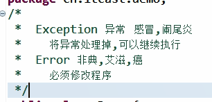
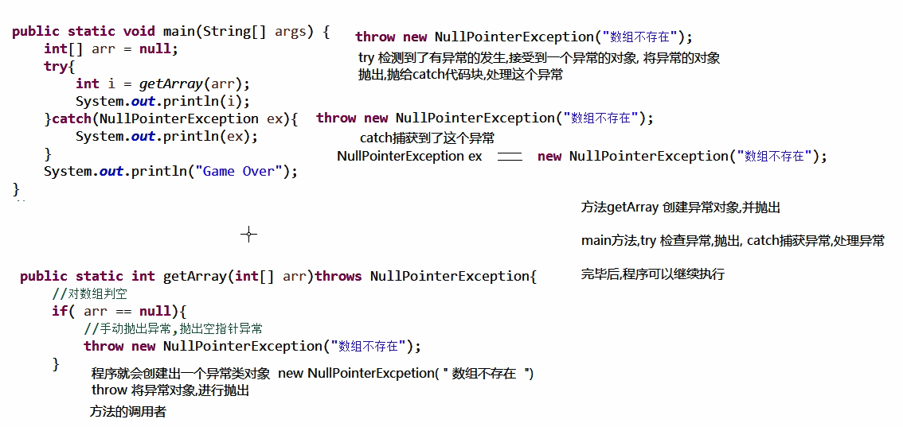
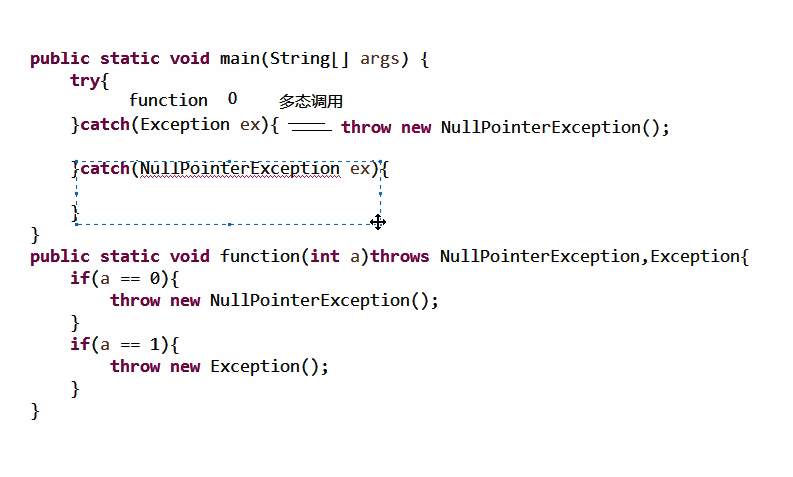
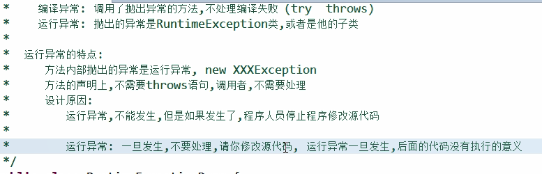
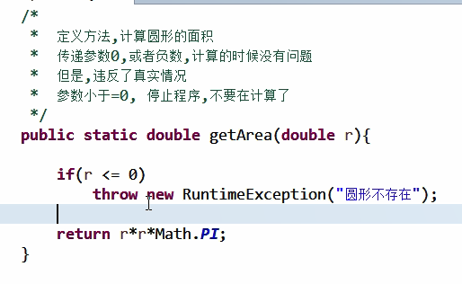
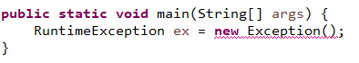
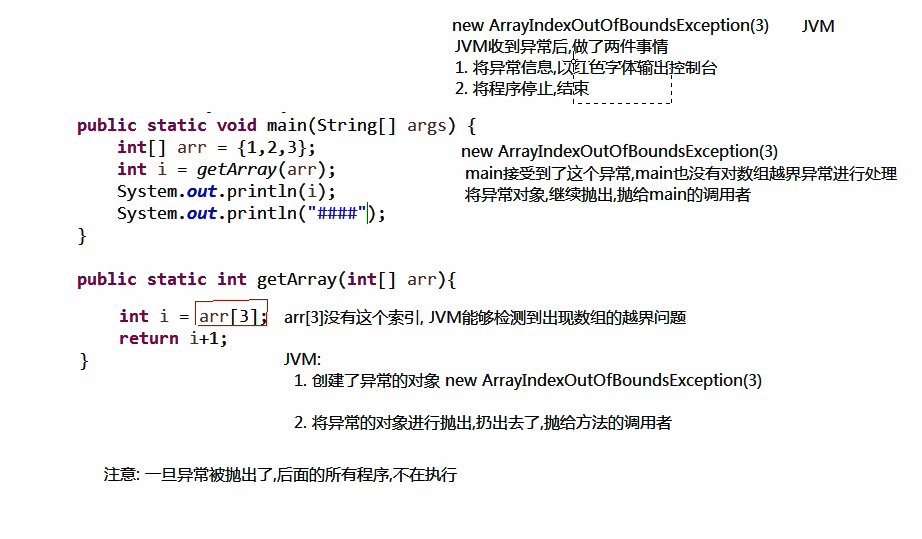

# Throwable

所有异常和错误的父类

### String getMessage()

对异常信息的简短描述,new 时添加的字符串，如果没有加字符串则返回null

### String toString()

对异常信息的简短描述,包名.类名+new 时添加的字符串

### void printStackTrace()

对异常信息追踪到标准的错误流,包名.类名+new 时添加的字符串+出错的代码位置,JVM默认调用的方法

## Exception

所有异常的父类




### 手动抛出异常

throw 在方法内部，用于抛出异常对象给方法的调用者

throw 必须new 一个异常对象

方法声明异常 throws，告诉方法可能出现异常，后面时异常类的类名

```java
public static int getArray(int[] arr) throws Exception{
    if(arr==null) {
        throw new Exception("传递数组不存在");
    }
    if(arr.length==0) {
        throw new Exception("数组中没有元素");
    }
    int i =arr[arr.length-1];
    return i*2;
}
public static void main(String[] args) throws Exception{
    int[] arr=null;
    int i = getArray(arr);
    System.out.println(i);
}
```

### try catch

处理了异常后，后面的代码可以正常执行

应多用try catch来捕获异常而不是抛给JVM

```java
try{
    被检测的代码
    可能出现的异常
}catch（异常类名 变量）{
    异常的处理方式
        循环，判断，调用方法，变量
}finally{
    必须执行的代码
}
```

```java
public class Test {

	public static void main(String[] args) {	
		try {
			int[] arr= {};
			int i =getarr(arr);
			System.out.println(i);
		}catch(NullPointerException e) {
			System.out.println(e);
		}catch(ArrayIndexOutOfBoundsException e) {
			System.out.println(e);
		}
		System.out.println("end");
	}
	public static int getarr(int[] arr) throws NullPointerException,ArrayIndexOutOfBoundsException{
		if(arr ==null) {
			throw new NullPointerException("数组不存在");
		}
		if(arr.length<6) {
			throw new ArrayIndexOutOfBoundsException("数组没有5索引");
		}
		return arr[5]+1;
	}
}
java.lang.ArrayIndexOutOfBoundsException: 数组没有5索引
end
```



### 注意

多catch写在一起时，

有顺序概念

平级异常，没有继承关系时，没有顺序关系

上下级关系异常

需要先捕获子类，再捕获高级的子类

因为多态调用



### finally

无论程序是否有异常finally都会执行,可以用于释放资源

除非在catch中System.exit(0)

```java
try {
    int[] arr= {};
    int i =getarr(arr);
    System.out.println(i);
}catch(NullPointerException e) {
    System.out.println(e);
}catch(ArrayIndexOutOfBoundsException e) {
    System.out.println(e);
}finally{
    System.out.println("finally代码块");
}
System.out.println("end");
java.lang.ArrayIndexOutOfBoundsException: 数组没有5索引
finally代码块
end
```
### RuntimeExcepiton

运行时错误

异常的子类

特点：方法内部抛出的是运行时异常，不需要声明throws 





这时候就需要运行时异常，方便错误的及早发现

父类的方法，如果抛出异常

子类重写后可以不抛出异常

但是抛出的异常为父类的异常或者父类异常的子类，因为编译看父类（多态）



类似于这样

如果父类的方法没有异常抛出

子类重写后不能抛出异常，因为没法多态

如果子类重写的该方法中调用了自己的一个抛出异常的方法，只能用try catch处理，否则无法编译通过

### 自定义异常

重点在于：继承和构造器

```java
public class MyException extends RuntimeException{
	public MyException(String msg) {
		super(msg);
	}

	public MyException() {
		super();
		
	}

	public MyException(String message, Throwable cause, boolean enableSuppression, boolean writableStackTrace) {
		super(message, cause, enableSuppression, writableStackTrace);
		
	}

	public MyException(String message, Throwable cause) {
		super(message, cause);
		
	}

	public MyException(Throwable cause) {
		super(cause);
		
	}
}

public class Test {

	public static void main(String[] args) {
		int avg=getAvg(1,4,6,74,-323,32,7);
		System.out.println(avg);
	}
	public static int getAvg(int...source){
		int sum=0;
		for(int i:source) {
			if(i<0) {
				throw new MyException("出现异常,"+"原因:"+i);
			}
			sum+=i;
		}
		return sum/source.length;
	}
}
```


## Error

所有错误的父类

一般在运行时出现，问题严重，需要修改源代码



