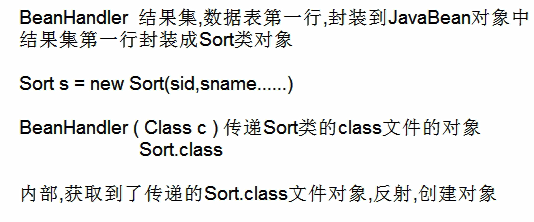
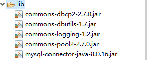

### 连接数据库

```java
import java.sql.*;
 
public class MySQLDemo {
 
    // MySQL 8.0 以下版本 - JDBC 驱动名及数据库 URL
    static final String JDBC_DRIVER = "com.mysql.jdbc.Driver";  
    static final String DB_URL = "jdbc:mysql://localhost:3306/RUNOOB";
 
    // MySQL 8.0 以上版本 - JDBC 驱动名及数据库 URL
    //static final String JDBC_DRIVER = "com.mysql.cj.jdbc.Driver";  
    //static final String DB_URL = "jdbc:mysql://localhost:3306/RUNOOB?useSSL=false&serverTimezone=UTC";
 
 
    // 数据库的用户名与密码，需要根据自己的设置
    static final String USER = "root";
    static final String PASS = "123456";
 
    public static void main(String[] args) {
        Connection conn = null;
        Statement stmt = null;
        try{
            // 注册 JDBC 驱动
            Class.forName(JDBC_DRIVER);
        
            // 打开链接
            System.out.println("连接数据库...");
            conn = DriverManager.getConnection(DB_URL,USER,PASS);
        
            // 执行查询
            System.out.println(" 实例化Statement对象...");
            stmt = conn.createStatement();
            String sql;
            sql = "SELECT id, name, url FROM websites";
            ResultSet rs = stmt.executeQuery(sql);
        
            // 展开结果集数据库
            while(rs.next()){
                // 通过字段检索
                int id  = rs.getInt("id");
                String name = rs.getString("name");
                String url = rs.getString("url");
    
                // 输出数据
                System.out.print("ID: " + id);
                System.out.print(", 站点名称: " + name);
                System.out.print(", 站点 URL: " + url);
                System.out.print("\n");
            }
            // 完成后关闭
            rs.close();
            stmt.close();
            conn.close();
        }catch(SQLException se){
            // 处理 JDBC 错误
            se.printStackTrace();
        }catch(Exception e){
            // 处理 Class.forName 错误
            e.printStackTrace();
        }finally{
            // 关闭资源
            try{
                if(stmt!=null) stmt.close();
            }catch(SQLException se2){
            }// 什么都不做
            try{
                if(conn!=null) conn.close();
            }catch(SQLException se){
                se.printStackTrace();
            }
        }
        System.out.println("Goodbye!");
    }
}
```

### int executeUpdate(String sql)

用于执行insert,update,delete操作

返回操作的条数

```java
String JDBC_DRIVER = "com.mysql.cj.jdbc.Driver";  
String DB_URL = "jdbc:mysql://localhost:3306/mybase?useSSL=false&serverTimezone=UTC";
String USER = "root";
String PASS = "19991006";
Class.forName(JDBC_DRIVER);
Connection conn = DriverManager.getConnection(DB_URL,USER,PASS);
System.out.println(conn);
Statement stmt=conn.createStatement();
int row = stmt.executeUpdate("INSERT INTO sort(sname,sprice,sdesc) VALUES ('汽车用品',5000,'涨价')");
System.out.println(row);
stmt.close();
conn.close();
```

### ResultSet executeQuery(String sql)

用于select操作

返回ResultSet类

getObject(String 列名)//获取写int 列号也可以,用于获取记录的值

```java
public class mysql {
	public static void main(String[] args) throws ClassNotFoundException, SQLException {
		  String JDBC_DRIVER = "com.mysql.cj.jdbc.Driver";  
	      String DB_URL = "jdbc:mysql://localhost:3306/mybase?useSSL=false&serverTimezone=UTC";
	      String USER = "root";
	      String PASS = "19991006";
	      Class.forName(JDBC_DRIVER);
	      Connection conn = DriverManager.getConnection(DB_URL,USER,PASS);
	      Statement stmt=conn.createStatement();
	      String sql = "SELECT * FROM sort";
	      ResultSet rs = stmt.executeQuery(sql);
	      System.out.println(rs);
	      //处理结果集,boolean next()返回true有结果集,返回false，没有结果集
	      while (rs.next()) {
			System.out.println(rs.getInt("sid")+" "+rs.getString("sname")+" "+rs.getDouble("sprice")+" "+rs.getString("sdesc"));
	      }
	}
}
com.mysql.cj.jdbc.result.ResultSetImpl@4909b8da
1 家具 2000.0 优惠促销
2 家具 5900.0 家具价格上调，原材料涨价
3 儿童玩具 300.0 赚家长钱
4 生鲜 500.99 生鲜商品
5 服装 24000.0 换季销售
6 洗涤 50.0 洗发水促销
7 汽车用品 5000.0 涨价
8 汽车用品 5000.0 涨价
```

### 注入攻击

```java
public class mysql {
    public static void main(String[] args) throws Exception{
        String JDBC_DRIVER = "com.mysql.cj.jdbc.Driver";  
        String DB_URL = "jdbc:mysql://localhost:3306/mybase?useSSL=false&serverTimezone=UTC";
        String USER = "root";
        String PASS = "19991006";
        Class.forName(JDBC_DRIVER);
        Connection conn = DriverManager.getConnection(DB_URL,USER,PASS);
        Statement stmt=conn.createStatement();
        Scanner sc = new Scanner(System.in);
        String user = sc.nextLine();
        String pass = sc.nextLine();
        String sql="SELECT * FROM users WHERE username = '"+user+"' AND password = '"+pass+"'";
        System.out.println(sql);
        ResultSet rs = stmt.executeQuery(sql);
        while(rs.next()) {
            System.out.println(rs.getString("username")+" "+rs.getString("password"));
        }
        rs.close();
        stmt.close();
        conn.close();
    }
}
输入
dsadsa
adsadsa 'or' 1=1
SELECT * FROM users WHERE username = 'dsadsa' AND password = 'adsadsa 'or' 1=1'
a 1
b 2
```

### PreparedStatement(SQL预编译存储，多次高效的执行sql)

可以防止sql注入还可以高效执行sql语句

用conn.prepareStatement()方法获取PreparedStatement类

```java
public class mysql {
	public static void main(String[] args) throws Exception{
		  String JDBC_DRIVER = "com.mysql.cj.jdbc.Driver";  
	      String DB_URL = "jdbc:mysql://localhost:3306/mybase?useSSL=false&serverTimezone=UTC";
	      String USER = "root";
	      String PASS = "19991006";
	      Class.forName(JDBC_DRIVER);
	      Connection conn = DriverManager.getConnection(DB_URL,USER,PASS);
	      Scanner sc = new Scanner(System.in);
	      String user = sc.nextLine();
	      String pass = sc.nextLine();
	      String sql="SELECT * FROM users WHERE username = ? AND password = ?";
	      PreparedStatement pst=conn.prepareStatement(sql);
	      pst.setObject(1,user);
	      pst.setObject(2,pass);
	      System.out.println(sql);
	      ResultSet rs = pst.executeQuery();
	      while(rs.next()) {
	    	  System.out.println(rs.getString("username")+" "+rs.getString("password"));
	      }
	      rs.close();
	      pst.close();
	      conn.close();
	}
}

a
1 'or' 1=1
SELECT * FROM users WHERE username = ? AND password = ?//防止了sql注入
    
a
1
SELECT * FROM users WHERE username = ? AND password = ?
a 1
```

```java
public class mysql {

	public static void main(String[] args) throws Exception {
		Class.forName("com.mysql.cj.jdbc.Driver");
		String url="jdbc:mysql://localhost:3306/mybase?useSSL=false&serverTimezone=UTC";
		String username="root";
		String password="19991006";
		Connection conn = DriverManager.getConnection(url, username, password);
		String sql="SELECT * FROM sort";
		PreparedStatement pst=conn.prepareStatement(sql);
		ResultSet rs = pst.executeQuery();
		while(rs.next()) {
			System.out.println(rs.getString("sid")+" "+rs.getString("sname")+" "+rs.getString("sprice")+" "+rs.getString("sdesc"));
		}
		rs.close();
		pst.close();
		conn.close();
	}

}
```

更新executeUpdate()

### 创建工具类

```java
public class JDBCUtils {
	private JDBCUtils() {}
	private static Connection conn;
	private static String url="jdbc:mysql://localhost:3306/mybase?useSSL=false&serverTimezone=UTC";
	private static String username="root";
	private static String password="19991006";
	static{
		try {
			Class.forName("com.mysql.cj.jdbc.Driver");
		} catch (Exception e) {
			throw new RuntimeException("数据库连接失败");
		}	
	}
	public static Connection getConnection() throws Exception {
		Connection conn = DriverManager.getConnection(url, username, password);
		return conn;
	}
	public static void close(Connection conn,Statement stmt,ResultSet rs) {
		if(rs!=null) {
			try {
				rs.close();
			} catch (Exception e) {
				
			}
		}
		if(stmt!=null) {
			try {
				stmt.close();
			} catch (Exception e) {
				
			}
		}
		if(conn!=null) {
			try {
				conn.close();
			} catch (Exception e) {
				
			}
		}
	}
	public static void close(Connection conn,Statement stmt) {
		if(stmt!=null) {
			try {
				stmt.close();
			} catch (Exception e) {
				
			}
		}
		if(conn!=null) {
			try {
				conn.close();
			} catch (Exception e) {
				
			}
		}
	}
}
```

案例

```java
public class Sort {
	private int sid;
	private String sname;
	private double sprice;
	private String sdesc;
	@Override
	public String toString() {
		return "Sort [sid=" + sid + ", sname=" + sname + ", sprice=" + sprice + ", sdesc=" + sdesc + "]";
	}
	public Sort() {
		super();
	}
	public Sort(int sid, String sname, double sprice, String sdesc) {
		super();
		this.sid = sid;
		this.sname = sname;
		this.sprice = sprice;
		this.sdesc = sdesc;
	}
	public int getSid() {
		return sid;
	}
	public void setSid(int sid) {
		this.sid = sid;
	}
	public String getSname() {
		return sname;
	}
	public void setSname(String sname) {
		this.sname = sname;
	}
	public double getSprice() {
		return sprice;
	}
	public void setSprice(double sprice) {
		this.sprice = sprice;
	}
	public String getSdesc() {
		return sdesc;
	}
	public void setSdesc(String sdesc) {
		this.sdesc = sdesc;
	}
}

public class Mysql {

	public static void main(String[] args) throws Exception{
		Connection conn=JDBCUtils.getConnection();
		PreparedStatement pst = conn.prepareStatement("SELECT * FROM sort");
		ResultSet rs = pst.executeQuery();
		List<Sort> list = new ArrayList<Sort>();
		while(rs.next()) {
			Sort s = new Sort(rs.getInt("sid"),rs.getString("sname"),rs.getDouble("sprice"),rs.getString("sdesc"));
			list.add(s);
		}
		JDBCUtils.close(conn,pst,rs);
		for(Sort s:list) {
			System.out.println(s);
		}
	}

}
```

### 使用properties

```properties
driverClass=com.mysql.cj.jdbc.Driver
url=jdbc:mysql://localhost:3306/mybase?useSSL=false&serverTimezone=UTC
username=root
password=19991006
```

```java
public class mysql {
	public static void main(String[] args) throws IOException, SQLException, ClassNotFoundException{
		//使用类的加载器读取文件
		InputStream prodata=mysql.class.getClassLoader().getResourceAsStream("database.properties");
		Properties pro = new Properties();
		pro.load(prodata);
		System.out.println(pro);
		String driverClass=pro.getProperty("driverClass");
		String url=pro.getProperty("url");
		String username=pro.getProperty("username");
		String password=pro.getProperty("password");
		Class.forName(driverClass);
		Connection conn=DriverManager.getConnection(url,username,password);
		System.out.println(conn);
	}
}
```

#### 工具

```java
public class JDBCConfig {
	private static Connection conn;
	private static String driverClass;
	private static String url;
	private static String username;
	private static String password;
	static {
		try {
			readConfig();
			Class.forName(driverClass);
			conn = DriverManager.getConnection(url, username, password);
		} catch (Exception e) {
			throw new RuntimeException("数据库连接失败");
		}
	}
	private static void readConfig() throws Exception{
		InputStream in = JDBCConfig.class.getClassLoader().getResourceAsStream("database.properties");
		Properties pro = new Properties();
		pro.load(in);
		driverClass = pro.getProperty("driverClass");
		url = pro.getProperty("url");
		username = pro.getProperty("username");
		password = pro.getProperty("password");
	}
	public static Connection getConnection() {
		return conn;
	}
}
```

#### 测试

```java
public class Test {
	public static void main(String[] args)throws Exception{
		Connection conn=JDBCConfig.getConnection();
		System.out.println(conn);
		PreparedStatement pst = conn.prepareStatement("SELECT * FROM sort");
		ResultSet rs = pst.executeQuery();
		List<Sort> list=new ArrayList<Sort> ();
		while(rs.next()) {
			Sort s = new Sort(rs.getInt("sid"),rs.getString("sname"),rs.getDouble("sprice"),rs.getString("sdesc"));
			list.add(s);
		}
		for(Sort s:list) {
			System.out.println(s);
		}
	}
}
```

## DButils

QueryRunner提供对sql语句的api

ResultSetHander用于定义select后，怎么封装结果集

DbUtils定义了关闭资源与事务处理的方法

### updata(Connection conn,String sql,Object… param)

用于添加，删除，修改

返回值为int ,表示操作的记录数

### query(Connection conn,String sql,ResultSetHandler r,Object..params)

用于数据查询

query方法的返回值为<T>

### 结果集

#### ArrayHandler

将结果的第一行存储到数组中

```java
QueryRunner qr = new QueryRunner();
String sql = "SELECT * FROM sort";
Object[] result=qr.query(conn, sql, new ArrayHandler());
for(Object obj:result) {
    System.out.print(obj+"\t");
}
1	家具	2000.0	优惠促销	
```

#### ArrayListHandler

将结果集的每一行都封装到对象数组中，对象数组存储到List集合

```java
QueryRunner qr = new QueryRunner();
String sql = "SELECT * FROM sort";
List<Object[]> result=qr.query(conn, sql, new ArrayListHandler());
for(Object[] objs:result) {
    for(Object obj:objs) {
        System.out.print(obj+"\t");
    }
    System.out.println();
}	
1	家具	2000.0	优惠促销	
2	家具	5900.0	家具价格上调，原材料涨价	
3	儿童玩具	300.0	赚家长钱	
4	花卉	100.88	情人节玫瑰	
5	汽车美容	5412.26	换季销售	
6	洗涤	50.0	洗发水促销	
7	汽车用品	5000.0	涨价	
8	汽车用品	5000.0	涨价	
10	体育用品	4995.5	购买体育用品
```

#### BeanHandler

将结果集的第一行数据封装成一个javaBean对象,与数据库表相对应的类

javaBean必须有空参构造器，赋值时用的是SET方法



```java
QueryRunner qr = new QueryRunner();
String sql = "SELECT * FROM sort";
Sort s=qr.query(conn, sql, new BeanHandler<Sort>(Sort.class));//这里使用的是空参构造器，赋值时用的是set方法，少一个都不能达到效果
System.out.println(s);
Sort [sid=1, sname=家具, sprice=2000.0, sdesc=优惠促销]
```

#### BeanListHandler

将数据结果集的每一行数据，封装成javaBean对象

多个javaBean对象存储到List集合中

```java
QueryRunner qr = new QueryRunner();
String sql = "SELECT * FROM sort";
List<Sort> s=qr.query(conn, sql, new BeanListHandler<Sort>(Sort.class));
for(Sort ss:s) {
    System.out.println(ss);
}
Sort [sid=1, sname=家具, sprice=2000.0, sdesc=优惠促销]
Sort [sid=2, sname=家具, sprice=5900.0, sdesc=家具价格上调，原材料涨价]
Sort [sid=3, sname=儿童玩具, sprice=300.0, sdesc=赚家长钱]
Sort [sid=4, sname=花卉, sprice=100.88, sdesc=情人节玫瑰]
Sort [sid=5, sname=汽车美容, sprice=5412.26, sdesc=换季销售]
Sort [sid=6, sname=洗涤, sprice=50.0, sdesc=洗发水促销]
Sort [sid=7, sname=汽车用品, sprice=5000.0, sdesc=涨价]
Sort [sid=8, sname=汽车用品, sprice=5000.0, sdesc=涨价]
Sort [sid=10, sname=体育用品, sprice=4995.5, sdesc=购买体育用品]
```

#### ColumnListHandler

将结果集指定列的数据存储到List集合

List<Object>每个列数据类型不同

```java
QueryRunner qr = new QueryRunner();
String sql = "SELECT * FROM sort";
List<Object> list=qr.query(conn, sql, new ColumnListHandler<Object>("sname"));
for(Object obj:list) {
    System.out.println(obj);
}
家具
家具
儿童玩具
花卉
汽车美容
洗涤
汽车用品
汽车用品
体育用品
```

#### ScalarHandler

对于查询后只有一个结果

```java
QueryRunner qr = new QueryRunner();
String sql = "SELECT COUNT(*) FROM sort";
long con=qr.query(conn, sql, new ScalarHandler<Long>());
System.out.println(con);
9
```

#### MapHandler

将结果集的第一行数据封装到Map集合中

Map<key,value>键：列名，值：数据

```java
QueryRunner qr = new QueryRunner();
String sql = "SELECT * FROM sort";
Map<String, Object> map=qr.query(conn, sql, new MapHandler());
for(String key:map.keySet()) {
    System.out.println(key+" "+map.get(key));
}
sid 1
sname 家具
sprice 2000.0
sdesc 优惠促销
```

#### MapListHandler

将结果集每一行存储到Map集合

将每个Map存储到List集合

```java
QueryRunner qr = new QueryRunner();
String sql = "SELECT * FROM sort";
List<Map<String,Object>> list=qr.query(conn, sql, new MapListHandler());//是有序map
for(Map<String,Object> map:list) {
    for(String key:map.keySet()) {
        System.out.print(key+" "+map.get(key)+" ");
    }
    System.out.println();
}
sid 1 sname 家具 sprice 2000.0 sdesc 优惠促销 
sid 2 sname 家具 sprice 5900.0 sdesc 家具价格上调，原材料涨价 
sid 3 sname 儿童玩具 sprice 300.0 sdesc 赚家长钱 
sid 4 sname 花卉 sprice 100.88 sdesc 情人节玫瑰 
sid 5 sname 汽车美容 sprice 5412.26 sdesc 换季销售 
sid 6 sname 洗涤 sprice 50.0 sdesc 洗发水促销 
sid 7 sname 汽车用品 sprice 5000.0 sdesc 涨价 
sid 8 sname 汽车用品 sprice 5000.0 sdesc 涨价 
sid 10 sname 体育用品 sprice 4995.5 sdesc 购买体育用品 
```

## 连接池

不关闭连接，下次使用更高效

导入DBCP和POOL

### BasicDataSource

实现了数据源的规范接口javax.DataSource



```java
public class JDBCUtils {
	private static BasicDataSource dataSource = new BasicDataSource();
	static {
		dataSource.setDriverClassName("com.mysql.cj.jdbc.Driver");
		dataSource.setUrl("jdbc:mysql://localhost:3306/mybase?useSSL=false&serverTimezone=UTC");
		dataSource.setUsername("root");
		dataSource.setPassword("19991006");
		//对象连接池配置，有默认的，可以不配
		dataSource.setInitialSize(10);//初始化连接
		dataSource.setMaxTotal(8);//最大连接数
		dataSource.setMaxIdle(5);//最大空闲数
		dataSource.setMinIdle(1);//最小空闲数
	}
	public static DataSource getDataSource() {
		System.out.println(dataSource);
		return dataSource;
	}
}
public class Test {
	private static QueryRunner qr = new QueryRunner(JDBCUtils.getDataSource());

	public static void main(String[] args) {
//		insert();
		select();
	}
	private static void select() {
		String sql = "SELECT * FROM sort";
		try {
			List<Object[]> list=qr.query(sql, new ArrayListHandler());
			for(Object[] objs:list) {
				for(Object obj:objs) {
					System.out.print(obj+"\t");
				}
				System.out.println();
			}
		} catch (Exception e) {
			e.printStackTrace();
		}
	}
	public static void insert() {
		String sql ="INSERT INTO sort (sname,sprice,sdesc) VALUES (?,?,?)";
		Object[] params= {"水果",100.15,"刚刚上市的"};
		try {
			int row=qr.update(sql,params);
			System.out.println(row);
		} catch (Exception e) {
			e.printStackTrace();
		}
	}
}
```

