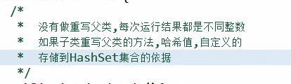

## ArrayList

```javascript
ArrayList<Integer> arr = new ArrayList<Integer>();
arr.add(5);
arr.add(10);
arr.add(14);
arr.add(355);
System.out.println(arr);
[5, 10, 14, 355]

ArrayList<Person> arr = new ArrayList<Person>();
arr.add(new Person("Mark",10));
arr.add(new Person("Lisa",12));
arr.add(new Person("Mar2k",16));
arr.add(new Person("Mar34k",18));
arr.add(new Person("Mar5k",15));
System.out.println(arr);
[Person [name=Mark, age=10], Person [name=Lisa, age=12], Person [name=Mar2k, age=16], Person [name=Mar34k, age=18], Person [name=Mar5k, age=15]]
```

## Collection 接口

### clear()

清空元素

### contains(Object obj)

判断obj是否在于集合中,存在返回true

依赖与equals()方法判断的结果

 ### size()

返回集合的个数

### toArray()

把集合中的元素转成数组中的元素

只能用Object[]接收

### remove(Object obj)

移除集合中指定的第一个元素（只删一个）,返回是否删除的布尔值

自动转型

Collection coll = new ArrayList()  //可以存任意类型

相应的迭代器也不能加类型

```java
Collection<String> coll = new ArrayList<String>();
coll.add("11");
coll.add("22");
System.out.println(coll);
coll.clear();
System.out.println(coll);
coll.add("33");
System.out.println(coll);
[11, 22]
[]
[33]

Collection<String> coll = new ArrayList<String>();
coll.add("11");
coll.add("22");
coll.add("33");
coll.add("44");
coll.add("55");
System.out.println(coll.contains("22")+" "+coll.contains("221"));
true false

Collection<String> coll = new ArrayList<String>();
coll.add("11");
coll.add("22");
coll.add("33");
coll.add("44");
coll.add("55");
Object[] arr = coll.toArray();
for(int i=0;i<arr.length;i++) {
	System.out.print(arr[i]+" ");
}
11 22 33 44 55 

Collection<String> coll = new ArrayList<String>();
coll.add("11");
coll.add("22");
coll.add("33");
coll.add("33");
coll.add("44");
coll.add("55");
System.out.println(coll.remove("1"));
System.out.println(coll);
System.out.println(coll.remove("33"));
System.out.println(coll);
false
[11, 22, 33, 33, 44, 55]
true
[11, 22, 33, 44, 55]
```

### Collections工具

#### Collections.sort(List)

对list集合进行排序

#### Collections.binarySearch(List,key)

返回被查找元素的索引,找不到返回(-插入点-1)

### Collections.shuffle(List)

对list进行随机排列

还有一些可以返回线程安全的map,list等的函数

```java
List<String> arr= new ArrayList<String>();
arr.add("as");
arr.add("34s");
arr.add("t4g");
arr.add("T4g");
System.out.println(arr);
Collections.sort(arr);
System.out.println(arr);
System.out.println(Collections.binarySearch(arr, "T4g"));
Collections.shuffle(arr);
System.out.println(arr);
[as, 34s, t4g, T4g]
[34s, T4g, as, t4g]
1
[T4g, t4g, as, 34s]
```

## Iterator

用同一种方式取不同的容器，获取集合中的元素

使用ArrayList对象.iterator()返回一个接口的实现类

一个迭代器只能使用一次

### hasNext()

判断是狗含有下一个元素，一开始指针指向-1

### next()

返回下一个元素，并往后走一个单位

```java
Collection<String> arr = new ArrayList<String>();
arr.add("11");
arr.add("22");
arr.add("33");
arr.add("44");
arr.add("55");
arr.add("66");
Iterator<String> it=arr.iterator();
System.out.println(it.hasNext());
while(it.hasNext()) {
    System.out.println(it.next());
}
true
11
22
33
44
55
66
```

```java
Collection coll = new ArrayList();//可以存任何类型，每个元素的类型也可以不一样
coll.add("33");
coll.add("123");
Iterator it = coll.iterator();
while(it.hasNext()) {
    Object obj = it.next();//默认为object
    System.out.println(obj);
    String s =(String)it.next();//可以强转,但是如果有类型不一样，会出现安全隐患,所以推荐使用泛型，泛型在下面
    System.out.println(s);
}

```

## 增强的for循环Iterable

Iterable接口用域实现增强for循环

代码简洁，方便对容器的遍历

但是没有索引，不能操作容器里的元素

```java
int[] arr= {1,2,3,4};
for(int i:arr) { //将arr[n] 赋值给 i
    System.out.println(i++);
}
System.out.println(arr[0]);
1
2
3
4
1
    
ArrayList<Person> array = new ArrayList<Person>();
array.add(new Person("mark",10));
array.add(new Person("Lisa",11));
for(Person p :array) {
    System.out.println(p);
}  
Person [name=mark, age=10]
Person [name=Lisa, age=11]
```

## 泛型（>=JDK1.5）

指明了集合中的存储数据的类型

如Collection<String> coll = new ArrayList<String>()

java泛型是伪泛型，只是编译手段，编译后的class文件中无泛型概念

在编译中类型不对则无法通过，所以保证了安全性

### 带有泛型的类

如ArrayList<E>,E为泛型的意思,E默认为Object

ArrayList<Integer> E为Integer

add(E e)  类似于C++的模板

Iterator<E> 也是泛型

T[] toArray(T[] a) 泛型方法

```java
ArrayList<Integer> array=new ArrayList<Integer>();
array.add(123);
array.add(456);
Integer j[] = array.toArray(new Integer[array.size()]);
for(Integer k:j){
    System.out.println(k);
}
123
456
```

泛型的优点：

- 安全性好,在编译时期就报错
- 避免了强转

### 泛型的通配符

？可以匹配任意类型

只能用作遍历

```java
public static void function(Collection<?> coll) { //不写<?>的话安全性低，但是又不强转，好像没什么影响
    Iterator<?> it = coll.iterator();
    while(it.hasNext()) {
        System.out.println(it.next());//不能强转
    }
    System.out.println("========================");
}

ArrayList<String> arr=new ArrayList<String>();
HashSet<Integer> set = new HashSet<Integer>();
arr.add("122");
arr.add("22");
set.add(156);
set.add(255300);
set.add(634);
set.add(75);
function(arr);
function(set);

122
22
========================
255300
634
75
156
========================
```

### 泛型的限定

ArrayList<? extends Employee>

上限限定，限定为某子类或者某实现类，可以传Employee或子类

ArrayList<? super Employee>

下限限定,可以传Employee或父类

```java
public static void function(ArrayList<? extends Employee>  arr) {
    Iterator<? extends Employee> it = arr.iterator();
    while(it.hasNext()) {
        System.out.println(it.next());
    }
    System.out.println("===========================");
}
ArrayList<Cook> cs = new ArrayList<Cook>();
ArrayList<Waiter> ws = new ArrayList<Waiter>();
ArrayList<Manager> ms = new ArrayList<Manager>();
cs.add(new Cook("c1",1));
cs.add(new Cook("c2",2));
ws.add(new Waiter("w1",3));
ws.add(new Waiter("w2",4));
ms.add(new Manager("m1",5,100));
ms.add(new Manager("m2",6,200));
function(cs);
function(ws);
function(ms);

Cook [toString()=Employee [name=c1, id=1]]
Cook [toString()=Employee [name=c2, id=2]]
===========================
Waiter [toString()=Employee [name=w1, id=3]]
Waiter [toString()=Employee [name=w2, id=4]]
===========================
Manager [jiangjin=100, toString()=Employee [name=m1, id=5]]
Manager [jiangjin=200, toString()=Employee [name=m2, id=6]]
===========================
```

## List

特点：有序，索引，可以重复元素

有Collection的方法

自己特有的方法是带索引的方法

### add(int index,E)

将一个元素插入index位置，add的index可以传list的size

带索引的方法要注意索引越界

### remove(int index)

删除指定索引的元素并把元素返回出来

### set(int index,E)

修改指定位置元素，并把被修改的元素返回

可以用for,迭代器,增强for遍历

迭代器的并发修改异常，在迭代器工作时集合的长度发生变化

ConcurrentModificationException

```java
while(it.hasNext()) {
    String s=it.next();
    System.out.println(s);
    if(s.equals("abc3")) {
        （!error）arr.add("111");		//在迭代器的工作中修改集合的长度
        arr.set(1,"111");	//这样是可以的
    }
}

List<String> arr= new ArrayList<String>();
arr.add("abc1");
arr.add("abc2");
arr.add("abc3");
arr.add("abc4");
arr.add("abc5");
Iterator<String> it =arr.iterator();
while(it.hasNext()) {
    String s=it.next();
    System.out.println(s);
    if(s.equals("abc3")) {
        arr.set(0,"111");	
    }
}
System.out.println(arr);
abc1
abc2
abc3
abc4
abc5
[111, abc2, abc3, abc4, abc5]
```

堆栈

先进后出

队列

先进先出

数组

查找元素快，通过索引可以快速访问指定位置元素

增删慢，需要创新新数组再拷贝到原数组

链表

查找元素慢，需要通过连接节点依次向后查

增删快

ArrayList<E>

查询快，增删慢，线程不安全

LinkedList<E>

增删快，查询慢，线程不安全

底层实现是链表

### add(E)

### addFirst(E)

### addLast(E)

添加元素,First在开头加,Last和不加在后面添加

### getFirst()

### getLast()

获取元素,First开头元素,Last末尾元素

如果link中没有元素则出现异常

可以用isEmpty()判断是否为空

### removeFirst()

### removeLast()

移除并返回元素的开头

```java
LinkedList<String> link = new LinkedList<String>();
link.add("123");
link.add("234");
link.addFirst("012");
link.addLast("345");
System.out.println(link);
if(!link.isEmpty()) {
    System.out.println(link.getFirst());
    System.out.println(link.getLast());
}
if(!link.isEmpty()) {
    System.out.println(link.removeFirst());
    System.out.println(link.removeLast());
}
System.out.println(link);
[012, 123, 234, 345]
012
345
012
345
[123, 234]
```

## Vector

已经被ArrayList取代，线程安全，速度慢

## Set

set只能用迭代器和增强for来取元素

和Collection一致

## HashSet

底层是一个HashMap实例,哈希表

初始容量为16，加载因子为0.75，当数据个数大于16*0.75=12个就需要扩充，数据的再哈希

没有顺序,可以存null,无索引,不存储重复元素，存储取出快，线程不安全，运行快



同一个元素hashcode一样

每一个元素都有hashcode,作为存入hashmap的依据

String有重写hashcode()

### add(E)

存储元素

返回是否存储成功，可以判断重复，依赖于hashCode()和equals()

```java
Set<String> set = new HashSet<String>();
set.add("aa");
set.add("bb");
set.add("dd");
set.add("56fas");
set.add("cc");
set.add("aa");
set.add("f6e");
Iterator<String> it =set.iterator();
while(it.hasNext()) {
    System.out.println(it.next());
}
System.out.println("==============");
aa
bb
dd
cc
56fas
f6e
==============

for(String s:set) {
    System.out.println(s);
}
aa
bb
dd
cc
56fas
f6e
```

重写类中的equals和hashcode来阻止数据一样的类进入hashSet

hashcode()和equals()需要同时重写，因为不同的类可能产生相同的hashcode，所以需要用equals来判断是否为同一个元素，需要降低hashCode()产生相同值的概率

```java
System.out.println(new Person().hashCode()+" "+new Person().hashCode());
2018699554 1311053135
但是空类没必要存多个，不符合hashSet不存储重复元素，所以可以重写hashCode来根据成员来产生hashcode
"a".hashCode()+10 == "b".hashCode()+9
    
public int hashCode(){
    final int prime =31;
    int result = 1;
    result = prime * result + age;
    result = prime * result + ((name==null)?0:name.hashCode());
}  
public boolean equals(Object obj)
{
    if(this == obj) return true;
    if(obj == null) return false;
    if(this.name.equals(obj.name) && this.age == obj.age){
        return true;
    }else{
        return false;
    }
}
HashSet<Person> set = new HashSet<Person>();
set.add(new Person("a",10));
set.add(new Person("b",11));
set.add(new Person("a",10));
set.add(new Person());
set.add(new Person("d",50));
set.add(new Person());
System.out.println(set);
[Person [name=null, age=0], Person [name=d, age=50], Person [name=a, age=10], Person [name=b, age=11]]
```


## LinkedHashSet

继承自HashSet

有顺序，不同于HashSet的单向列表,LinkedHashSet为双向链表，单结点会保存前一个和后一个两个结点的指针

线程不安全，运行速度快

```java
LinkedHashSet<String> linkset = new LinkedHashSet<String>();
linkset.add("ds54");
linkset.add("f45ew");
linkset.add("er8943");
System.out.println(linkset);
[ds54, f45ew, er8943]
HashSet<String> set = new HashSet<String>();
set.add("ds54");
set.add("f45ew");
set.add("er8943");
System.out.println(set);
[ds54, er8943, f45ew]
```

### 基本类型和String判断重复

都重写了hashCode()和equals()

所以可以在存入hashSet中判断出是否重复

所以需要存入HashSet中前需要考虑是否需要重写hashCode()和equals()

### 注意

两个对象的hashcode一样也不保证equals()结果为true

两个对象的equals()结果为true则hashcode必须一样（来自hashCode中的协议，但实际上两个匿名对象如果只重写了equals,不重写hashCode()函数计算出的hashcode是不一样的，所以需要两个需要同时重写）

equals=true =>hashcode一样

equals=false =>hashcode不一定一样

## Map

每次存储两个对象,键值对

键不能重复

Map<String,Integer> map= new HashMap<String,Integer>();

### put(K,V)

K作为键，V作为值

存储了重复的键时，将覆盖原有的值，并在此时返回原有的值，不是覆盖都是返回null

```java
Map<String,Integer> map= new HashMap<String,Integer>();
map.put("a", 1);
map.put("b", 2);
map.put("c", 3);
Integer i=map.put("a", 5);
map.put("d", 4);
System.out.println(map+" "+i);
{a=5, b=2, c=3, d=4} 1
```

### V get(K)

通过键返回值

如果集合中不存在这个键则返回null

```java
Map<String,Integer> map= new HashMap<String,Integer>();
map.put("a", 1);
map.put("b", 2);
map.put("c", 3);
map.put("d", 4);
System.out.println(map.get("c"));
3
```

### V remove(K)

通过键删除值，并把这个值返回出来

如果没有这个键，则返回null

```java
Map<String,Integer> map= new HashMap<String,Integer>();
map.put("a", 1);
map.put("b", 2);
map.put("c", 3);
map.put("d", 4);
System.out.println(map.remove("a"));
1
```

### keySet()

返回map中的所有键，并存入Set


遍历方法1

```java
HashMap<String,Person> map = new HashMap<String,Person>();
map.put("mark",new Person("mark",10));
map.put("Lisa",new Person("Lisa",11));
map.put("olp",new Person("olp",11));
for(String key:map.keySet()) {
    System.out.println(key+" "+map.get(key));
}
System.out.println("=====================");
for(Map.Entry<String, Person> entry :map.entrySet()) {
    System.out.println(entry.getKey()+" "+entry.getValue());
}
System.out.println("======================");
olp Person [name=olp, age=11]
mark Person [name=mark, age=10]
Lisa Person [name=Lisa, age=11]
=====================
olp Person [name=olp, age=11]
mark Person [name=mark, age=10]
Lisa Person [name=Lisa, age=11]
======================
```

### entrySet()

遍历方法2


```java
HashMap<Person,String> map = new HashMap<Person,String>();
map.put(new Person("mark",10),"mark");
map.put(new Person("Lisa",11),"Lisa");
map.put(new Person("olp",11),"olp");
map.put(new Person("olp",11),"ol2p");//由hashcode()和equals()保证了唯一性，相同键再插入会替换值
for(Person key:map.keySet()) {
    System.out.println(key+" "+map.get(key));
}
System.out.println("=====================");
for(Map.Entry<Person, String> entry :map.entrySet()) {
    System.out.println(entry.getKey()+" "+entry.getValue());
}
System.out.println("=====================");
Person [name=Lisa, age=11] Lisa
Person [name=mark, age=10] mark
Person [name=olp, age=11] ol2p
=====================
Person [name=Lisa, age=11] Lisa
Person [name=mark, age=10] mark
Person [name=olp, age=11] ol2p
=====================
```

```java
public static void keySet(HashMap<String,HashMap<String,String>> cb) {
    Set<String> classname = cb.keySet();
    Iterator<String> it =classname.iterator();
    while(it.hasNext()) {
        String key =it.next();
        Set<String> set=cb.get(key).keySet();
        Iterator<String> its = set.iterator();
        while(its.hasNext()) {
            String itemkey=its.next();
            System.out.println(key+" "+itemkey+" "+cb.get(key).get(itemkey));
        }
    } 
}

public static void entrySet(HashMap<String,HashMap<String,String>> cb) {
    Set<Map.Entry<String,HashMap<String,String>>> entryclass = cb.entrySet();
    Iterator<Map.Entry<String,HashMap<String,String>>> it =entryclass.iterator();
    while(it.hasNext()) {
        Map.Entry<String,HashMap<String,String>> entry = it.next();
        String key = entry.getKey();
        HashMap<String,String> std = entry.getValue();
        Set<Map.Entry<String, String>> stds = std.entrySet();
        Iterator<Map.Entry<String, String>> stdsit=stds.iterator();
        while(stdsit.hasNext()){
            Map.Entry<String,String> stdentry=stdsit.next();
            String stdkey = stdentry.getKey();
            String stdinfo = stdentry.getValue();
            System.out.println(key+" "+" "+stdkey+" "+stdinfo);
        }
    }
}

HashMap<String,String> javase = new HashMap<String,String>();
HashMap<String,String> javaee = new HashMap<String,String>();
javase.put("1", "javase1");
javase.put("2", "javase2");
javaee.put("1", "javaee1");
javaee.put("2", "javaee2");
HashMap<String,HashMap<String,String>> cb = new HashMap<String,HashMap<String,String>>();
cb.put("基础班",javase);
cb.put("就业班",javaee);
keySet(cb);
entrySet(cb);
就业班 1 javaee1
就业班 2 javaee2
基础班 1 javase1
基础班 2 javase2
就业班  1 javaee1
就业班  2 javaee2
基础班  1 javase1
基础班  2 javase2
```

## demo斗地主案例


```java
import java.util.ArrayList;
import java.util.Collections;
import java.util.HashMap;

public class Demo {

	public static void main(String[] args) {
		//1.组合牌
		HashMap<Integer,String> pooker = new HashMap<Integer,String>();
		ArrayList<Integer> pookerNumber = new ArrayList<Integer>();
		String[] numbers= {"2","A","K","Q","J","10","9","8","7","6","5","4","3"};
		String[] flowers= {"♠","♥","♣","♦"};
		int index=2;
		for(String number:numbers) {
			for(String flower:flowers) {
				pooker.put(index, flower+number);
				pookerNumber.add(index);
				index++;
			}
		}
		pooker.put(0, "大王");
		pookerNumber.add(0);
		pooker.put(1, "小王");
		pookerNumber.add(1);
		System.out.println(pooker+" "+pookerNumber);
		//洗牌
		Collections.shuffle(pookerNumber);
		System.out.println(pookerNumber);
		ArrayList<Integer> player1 = new ArrayList<Integer>();
		ArrayList<Integer> player2 = new ArrayList<Integer>();
		ArrayList<Integer> player3 = new ArrayList<Integer>();
		ArrayList<Integer> dipai = new ArrayList<Integer>();
		for(int i =0;i<pookerNumber.size();i++) {
			if(i<3) {
				dipai.add(pookerNumber.get(i));
			}else if(i%3==0) {
				player1.add(pookerNumber.get(i));
			}else if(i%3==1) {
				player2.add(pookerNumber.get(i));
			}else if(i%3==2) {
				player3.add(pookerNumber.get(i));
			}
		}
		//发牌
		Collections.sort(player1);
		Collections.sort(player2);
		Collections.sort(player3);
		Collections.sort(dipai);
		//看牌
		readpooker("玩家1",player1, pooker);
		readpooker("玩家2",player2, pooker);
		readpooker("玩家3",player3, pooker);
		readpooker("底牌",dipai, pooker);
	}
	public static void readpooker(String name,ArrayList<Integer> arr,HashMap<Integer,String> pooker) {
		System.out.print(name+" :");
		for(Integer t:arr) {
			String value = pooker.get(t);
			System.out.print(value+" ");
		}
		System.out.println();
	}
}
{0=大王, 1=小王, 2=♠2, 3=♥2, 4=♣2, 5=♦2, 6=♠A, 7=♥A, 8=♣A, 9=♦A, 10=♠K, 11=♥K, 12=♣K, 13=♦K, 14=♠Q, 15=♥Q, 16=♣Q, 17=♦Q, 18=♠J, 19=♥J, 20=♣J, 21=♦J, 22=♠10, 23=♥10, 24=♣10, 25=♦10, 26=♠9, 27=♥9, 28=♣9, 29=♦9, 30=♠8, 31=♥8, 32=♣8, 33=♦8, 34=♠7, 35=♥7, 36=♣7, 37=♦7, 38=♠6, 39=♥6, 40=♣6, 41=♦6, 42=♠5, 43=♥5, 44=♣5, 45=♦5, 46=♠4, 47=♥4, 48=♣4, 49=♦4, 50=♠3, 51=♥3, 52=♣3, 53=♦3} [2, 3, 4, 5, 6, 7, 8, 9, 10, 11, 12, 13, 14, 15, 16, 17, 18, 19, 20, 21, 22, 23, 24, 25, 26, 27, 28, 29, 30, 31, 32, 33, 34, 35, 36, 37, 38, 39, 40, 41, 42, 43, 44, 45, 46, 47, 48, 49, 50, 51, 52, 53, 0, 1]
[40, 34, 9, 44, 36, 37, 23, 47, 42, 22, 49, 32, 30, 46, 53, 27, 43, 26, 0, 33, 52, 39, 1, 11, 31, 19, 8, 6, 17, 45, 5, 29, 13, 20, 4, 14, 24, 51, 28, 50, 41, 35, 21, 15, 38, 3, 12, 2, 48, 10, 25, 16, 18, 7]
玩家1 :大王 ♥2 ♦2 ♠A ♣Q ♣J ♦J ♠10 ♥10 ♣10 ♥9 ♠8 ♥8 ♥6 ♣5 ♣4 ♠3 
玩家2 :小王 ♣2 ♠K ♣K ♥Q ♦Q ♠J ♥J ♦9 ♦8 ♣7 ♦6 ♥5 ♠4 ♥4 ♦4 ♥3 
玩家3 :♠2 ♥A ♣A ♥K ♦K ♠Q ♦10 ♠9 ♣9 ♣8 ♥7 ♦7 ♠6 ♠5 ♦5 ♣3 ♦3 
底牌 :♦A ♠7 ♣6 
```

