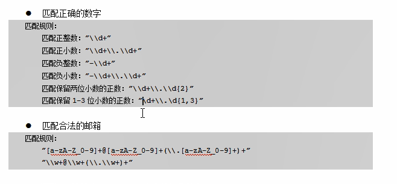

### String.matches(String 正则)

匹配成功返回true

### String .split(String 正则)

使用规则字符串进行切割
### String.replaceAll(String 正则规则,String 字符串)
按照正则规则进行替换字符串

```java
"[0-9]{6,12}"
0-9的6到十二位数字

"1[34578][0-9]{}"
11位手机号

"a*b"
a出现的次数为0或多次+b

```

demo
```java
String str="1-2-3-5-6-7-ad 4 2314 34 534a215 w45   - 4f52f-fa ";
String[] arr = str.split("-");
for(int i =0;i<arr.length;i++) {
System.out.print(arr[i]+" ");
}	
1 2 3 5 6 7 ad 4 2314 34 534a215 w45     4f52f fa 

System.out.println();
String[] arr1 = str.split(" +");
for(int i =0;i<arr1.length;i++) {
System.out.print(arr1[i]+" ");
}	
1-2-3-5-6-7-ad 4 2314 34 534a215 w45 - 4f52f-fa 

String str1="1.16.6g.d46qw dsad.sd4q6d s.ad 4sqd... d4qw";
System.out.println();
String[] arr2 = str1.split("\\.+");
for(int i =0;i<arr2.length;i++) {
System.out.print(arr2[i]+" ");
1 16 6g d46qw dsad sd4q6d s ad 4sqd  d4qw
}	

{
String str="1.16.6g.d46333qw dsad.sd4q6d s.ad 4sqd... d4qw";
str = str.replaceAll("[\\d+]", "#");
System.out.println(str);
#.##.#g.d#####qw dsad.sd#q#d s.ad #sqd... d#qw

str="1.16.6g.d46qw ds333ad.sd4q6d s.ad 4sqd... d4qw";
str = str.replaceAll("[\\d]+", "#");
System.out.println(str);
#.#.#g.d#qw ds#ad.sd#q#d s.ad #sqd... d#qw
}
```



