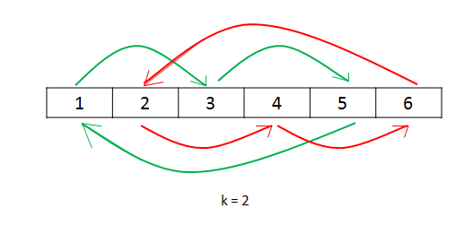
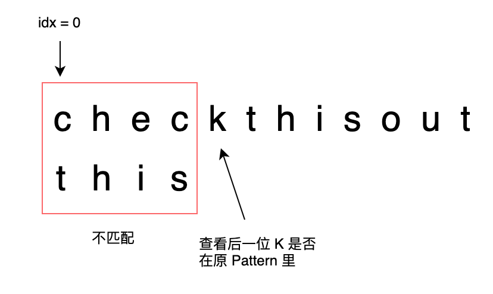
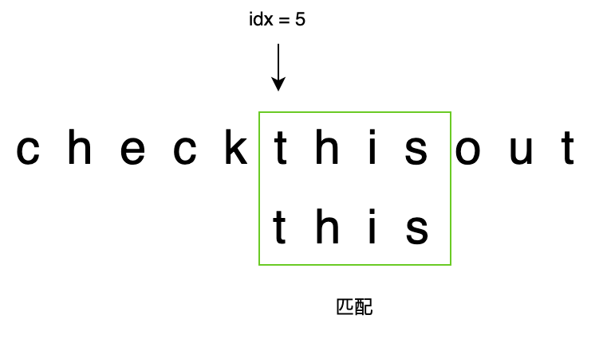

[TOC]

## 1.删除排序数组中的重复项

​		Given a sorted array nums, remove the duplicates in-place such that each element appears only once and returns the new length.

​		Do not allocate extra space for another array, you must do this by modifying the input array in-place with O(1) extra memory.

Constraints:

- 0 <= nums.length <= 3 * 104
- -104 <= nums[i] <= 104
- nums is sorted in ascending order.


``` c
//时间复杂度O(n), 空间复杂度O(1)
int removeDuplicates(int* nums, int numsSize){
    if (numsSize == 0)return 0;
    int i = 0;
    for (int j = 1; j < numsSize; j++){
        if( nums[i] != nums[j] ){
            nums[++i] = nums[j];
        }
    }
    return i+1;
}
```

### 解法1 双指针

```c
//时间复杂度O(n)，空间复杂度O(1)
int removeDuplicates(int* nums, int numsSize) {
    if (numsSize == 0) {
        return 0;
    }
    int fast = 1, slow = 1;
    while (fast < numsSize) {
        if (nums[fast] != nums[fast - 1]) {
            nums[slow] = nums[fast];
            ++slow;
        }
        ++fast;
    }
    return slow;
}
```


## 2.买卖股票的最佳时机 II

Say you have an array prices for which the ith element is the price of a given stock on day i.

Design an algorithm to find the maximum profit. You may complete as many transactions as you like (i.e., buy one and sell one share of the stock multiple times).

Note: You may not engage in multiple transactions at the same time (i.e., you must sell the stock before you buy again).

> Input: [7,1,5,3,6,4]
> Output: 7
>
> Explanation: Buy on day 2 (price = 1) and sell on day 3 (price = 5), profit = 5-1 = 4.Then buy on day 4 (price = 3) and sell on day 5 (price = 6), profit = 6-3 = 3.

```c
//时间复杂度O(n), 空间复杂度O(1)
int maxProfit(int* prices, int pricesSize){
    if (!pricesSize){
        return 0;
    }
    int profit=0;
    for(int i=1;i<pricesSize;i++){
        if(prices[i]-prices[i-1]>0){
            profit+=prices[i]-prices[i-1];
        }
    }
    return profit;
}
```

### BP

```java
//计算所有的交易可能性
class Solution {
    public int maxProfit(int[] prices) {
        int i = 0;
        int valley = prices[0];
        int peak = prices[0];
        int maxprofit = 0;
        while (i < prices.length - 1) {
            while (i < prices.length - 1 && prices[i] >= prices[i + 1])
                i++;
            valley = prices[i];
            while (i < prices.length - 1 && prices[i] <= prices[i + 1])
                i++;
            peak = prices[i];
            maxprofit += peak - valley;
        }
        return maxprofit;
    }
}
```

## 3. 旋转数组

Given an array, rotate the array to the right by k steps, where k is non-negative.

> Input: nums = [-1,-100,3,99], k = 2
> Output: [3,99,-1,-100]
> Explanation: 
> rotate 1 steps to the right: [99,-1,-100,3]
> rotate 2 steps to the right: [3,99,-1,-100]

### 解法1

如果我们直接把每一个数字放到它最后的位置，但这样的后果是遗失原来的元素。因此，我们需要把被替换的数字保存在变量 temp里面。然后，我们将被替换数字（temp）放到它正确的位置，并继续这个过程 n 次， n 是数组的长度。这是因为我们需要将数组里所有的元素都移动。但是，这种方法可能会有个问题，如果 n%k == 0，其中 k=k%n （因为如果 k 大于 n，移动 k 次实际上相当于移动 k%n 次）。这种情况下，我们会发现在没有遍历所有数字的情况下回到出发数字。此时，我们应该从下一个数字开始再重复相同的过程。



```C
//时间复杂度：O(n)O(n) ， 空间复杂度：O(1)O(1) 
void rotate(int* nums, int numsSize, int k){
    if (numsSize == 0 || k % numsSize == 0){
        return;
    }
    k = k % numsSize;
    long count = 0;
    for(long start = 0 ; count < numsSize; start++ ){
        long current = start;
        long prev = nums[start];
        do{
            long next = (current + k) % numsSize;
            long temp = nums[next];
            nums[next] = prev;
            prev = temp;
            current = next;
            count++;
        }while(start != current);
    }
}
```

### 解法2

这个方法基于这个事实：当我们旋转数组 k 次， k\%nk%n 个尾部元素会被移动到头部，剩下的元素会被向后移动。

在这个方法中，我们首先将所有元素反转。然后反转前 k 个元素，再反转后面 n-kn−k 个元素，就能得到想要的结果。

```C
void reverse(int* nums, int satrt, int end);
void rotate(int* nums, int numsSize, int k){
    if (numsSize == 0 || k % numsSize == 0){
        return;
    }
    k %= numsSize;
    reverse(nums, 0, numsSize - 1);
    reverse(nums, 0, k - 1);
    reverse(nums, k, numsSize - 1);
}
void reverse(int* nums, int start, int end){
    while (start < end) {
        int temp = nums[start];
        nums[start] = nums[end];
        nums[end] = temp;
        start++;
        end--;
    }
}
```

## 4.存在重复元素

Given an array of integers, find if the array contains any duplicates.

Your function should return true if any value appears at least twice in the array, and it should return false if every element is distinct.

> Example 1:
> Input: [1,2,3,1]
> Output: true

### 解法1

先排序，判断相邻的两个值是否重复

```c
//时间复杂度O(nlogn), 空间复杂度O(1)
void swap(int tree[], int i, int j);
void heapify();
void buildHeap();
void heapSort();
bool containsDuplicate(int* nums, int numsSize){
    if(numsSize <= 1) return false;
    heapSort(nums, numsSize);
    for(int i=0; i<numsSize-1; i++){
        if (nums[i] == nums[i+1]) return true;
    }
    return false;
}
void heapSort(int tree[], int n){ //堆排序
    if (n<=2) return;
    buildHeap(tree, n);
    for (int i = n-1; i>0; i--){
        swap(tree, i, 0);
        heapify(tree, i, 0);
    }
}
void heapify(int tree[], int n ,int i){ 
    if (i >= n) return;
    int c1 = 2*i +1;
    int c2 = 2*i +2;
    int max = i;
    if (c1 < n && tree[c1] > tree[max]) max = c1;
    if (c2 < n && tree[c2] > tree[max]) max = c2;
    if (max != i) {
        swap(tree, i, max);
        heapify(tree, n, max);
    }
};
void buildHeap(int tree[], int n){ //构建堆
    int lastNode = n-1;
    int parent = (lastNode - 1)/2;
    for (int i=parent;i>=0;i--){
        heapify(tree, n, i);
    }
};
void swap(int tree[], int i, int j){
    int temp = tree[i];
    tree[i] = tree[j];
    tree[j] = temp;
};
```

### 解法2

哈希表

## 5.找出只出现一次的数字

Given a non-empty array of integers nums, every element appears ==twice== except for one. Find that single one.

Follow up: Could you implement a solution with a linear runtime complexity and without using extra memory?

> Input: nums = [4,1,2,1,2]
> Output: 4

### 解法1

先排序, 判断第一个与第二个值是否相同, 最后一个和倒数第二个是否相同,  否则判断每次的中间值是否相同

```c
//时间复杂度O(nlogn), 空间复杂度O(1)
void swap(int tree[], int i, int j);
void heapify();
void buildHeap();
void heapSort();
int singleNumber(int* nums, int numsSize){
    if(numsSize ==1) return nums[0];
    heapSort(nums);
    if (nums[0] != nums[1]) return nums[0];
    if (nums[numsSize-2] != nums[numsSize-1]) return nums[numsSize-1];
    for(int i=0; i< numsSize-2; i++){
        if(nums[i] != nums[i+1] && nums[i+1] != nums[i+2]) return nums[i+1];
    }
    return nums[numsSize-1];
};
void heapSort(int tree[], int n){
    buildHeap(tree, n);
    for (int i = n-1; i>0; i--){
        swap(tree, i, 0);
        heapify(tree, i, 0);
    }
}
void heapify(int tree[], int n ,int i){
    if (i >= n) return;
    int c1 = 2*i +1;
    int c2 = 2*i +2;
    int max = i;
    if (c1 < n && tree[c1] > tree[max]) max = c1;
    if (c2 < n && tree[c2] > tree[max]) max = c2;
    if (max != i) {
        swap(tree, i, max);
        heapify(tree, n, max);
    }
};
void buildHeap(int tree[], int n){
    int lastNode = n-1;
    int parent = (lastNode - 1)/2;
    for (int i=parent;i>=0;i--){
        heapify(tree, n, i);
    }
};
void swap(int tree[], int i, int j){
    int temp = tree[i];
    tree[i] = tree[j];
    tree[j] = temp;
};
```

### 解法2

遍历数组进行异或运算,算出出现次数为1的值（如果题目不限定,应该是所有奇数次数的异或）

```c
//时间复杂度O(n), 空间复杂度O(1)
int singleNumber(int* nums, int numsSize){
    if (numsSize == 1) return nums[0];
    for(int i = 0; i<numsSize-1; i++) nums[i+1] ^= nums[i];
    return nums[numsSize-1];
}
```

## 6.两个数组的交集

Given two arrays, write a function to compute their intersection.

> Input: nums1 = [1,2,2,1], nums2 = [2,2]
>Output: [2,2]

### 解法1， 先排序然后利用双指针

```c
/**
 * Note: The returned array must be malloced, assume caller calls free().
 */
// 时间复杂度O(mlogm+nlogn)， 空间复杂度O(min(m,n))
void swap(int tree[], int i, int j);
void heapify();
void buildHeap();
void heapSort();
int* intersect(int* nums1, int nums1Size, int* nums2, int nums2Size, int* returnSize){
    *returnSize = 0;
    int* intersection = (int*)malloc(sizeof(int) * fmin(nums1Size, nums2Size));
    heapSort(nums1, nums1Size);
    heapSort(nums2, nums2Size);
    int nums1Point = 0 ;
    int nums2Point = 0;
    while(nums1Point < nums1Size && nums2Point < nums2Size) {     
        if (nums1[nums1Point] == nums2[nums2Point]){
            intersection[(*returnSize)++] = nums1[nums1Point];
            nums1Point++;
            nums2Point++;
        } else if (nums1[nums1Point] < nums2[nums2Point]) {
            nums1Point++;
        } else {
            nums2Point++;
        }
    }
    return intersection;
}
void heapSort(int tree[], int n){ //堆排序
    buildHeap(tree, n);
    for (int i = n-1; i>0; i--){
        swap(tree, i, 0);
        heapify(tree, i, 0);
    }
}
void heapify(int tree[], int n ,int i){ 
    if (i >= n) return;
    int c1 = 2*i +1;
    int c2 = 2*i +2;
    int max = i;
    if (c1 < n && tree[c1] > tree[max]) max = c1;
    if (c2 < n && tree[c2] > tree[max]) max = c2;
    if (max != i) {
        swap(tree, i, max);
        heapify(tree, n, max);
    }
};
void buildHeap(int tree[], int n){ //构建堆
    int lastNode = n-1;
    int parent = (lastNode - 1)/2;
    for (int i=parent;i>=0;i--){
        heapify(tree, n, i);
    }
};
void swap(int tree[], int i, int j){
    int temp = tree[i];
    tree[i] = tree[j];
    tree[j] = temp;
};
```

### 解法2， 利用哈希表

对长度短的建立哈希表更高效

```java
class Solution {
    public int[] intersect(int[] nums1, int[] nums2) {
        if (nums1.length > nums2.length) {
            return intersect(nums2, nums1);
        }
        Map<Integer, Integer> map = new HashMap<Integer, Integer>();
        for (int num : nums1) {
            int count = map.getOrDefault(num, 0) + 1;
            map.put(num, count);
        }
        int[] intersection = new int[nums1.length];
        int index = 0;
        for (int num : nums2) {
            int count = map.getOrDefault(num, 0);
            if (count > 0) {
                intersection[index++] = num;
                count--;
                if (count > 0) {
                    map.put(num, count);
                } else {
                    map.remove(num);
                }
            }
        }
        return Arrays.copyOfRange(intersection, 0, index);
    }
}
```

## 7.加一

Given a non-empty array of decimal digits representing a non-negative integer, increment one to the integer.

The digits are stored such that the most significant digit is at the head of the list, and each element in the array contains a single digit.

You may assume the integer does not contain any leading zero, except the number 0 itself.

> Input: digits = [1,2,3]
> Output: [1,2,4]
> Explanation: The array represents the integer 123.

### 解法1 如果进位则重新申请内存

```c
//时间复杂度O(n), 空间复杂度O(1)
int* plusOne(int* digits, int digitsSize, int* returnSize){
    *returnSize = digitsSize;
    int* represention = (int*)malloc(sizeof(int) * digitsSize);
    bool addneed = true; 
    for(int i=digitsSize-1; i>=0; i--){
        int num = digits[i];
        if (addneed) num++;
        if (addneed && num%10 == 0) {
            addneed = true;
            represention[i] = 0;
            if(i==0){
                represention = (int*)realloc(represention, sizeof(int) * (digitsSize + 1));
                represention[0] = 1;
                for(int j=1;j <=digitsSize; j++){
                    represention[j] = 0;
                }
                (*returnSize) = digitsSize + 1;
            }
        }else{
            addneed = false;
            
            represention[i] = num;
        }
    }
    return represention;
}
```

## 8.移动0

Given an array nums, write a function to move all 0's to the end of it while maintaining the relative order of the non-zero elements.

> Input: [0,1,0,3,12]
> Output: [1,3,12,0,0]

### 解法1

出现0时慢指针不动,快指针动,遇到不为0时填充慢指针,最后慢指针到快指针之间填充0

```c
//时间复杂度O(n), 空间复杂度O(1)
void moveZeroes(int* nums, int numsSize){
    if (numsSize<=1) return;
    int start=0, end=0;
    for(;end < numsSize; end++){
        if(nums[end]!=0){
            nums[start] = nums[end];
            start++;
        }
    }
    for(int i = start; i<end; i++){
        nums[i] = 0;
    }
}
```

### 解法2

在上一步的解法上优化操作数

只操作了nums[i] != 0 的数， 当大多数为0时更优，最坏情况一致

```c
//时间复杂度O(n), 空间复杂度O(1)
void swap(int* nums, int i ,int j);
void moveZeroes(int* nums, int numsSize){
    if (numsSize<=1) return;
    for(int lazy=0, fast=0;fast < numsSize; fast++){
        if(nums[fast]!=0){
            swap(nums, lazy++, fast);
        }
    }
}
void swap(int* nums, int i ,int j){
    int temp = nums[i];
    nums[i] = nums[j];
    nums[j] = temp;
}
```

## 9.两数之和

Given an array of integers nums and an integer target, return indices of the two numbers such that they add up to target.

You may assume that each input would have exactly one solution, and you may not use the same element twice.

You can return the answer in any order.

> Input: nums = [2,7,11,15], target = 9
> Output: [0,1]
> Output: 
>
> Because nums[0] + nums[1] == 9, we return [0, 1].

### 解法1

将所有的与nums可以组成target的值计算出来存入solution，然后遍历solution，在nums中寻找

```c
/**
 * Note: The returned array must be malloced, assume caller calls free().
 */
// 时间复杂度O(n^2), 空间复杂度O（n）
int* twoSum(int* nums, int numsSize, int target, int* returnSize) {
    for (int i = 0; i < numsSize; ++i) {
        for (int j = i + 1; j < numsSize; ++j) {
            if (nums[i] + nums[j] == target) {
                int* ret = malloc(sizeof(int) * 2);
                ret[0] = i, ret[1] = j;
                *returnSize = 2;
                return ret;
            }
        }
    }
    *returnSize = 0;
    return NULL;
}
```

### 解法2

先建立哈希表,每次先查询target - x是否存在,再插入x,可以保证x不匹配自己 

```c
// 时间复杂度O(n), 空间复杂度O(n)
struct hashTable {
    int key;
    int val;
    UT_hash_handle hh;
};

struct hashTable* hashtable;

struct hashTable* find(int ikey) {
    struct hashTable* tmp;
    HASH_FIND_INT(hashtable, &ikey, tmp);
    return tmp;
}

void insert(int ikey, int ival) {
    struct hashTable* it = find(ikey);
    if (it == NULL) {
        struct hashTable* tmp = malloc(sizeof(struct hashTable));
        tmp->key = ikey, tmp->val = ival;
        HASH_ADD_INT(hashtable, key, tmp);
    } else {
        it->val = ival;
    }
}

int* twoSum(int* nums, int numsSize, int target, int* returnSize) {
    hashtable = NULL;
    for (int i = 0; i < numsSize; i++) {
        struct hashTable* it = find(target - nums[i]);
        if (it != NULL) {
            int* ret = malloc(sizeof(int) * 2);
            ret[0] = it->val, ret[1] = i;
            *returnSize = 2;
            return ret;
        }
        insert(nums[i], i);
    }
    *returnSize = 0;
    return NULL;
}
```

## 10.有效的数独

Determine if a 9 x 9 Sudoku board is valid. Only the filled cells need to be validated according to the following rules:

> Input: board = 
>
> [["5","3",".",".","7",".",".",".","."]
> ,
>
>  ["6",".",".","1","9","5",".",".","."]
> ,
>
>  [".","9","8",".",".",".",".","6","."]
> ,
>
>  ["8",".",".",".","6",".",".",".","3"]
> ,
>
>  ["4",".",".","8",".","3",".",".","1"]
> ,
>
>  ["7",".",".",".","2",".",".",".","6"]
> ,
>
>  [".","6",".",".",".",".","2","8","."]
> ,
>
>  [".",".",".","4","1","9",".",".","5"]
> ,
>
>  [".",".",".",".","8",".",".","7","9"]]
>
> Output: true

### 解法1

在一个数组内写入规则

```C++
//时间复杂度O(1),空间复杂度O(1)
class Solution {
public:
    bool isValidSudoku(vector<vector<char>>& board) {
        vector<int> wow(9,0);
        int mux1;
        int mux2;
        int mux3;
        int box_index;
        for(int i=0;i<9;i++){
            for(int j=0;j<9;j++){
                if(board[i][j] == '.'){
                    continue;
                }
                mux1 = 0x01 << (board[i][j] - '1');
                mux2 = 0x01 << 9 << (board[i][j] - '1');
                mux3 = 0x01 << 9 << 9 << (board[i][j] - '1');
                box_index = (i/3) * 3 + j/3;
                //["5","3","2","1","6",".",".","8","."]
                //["6",".",".","1","9","5",".",".","."]
                //0x000010000 000010000 000010000 规则写入5
                //0X000010100 000010000 000010100
                //....
                //0X010110111 000110000 000010110
                if((wow[i]&mux1) != mux1 && (wow[j]&mux2) != mux2 && (wow[box_index]&mux3) != mux3){
                    wow[i] = wow[i]|mux1;
                    wow[j] = wow[j]|mux2;
                    wow[box_index] = wow[box_index]|mux3;
                }
                else{
                    return false;
                }
            }
        }
        return true;
    }
};
```

### 解法2

利用hashmap

```python
#时间复杂度O(1),空间复杂度O(1)
class Solution:
    def isValidSudoku(self, board):
        """
        :type board: List[List[str]]
        :rtype: bool
        """
        # init data
        rows = [{} for i in range(9)]
        columns = [{} for i in range(9)]
        boxes = [{} for i in range(9)]

        # validate a board
        for i in range(9):
            for j in range(9):
                num = board[i][j]
                if num != '.':
                    num = int(num)
                    box_index = (i // 3 ) * 3 + j // 3
                    
                    # keep the current cell value
                    rows[i][num] = rows[i].get(num, 0) + 1
                    columns[j][num] = columns[j].get(num, 0) + 1
                    boxes[box_index][num] = boxes[box_index].get(num, 0) + 1
                    
                    # check if this value has been already seen before
                    if rows[i][num] > 1 or columns[j][num] > 1 or boxes[box_index][num] > 1:
                        return False         
        return True

```

### 解法3

利用指数的性质

```java
class Solution {
    public boolean isValidSudoku(char[][] board) {
        int[] rows=new int[9];Arrays.fill(rows, 1);
        int[] cols=new int[9];Arrays.fill(cols, 1);
        int[] boxs=new int[9];Arrays.fill(boxs, 1);
        for(int i=0;i<board.length;i++){
            for(int j=0;j<board[i].length;j++){
                if(board[i][j]=='.')continue;
                int temp=getPrimeNumbder(board[i][j]-'0');
                int z= (i / 3 ) * 3 + j / 3;/*获取盒子下标*/
                /*如果出现数组%temp==0的情况直接表示重复了*/
                if(rows[i]%temp==0||cols[j]%temp==0||boxs[z]%temp==0)return false;
                rows[i]*=temp;/*将各质数的乘积保存在数组中*/
                cols[j]*=temp;
                boxs[z]*=temp;
            }
        }
        return true;
    }
    public int getPrimeNumbder(int x){/*获取前9个质数*/
         switch(x){
            case 1:
                return 2;
            case 2:
                return 3;
            case 3:
                return 5;
            case 4:
                return 7;
            case 5:
                return 11;
            case 6:
                return 13;
            case 7:
                return 17;
            case 8:
                return 19;
            case 9:
                return 23;
        }
        return 0;
    }
}
```

## 11.旋转图像

You are given an n x n 2D matrix representing an image, rotate the image by 90 degrees (clockwise).

You have to rotate the image in-place, which means you have to modify the input 2D matrix directly. DO NOT allocate another 2D matrix and do the rotation.

> Input: matrix = [[1,2,3],[4,5,6],[7,8,9]]
> Output: [[7,4,1],[8,5,2],[9,6,3]]


### 解法1

将每一层分成上下左右四个部分, 遍历转移

```c
// 时间复杂度O(n^2), 空间复杂度O(1)
void rotate(int** matrix, int matrixSize, int* matrixColSize){
    if (*matrixColSize == 1) return;
    for (int i = 0; i < *matrixColSize / 2; i++) {
        int maxLen = *matrixColSize - 1;
        for (int j = 0; j < maxLen - 2 * i; j++) { 
            int temp = matrix[maxLen - i][j + i];
            matrix[maxLen - i][j + i] = matrix[maxLen  -i - j][maxLen - i];
            matrix[maxLen  -i - j][maxLen - i] = matrix[i][maxLen - j - i];
            matrix[i][maxLen - j - i] = matrix[j + i][i];
            matrix[j + i][i] = temp;
        }
    }
}
```

### 解法2

先转置矩阵，再翻转每一行

```python
class Solution:
    def rotate(self, matrix):
        """
        :type matrix: List[List[int]]
        :rtype: void Do not return anything, modify matrix in-place instead.
        """
        n = len(matrix[0])        
        # transpose matrix
        for i in range(n):
            for j in range(i, n):
                matrix[j][i], matrix[i][j] = matrix[i][j], matrix[j][i] 
        
        # reverse each row
        for i in range(n):
            matrix[i].reverse()
```

## 12.反转字符串

Write a function that reverses a string. The input string is given as an array of characters char[].

Do not allocate extra space for another array, you must do this by modifying the input array in-place with O(1) extra memory.

You may assume all the characters consist of printable ascii characters.

> Input: ["h","e","l","l","o"]
> Output: ["o","l","l","e","h"]

```c
// 时间复杂度O(n), 空间复杂度O(1)
void swap(char* s, int pointOne, int pointTwo) {
    char temp = s[pointOne];
    s[pointOne] = s[pointTwo];
    s[pointTwo] = temp;
}
void reverseString(char* s, int sSize){
    if (sSize == 1) return;
    for (int start = 0, end = sSize -1; start < end;) {
        swap(s,  start++, end--);
    }
}
```

## 13.整数反转

Given a 32-bit signed integer, reverse digits of an integer.

> Input: x = 120
> Output: 21
>
> Input: x = 123
Output: 321

### 解法1

保存到数组中

```c
int reverse(int x){
    if (x == 0) return x;
    long tempX = 0;
    long negative = x < 0 ? -1 : 1;
    tempX = x * negative;
    if((tempX > pow(2,31) - 1) || tempX < -pow(2,31)) return 0;
    int zeroCount = (int)log10(tempX);
    int nums[zeroCount+1];
    for(int i = 0; i <= zeroCount; i++) {
        nums[i] = tempX % 10 ;
        tempX /= 10;
    }
    tempX = 0;
    for(int i = 0; i <= zeroCount; i++) {
        tempX *= 10;
        if((tempX > pow(2,31) - 1) || tempX < -pow(2,31)) return 0;
        tempX += nums[i];
    }
    x = negative * tempX;
    return x;
}

```

### 解法2

每次弹出第一个然后加入最后一个

//-2147483648~2147483647

如果 temp=rev⋅10+pop 导致溢出，那么一定有 rev≥ 
10/INTMAX
	
 。

如果 rev> 
10/INTMAX
	
 ，那么 temp=rev⋅10+pop 一定会溢出。

如果 ev== 
10/INTMAX
	
 ，那么只要 pop>7，temp=rev⋅10+pop 就会溢出。

```c
int reverse(int x){
    if (x == 0) return x;
    int rev = 0;
    while (x != 0) {
        int pop = x % 10;
        x /= 10;
        if (rev > INT_MAX/10 || (rev == INT_MAX / 10 && pop > 7)) return 0;
        if (rev < INT_MIN/10 || (rev == INT_MIN / 10 && pop < -8)) return 0;
        rev = rev * 10 + pop;
    }
    return rev;
}
```

关于取模和取余的问题可以参考

https://www.cnblogs.com/downey-blog/p/10482778.html

## 14.字符串中的第一个唯一字符

Given a string, find the first non-repeating character in it and return its index. If it doesn't exist, return -1.

> 
> s = "leetcode"
> return 0.
> 
> s = "loveleetcode"
> return 2.

### 解法1

```c
// 时间复杂度O(n), 空间复杂度O(n)
struct hashTable {
    int key;
    int val;
    int index;
    UT_hash_handle hh;
};

struct hashTable* hashtable;

struct hashTable* find(int ikey) {
    struct hashTable* tmp;
    HASH_FIND_INT(hashtable, &ikey, tmp);
    return tmp;
}

void insert(int ikey, int ival, int index) {
    struct hashTable* it = find(ikey);
    if (it == NULL) {
        struct hashTable* tmp = malloc(sizeof(struct hashTable));
        tmp->key = ikey, tmp->val = ival, tmp->index = index;
        HASH_ADD_INT(hashtable, key, tmp);
    } else {
        it->val = ival;
    }
}

int firstUniqChar(char * s){
    int length = strlen(s);
    hashtable = NULL;
    for (int i = 0; i < length; i++) {
        struct hashTable* it = find((int)s[i]);
        int count = 1;
        if (it != NULL) {
           count = it->val + 1;
        }
        insert((int)s[i], count, i);
    }
    for (int i = 0; i < length; i++) {
        struct hashTable* it = find((int)s[i]);
        if (it->val == 1) return it->index;
    }
    return -1;
}
```

### 解法2

利用数组

```c
// 时间复杂度O(n), 空间复杂度O(n)
int firstUniqChar(char * s){
    int result[26] = {0};
    int length = strlen(s);
    if (length == 1) return 0;
    for (int i = 0; i < length; i++) {
        result[s[i] - 'a']++;
    }
    for (int i = 0; i < length; i++) {
        if (result[s[i] -'a'] == 1) {
            return i;
        }
    }
    return -1;
}
```

## 15.有效的字母异位词

Given two strings s and t , write a function to determine if t is an anagram of s.

> Input: s = "anagram", t = "nagaram"
> Output: true
> 
> Input: s = "rat", t = "car"
> Output: false

### 解法1

利用排序将数组排序然后对比

```c
// 时间复杂度O(nlogn), 空间复杂度O(logn)
int cmp(const void* _a, const void* _b) {
    char a = *(char*)_a, b = *(char*)_b;
    return a - b;
}

bool isAnagram(char* s, char* t) {
    int len_s = strlen(s), len_t = strlen(t);
    if (len_s != len_t) {
        return false;
    }
    qsort(s, len_s, sizeof(char), cmp);
    qsort(t, len_t, sizeof(char), cmp);
    return strcmp(s, t) == 0;
}
```

### 解法2

哈希表

```c
// 时间复杂度O(n), 空间复杂度O(S) S为字符集的大小
bool isAnagram(char* s, char* t) {
    int len_s = strlen(s), len_t = strlen(t);
    if (len_s != len_t) {
        return false;
    }
    int table[26];
    memset(table, 0, sizeof(table));
    for (int i = 0; i < len_s; ++i) {
        table[s[i] - 'a']++;
    }
    for (int i = 0; i < len_t; ++i) {
        table[t[i] - 'a']--;
        if (table[t[i] - 'a'] < 0) {
            return false;
        }
    }
    return true;
}
```

含Unicode

```go
func isAnagram(s, t string) bool {
    if len(s) != len(t) {
        return false
    }
    cnt := map[rune]int{}
    for _, ch := range s {
        cnt[ch]++
    }
    for _, ch := range t {
        cnt[ch]--
        if cnt[ch] < 0 {
            return false
        }
    }
    return true
}
```

## 16.验证回文串

Given a string, determine if it is a palindrome, considering only alphanumeric characters and ignoring cases.

> Input: "A man, a plan, a canal: Panama"
> Output: true
>
> Input: "race a car"
> Output: false

### 解法1

```c
// 时间复杂度O(|S|). 空间复杂度O(1) S为字符串长度
bool isVaildchar(char c);
bool charEqual(char s, char t);
bool isPalindrome(char * s){
    int start = 0;
    int end = strlen(s) - 1;
    if (end <= 0) return true; 
    while (start < end) {
        while (end>start && !isVaildchar(s[start])) {
            start++;
        }
        while (end>start && !isVaildchar(s[end])) {
            end--;
        }
        if (end>start && !charEqual(s[start++], s[end--])) return false;
    }
    return true;
}
bool isVaildchar(char c) {
    if ((c <= 'z' && c>= 'a') || (c <= 'Z' && c >= 'A') || (c <= '9' && c >= '0')) return true;
    return false;
}
bool charEqual(char s, char t) {
    if (((s <= '9' && s >= '0') || (t <= '9' && t >= '0')) && (s - t == 0)) return true;
    if(!((s <= '9' && s >= '0') || (t <= '9' && t >= '0')) && (abs(s - t) == 32 || abs(s - t) == 0)) return true;
    return false;
}
```

### 解法2

先翻转字符串，然后对比两个字符串

```python
# 时间复杂度O(|S|), 空间复杂度O(|S|) 
class Solution:
    def isPalindrome(self, s: str) -> bool:
        sgood = "".join(ch.lower() for ch in s if ch.isalnum())
        return sgood == sgood[::-1]
```

## 17.字符串转换整数 atoi

Implement `atoi` which converts a string to an integer.

The function first discards as many whitespace characters as necessary until the first non-whitespace character is found. Then, starting from this character takes an optional initial plus or minus sign followed by as many numerical digits as possible, and interprets them as a numerical value.

The string can contain additional characters after those that form the integral number, which are ignored and have no effect on the behavior of this function.

If the first sequence of non-whitespace characters in str is not a valid integral number, or if no such sequence exists because either str is empty or it contains only whitespace characters, no conversion is performed.

If no valid conversion could be performed, a zero value is returned.

> Input: str = "42"
> Output: 42
>
> Input: str = "   -42"
> Output: -42
> Explanation: The first non-whitespace character is '-', which is the minus sign. Then take as many numerical digits as possible, which gets 42.
>
> Input: str = "4193 with words"
Output: 4193
Explanation: Conversion stops at digit '3' as the next character is not a numerical digit.
>
> Input: str = "words and 987"
Output: 0
Explanation: The first non-whitespace character is 'w', which is not a numerical digit or a +/- sign. Therefore no valid conversion could be performed.
> 
> Input: str = "-91283472332"
Output: -2147483648
Explanation: The number "-91283472332" is out of the range of a 32-bit signed integer. Thefore INT_MIN (−231) is returned.

### 解法1

```c
// 时间复杂度O(|S|), 空间复杂度O(1)
bool isVaildChar(char c);
int myAtoi(char * s){
    int len = strlen(s);
    int needReslove = -1;
    bool numberStart = false;
    bool isZero = false;
    int rev = 0;
    for (int i = 0; i < len; i++) {

        if (!isVaildChar(s[i]) && !numberStart) return 0;
        if (!(s[i] <= '9' && s[i] >= '0') && numberStart) return rev * (-1 * needReslove);

        if (s[i] == '-' && !numberStart) {
            if (isZero) return 0;
            needReslove = 1; 
            numberStart = true;
            continue;
        }
        if (s[i] == '+' && !numberStart) {
            if (isZero) return 0;
            numberStart = true;
            continue;
        }
        if (s[i] == '0') {
            isZero = true;
        }
        if ((s[i] <= '9' && s[i] > '0') && !numberStart) {
            numberStart = true;
            rev = s[i] - '0';
            continue;
        } else if ((s[i] <= '9' && s[i] >= '0') && numberStart) {
            if (needReslove == 1) {
                if (rev*-1 < INT_MIN/10 || (rev*-1 == INT_MIN / 10 && s[i] - '0' >= 8) ) 
                    return INT_MIN;
            } else {
                if (rev > INT_MAX/10 || (rev == INT_MAX / 10 && s[i] - '0' >= 7)) return INT_MAX;
            }
            rev *= 10;
            rev += s[i] - '0';
            continue;
        } else if (!(s[i] <= '9' && s[i] >= '0') && numberStart) {
            return rev * (-1 * needReslove);
        }

        if (s[i] == ' ') {
            if (isZero) return 0;
            continue;
        }
    }
    return rev * (-1 * needReslove);
}
bool isVaildChar(char c){
    if ((c <= '9' && c >= '0') || c == ' ' || c == '-' || c == '+')return true;
    return false; 
}
```

### 解法2

正则匹配

```python
class Solution:
    def myAtoi(self, s: str) -> int:
        return max(min(int(*re.findall('^[\+\-]?\d+', s.lstrip())), 2**31 - 1), -2**31)
```

### 解法3

确定有限状态机（deterministic finite automaton, DFA）

```python
# 时间复杂度O(|S|), 空间复杂度O(1)
INT_MAX = 2 ** 31 - 1
INT_MIN = -2 ** 31

class Automaton:
    def __init__(self):
        self.state = 'start'
        self.sign = 1
        self.ans = 0
        self.table = {
            'start': ['start', 'signed', 'in_number', 'end'],
            'signed': ['end', 'end', 'in_number', 'end'],
            'in_number': ['end', 'end', 'in_number', 'end'],
            'end': ['end', 'end', 'end', 'end'],
        }
        
    def get_col(self, c):
        if c.isspace():
            return 0
        if c == '+' or c == '-':
            return 1
        if c.isdigit():
            return 2
        return 3

    def get(self, c):
        self.state = self.table[self.state][self.get_col(c)]
        if self.state == 'in_number':
            self.ans = self.ans * 10 + int(c)
            self.ans = min(self.ans, INT_MAX) if self.sign == 1 else min(self.ans, -INT_MIN)
        elif self.state == 'signed':
            self.sign = 1 if c == '+' else -1

class Solution:
    def myAtoi(self, str: str) -> int:
        automaton = Automaton()
        for c in str:
            automaton.get(c)
        return automaton.sign * automaton.ans
```

```java
class Solution {
public:
    int myAtoi(string str) {
        long long int ans=0;
        int flag=0;//用每一位分别存储状态信息，初始位0000（只用到四位）
        for(int i=0;i<str.size();i++){
            if((flag&1) == 0 && str[i]==' ')
                continue;
            flag|=1;//此时位0001，代表空字符判断结束
            if((flag&14)==0 && (str[i]=='+' || str[i]=='-')){//14=1110，3个1分别代表出现数字、符号位为“+”和符号位为“-”。显然需要这三位都为0才可以进行符号位判断
                flag|=(str[i]=='-'?2:4);//'+'则和0100取或，加上4'-'则和0010取或
                continue;
            }
            if(str[i]>='0' && str[i]<='9'){
                flag|=8;
                ans=10*ans+str[i]-'0';//'0'用来将ascll码转换成数字（利用其排序规则）
                if(ans>(long long)INT_MAX)//每加一位数字都进行溢出判断，防止数字过大
                    return (flag&2)==2?INT_MIN:INT_MAX;
                continue;
            }
            break;//判断首次出现数字后是否出现非数字字符，出现则结束循环
        }
        return (flag&2)==2?-ans:ans;
    }
};
```

## 18.实现 strStr()

Implement strStr().

Return the index of the first occurrence of needle in haystack, or -1 if needle is not part of haystack.

> Input: haystack = "aaaaa", needle = "bba"
Output: -1
>
> Input: haystack = "aaaaa", needle = "bba"
Output: -1
>
> Input: haystack = "", needle = ""
Output: 0

### 解法1

双指针

```c
// 最坏时间复杂度为 O((N - L)L)，最优时间复杂度为 O(N).  空间复杂度O(1)
int strStr(char * haystack, char * needle){
    int hLen = strlen(haystack);
    int nLen = strlen(needle);
    if (nLen == 0) return 0;
    if (hLen < nLen) return -1;
    for(int i = 0; i < hLen; i++) {
        if (hLen - i < nLen) return -1;
        bool checkBegin = true;
        if (haystack[i] == needle[0]) {
            for (int j = 1; j < nLen; j++) {
                if (haystack[i+j] != needle[j]) {
                    checkBegin = false;
                    break;
                }   
            }
            if (checkBegin) return i;
        }
    }
    return -1;
}
```

### 解法2 Rabin Karp

有一种最坏时间复杂度也为 O(N)*O*(*N*) 的算法。思路是这样的，先生成窗口内子串的哈希码，然后再跟 needle 字符串的哈希码做比较。

这个思路有一个问题需要解决，如何在常数时间生成子串的哈希码？

**滚动哈希：常数时间生成哈希码**

生成一个长度为 L 数组的哈希码，需要 O(L)*O*(*L*) 时间。

> 如何在常数时间生成滑动窗口数组的哈希码？利用滑动窗口的特性，每次滑动都有一个元素进，一个出。

由于只会出现小写的英文字母，因此可以将字符串转化成值为 0 到 25 的整数数组： `arr[i] = (int)S.charAt(i) - (int)'a'`。按照这种规则，`abcd` 整数数组形式就是 `[0, 1, 2, 3]`，转换公式如下所示。


$$
h_0 = 0 \times 26^3 + 1 \times 26^2 + 2 \times 26^1 + 3 \times 26^0
$$
可以将上面的公式写成通式，如下所示。其中 c_i*c**i* 为整数数组中的元素，a = 26*a*=26，其为字符集的个数。
$$
h_0 = c_0a^{L - 1} + c_1 a^{L - 2} + \cdots + c_i a^{L - 1 - i } + \cdots + c_{L - 1} a^1 + c_L a^0
$$

$$
h_0 = \sum_{i = 0}^{L - 1}{c_i a^{L - 1 - i}}
$$

下面来考虑窗口从 `abcd` 滑动到 `bcde` 的情况。这时候整数形式数组从 `[0, 1, 2, 3]` 变成了 `[1, 2, 3, 4]`，数组最左边的 0 被移除，同时最右边新添了 4。滑动后数组的哈希值可以根据滑动前数组的哈希值来计算，计算公式如下所示。
$$
h_1 = (h_0 - 0 \times 26^3) \times 26 + 4 \times 26^0
$$
写成通式如下所示。

$$
h_1 = (h_0 a - c_0 a^L) + c_{L + 1}
$$
**如何避免溢出**

a^L*a**L* 可能是一个很大的数字，因此需要设置数值上限来避免溢出。设置数值上限可以用取模的方式，即用 `h % modulus` 来代替原本的哈希值。

- 计算子字符串 `haystack.substring(0, L)` 和 `needle.substring(0, L)` 的哈希值。
- 从起始位置开始遍历：从第一个字符遍历到第 N - L 个字符。
  - 根据前一个哈希值计算滚动哈希。
  - 如果子字符串哈希值与 needle 字符串哈希值相等，返回滑动窗口起始位置。
- 返回 -1，这时候 haystack 字符串中不存在 needle 字符串。

```python
class Solution:
    def strStr(self, haystack: str, needle: str) -> int:
        L, n = len(needle), len(haystack)
        if L > n:
            return -1
        
        # base value for the rolling hash function
        a = 26
        # modulus value for the rolling hash function to avoid overflow
        modulus = 2**31
        
        # lambda-function to convert character to integer
        h_to_int = lambda i : ord(haystack[i]) - ord('a')
        needle_to_int = lambda i : ord(needle[i]) - ord('a')
        
        # compute the hash of strings haystack[:L], needle[:L]
        h = ref_h = 0
        for i in range(L):
            h = (h * a + h_to_int(i)) % modulus
            ref_h = (ref_h * a + needle_to_int(i)) % modulus
        if h == ref_h:
            return 0
              
        # const value to be used often : a**L % modulus
        aL = pow(a, L, modulus) 
        for start in range(1, n - L + 1):
            # compute rolling hash in O(1) time
            h = (h * a - h_to_int(start - 1) * aL + h_to_int(start + L - 1)) % modulus
            if h == ref_h:
                return start

        return -1
```

### 解法3 Sunday

匹配机制非常容易理解：

- 目标字符串`String`
- 模式串 `Pattern`
- 当前查询索引 `idx` （初始为 00）
- 待匹配字符串 `str_cut` : `String [ idx : idx + len(Pattern) ]`

每次匹配都会从 **目标字符串中** 提取 **待匹配字符串**与 **模式串** 进行匹配：

- 若匹配，则返回当前 `idx`
- 不匹配，则查看 **待匹配字符串** 的后一位字符 `c`：
  1. 若`c`存在于`Pattern`中，则 `idx = idx + 偏移表[c]`
  2. 否则，`idx = idx + len(pattern)`

Repeat Loop 直到 `idx + len(pattern) > len(String)`

String: `checkthisout`
Pattern: `this`

#### Step 1:



- idx = 0
- 待匹配字符串为：`chec`
- 因为 `chec != this`
- 所以查看 `chec` 的下一个字符 `k`
- `k` 不在 Pattern 里
- 所以查看 偏移表，`idx = idx + 5`

#### Step 2:



- idx = 5

- 待匹配字符串为：`this`

- 因为 `this == this`

- 匹配，所以返回 55

  最坏情况：O(nm)*O*(*n**m*)
  平均情况：O(n)*O*(*n*)

  ```python
  class Solution:
      def strStr(self, haystack: str, needle: str) -> int:
      
          # Func: 计算偏移表
          def calShiftMat(st):
              dic = {}
              for i in range(len(st)-1,-1,-1):
                  if not dic.get(st[i]):
                      dic[st[i]] = len(st)-i
              dic["ot"] = len(st)+1
              return dic
          
          # 其他情况判断
          if len(needle) > len(haystack):return -1
          if needle=="": return 0
         
      	# 偏移表预处理    
          dic = calShiftMat(needle)
          idx = 0
      
          while idx+len(needle) <= len(haystack):
              
              # 待匹配字符串
              str_cut = haystack[idx:idx+len(needle)]
              
              # 判断是否匹配
              if str_cut==needle:
                  return idx
              else:
                  # 边界处理
                  if idx+len(needle) >= len(haystack):
                      return -1
                  # 不匹配情况下，根据下一个字符的偏移，移动idx
                  cur_c = haystack[idx+len(needle)]
                  if dic.get(cur_c):
                      idx += dic[cur_c]
                  else:
                      idx += dic["ot"]
              
          
          return -1 if idx+len(needle) >= len(haystack) else idx
  ```

  ### 解法4
  
  KMP
  
  
  
  
  
  ```c++
  class Solution {
  public:
      void getNext(int* next, const string& s) {
          int j = -1;
          next[0] = j;
          for(int i = 1; i < s.size(); i++) { // 注意i从1开始
              while (j >= 0 && s[i] != s[j + 1]) { // 前后缀不相同了
                  j = next[j]; // 向前回溯
              }
              if (s[i] == s[j + 1]) { // 找到相同的前后缀
                  j++;
              }
              next[i] = j; // 将j（前缀的长度）赋给next[i]
          }
      }
      int strStr(string haystack, string needle) {
          if (needle.size() == 0) {
              return 0;
          }
          int next[needle.size()];
          getNext(next, needle);
          int j = -1; // // 因为next数组里记录的起始位置为-1
          for (int i = 0; i < haystack.size(); i++) { // 注意i就从0开始
              while(j >= 0 && haystack[i] != needle[j + 1]) { // 不匹配
                  j = next[j]; // j 寻找之前匹配的位置
              }
              if (haystack[i] == needle[j + 1]) { // 匹配，j和i同时向后移动
                  j++; // i的增加在for循环里
              }
              if (j == (needle.size() - 1) ) { // 文本串s里出现了模式串t
                  return (i - needle.size() + 1);
              }
          }
          return -1;
      }
  };
  ```
  
  

## 19.外观数组

The count-and-say sequence is a sequence of digit strings defined by the recursive formula:

countAndSay(1) = "1"
countAndSay(n) is the way you would "say" the digit string from countAndSay(n-1), which is then converted into a different digit string.


> Input: n = 1
> Output: "1"
> Explanation: This is the base case.

> Input: n = 4
> Output: "1211"
> Explanation:
> countAndSay(1) = "1"
> countAndSay(2) = say "1" = one 1 = "11"
> countAndSay(3) = say "11" = two 1's = "21"
> countAndSay(4) = say "21" = one 2 + one 1 = "12" + "11" = "1211"

### 解法1

```c
char * countAndSay(int n){
    char *res = (char*)malloc(sizeof(char) * 5000);
    char *tmp = (char*)malloc(sizeof(char) * 5000);
    res[0] = '1'; res[1] = '\0';     // res 初始化为 "1"
    int len = 1;                     // len 为 res 的有效长度
    while (--n) {
        int i = 0, j = 0;
        while(i < len) {             // 对 res 的每位字符 c 进行报数
            int count = 1;
            char c = res[i++];
            while (i < len && res[i] == c)    // 计算本轮报数结果，即本轮有几个 c
                i++,count++;
            tmp[j++] = count + '0';           // 将报数结果存入 tmp
            tmp[j++] = c;
        }
        tmp[j] = '\0';
        strcpy(res, tmp);                     // 将 tmp 复制到 res，并更新 res 长度
        len = j;
    }
    return res;
}
```

## 20.最长公共前缀

Write a function to find the longest common prefix string amongst an array of strings.

If there is no common prefix, return an empty string "".

> Input: strs = ["flower","flow","flight"]
> Output: "fl"

> Input: strs = ["dog","racecar","car"]
> Output: ""
> Explanation: There is no common prefix among the input strings.

**Constraints**

- 0 <= strs.length <= 200
- 0 <= strs[i].length <= 200
- strs[i] consists of only lower-case English letters.

```c
char * longestCommonPrefix(char ** strs, int strsSize){
    char *res = (char*)malloc(sizeof(char) * 200);
    res[0] = '\0';
    if (strsSize == 0) return res;
    for (int i = 0; i < strlen(strs[0]); i++ ) {
        char temp = strs[0][i];
        for (int j = 0; j < strsSize; j++) {
            if(temp != strs[j][i]) return res;
        }
        res[i] = temp;
        res[i + 1] = '\0';
    }
    return res;
}
```

若使用其他语言应考虑数组长度小于第一个数组的情况

### 解法1

横向扫描

依次遍历字符串数组中的每个字符串，对于每个遍历到的字符串，更新最长公共前缀，当遍历完所有的字符串以后，即可得到字符串数组中的最长公共前缀。

```java
// 时间复杂度 O(mn)
// 空间复杂度 O(1)
class Solution {
    public String longestCommonPrefix(String[] strs) {
        if (strs == null || strs.length == 0) {
            return "";
        }
        String prefix = strs[0];
        int count = strs.length;
        for (int i = 1; i < count; i++) {
            prefix = longestCommonPrefix(prefix, strs[i]);
            if (prefix.length() == 0) {
                break;
            }
        }
        return prefix;
    }

    public String longestCommonPrefix(String str1, String str2) {
        int length = Math.min(str1.length(), str2.length());
        int index = 0;
        while (index < length && str1.charAt(index) == str2.charAt(index)) {
            index++;
        }
        return str1.substring(0, index);
    }
}
```

### 解法2

纵向扫描

从前往后遍历所有字符串的每一列，比较相同列上的字符是否相同，如果相同则继续对下一列进行比较，如果不相同则当前列不再属于公共前缀，当前列之前的部分为最长公共前缀。

```java
// 时间复杂度 O(mn), 空间复杂度 O(1)
class Solution {
    public String longestCommonPrefix(String[] strs) {
        if (strs == null || strs.length == 0) {
            return "";
        }
        int length = strs[0].length();
        int count = strs.length;
        for (int i = 0; i < length; i++) {
            char c = strs[0].charAt(i);
            for (int j = 1; j < count; j++) {
                if (i == strs[j].length() || strs[j].charAt(i) != c) {
                    return strs[0].substring(0, i);
                }
            }
        }
        return strs[0];
    }
}
```

### 解法3


```java
// 时间复杂度 O(mn), 空间复杂度 O(mlogn)
class Solution {
    public String longestCommonPrefix(String[] strs) {
        if (strs == null || strs.length == 0) {
            return "";
        } else {
            return longestCommonPrefix(strs, 0, strs.length - 1);
        }
    }

    public String longestCommonPrefix(String[] strs, int start, int end) {
        if (start == end) {
            return strs[start];
        } else {
            int mid = (end - start) / 2 + start;
            String lcpLeft = longestCommonPrefix(strs, start, mid);
            String lcpRight = longestCommonPrefix(strs, mid + 1, end);
            return commonPrefix(lcpLeft, lcpRight);
        }
    }

    public String commonPrefix(String lcpLeft, String lcpRight) {
        int minLength = Math.min(lcpLeft.length(), lcpRight.length());       
        for (int i = 0; i < minLength; i++) {
            if (lcpLeft.charAt(i) != lcpRight.charAt(i)) {
                return lcpLeft.substring(0, i);
            }
        }
        return lcpLeft.substring(0, minLength);
    }
}
```

### 解法4

#### 二分查找

```java
// 时间复杂度：O(mnlogm)
// 空间复杂度：O(1)
class Solution {
    public String longestCommonPrefix(String[] strs) {
        if (strs == null || strs.length == 0) {
            return "";
        }
        int minLength = Integer.MAX_VALUE;
        for (String str : strs) {
            minLength = Math.min(minLength, str.length());
        }
        int low = 0, high = minLength;
        while (low < high) {
            int mid = (high - low + 1) / 2 + low;
            if (isCommonPrefix(strs, mid)) {
                low = mid;
            } else {
                high = mid - 1;
            }
        }
        return strs[0].substring(0, low);
    }

    public boolean isCommonPrefix(String[] strs, int length) {
        String str0 = strs[0].substring(0, length);
        int count = strs.length;
        for (int i = 1; i < count; i++) {
            String str = strs[i];
            for (int j = 0; j < length; j++) {
                if (str0.charAt(j) != str.charAt(j)) {
                    return false;
                }
            }
        }
        return true;
    }
}
```

