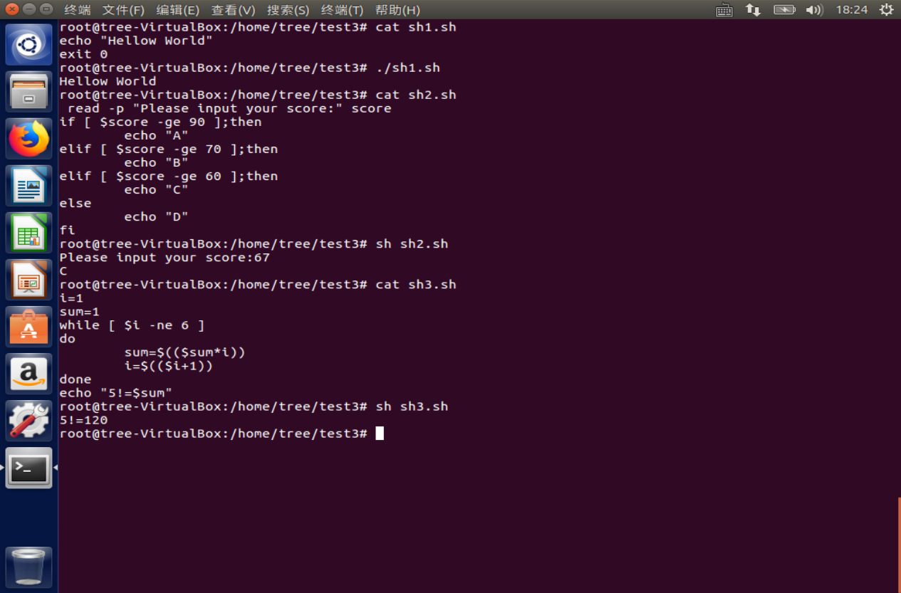
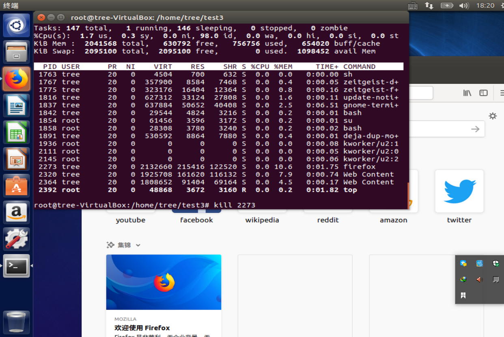
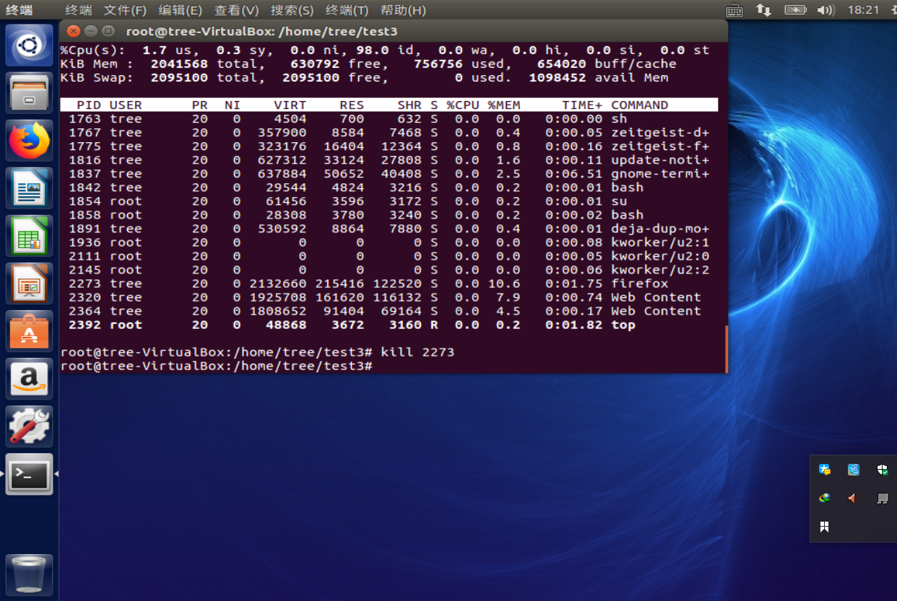

### shell script



```shell
1
echo "Hellow World"
exit 0

2
 read -p "Please input your score:" score
if [ $score -ge 90 ];then
        echo "A"
elif [ $score -ge 70 ];then
        echo "B"
elif [ $score -ge 60 ];then
        echo "C"
else
        echo "D"
fi


3
i=1
sum=1
while [ $i -ne 6 ]
do
        sum=$(($sum*$i))
        i=$(($i+1))
done
echo "5!=$sum"


```

###top & kill 命令






