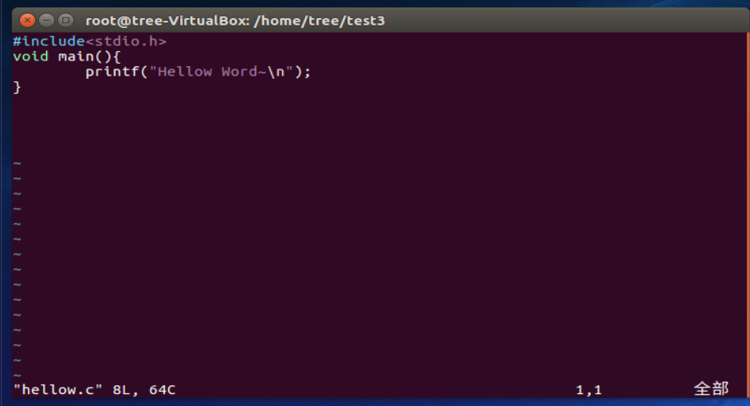
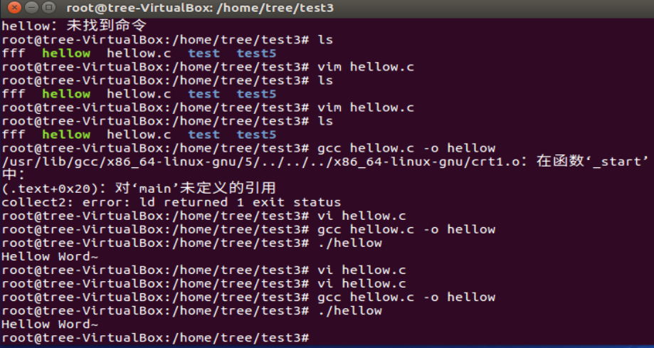

### 文档操作

```shell
cd /usr/share/doc  //绝对路径 从跟目录出发
cd ../man //相对路径 从当前目录触发

pwd  //显示当前目录

mkdir dir //建立新目录

rmdir dir//删除一个空目录 
-m 711 //添加rwx-x-x权限 
-p //多级目录 上同

ls //文档与目录检视 
-a //全部档案，连同隐藏档
-d //仅列出档案本身
-l //长数据传输出，包含属性和权限...

cp [option] 源文件(多个) 目标文件(dir) //复制文档或目录
-a == -pdr
-p //连同文档属性，否则为默认属性
-d //若源文件是link属性，则复制为link属性
-r //递归连续复制，用于目录的复制行为
-i //若目录文件已存在，会在覆盖前询问操作

rm [option] (file/dir)  //删除文档或目录
-f 忽略不存在的文档，不会出现警告
-i 互动，会询问是否删除(y/n)
-r 可以递归删除

mv [option] source destination //移动文档或目录
-f 若文档存在，强制覆盖不询问
-i 若文档存在，询问是否覆盖(y/n)
-u 若文档存在，切source更新，才更新

cat [option] file //文件查看
-A 可以列出一些特殊字符 == -vET
-b 列出行号，忽略空白行
-E 显示结尾的断行字符
-n 打印行号，不忽略空白行
-T 讲Tab以^I显示
-v 列出一些特殊字符

more file //文件查看可滚动
space    向下翻一页
Enter    向下翻一行
/字符串   向下搜索字符串
:f       立即显示出文件名以及显示的目前显示的行数
q        立即离开more,不再显示
b/ctrl-b 往回翻页

less file 
space 同上
[pagedown] 向下翻页
[pageup] 向上翻页
/字符串 向下搜索字符串
?字符串 向上搜索字符串
n 重复上一个搜索
N 反向重复上一个搜索
q 离开less程序

touch [option] file //修改档案时间或建置新档
-a 仅修订access time
-c 仅修改档案时间，若档案不存在也不新建
-d 后面可以接欲修订的日期，而非当前时间 == --date=""
-m 仅修改mtime
-t 后面可以接欲修改时间 格式YYMMDDhhmm

chmod //修改文档权限和目录配置
r:4(read)  (owner/group/others)
w:2(write)  
x:1(execute执行)
1.chmod [-R] xyz 档案戒目彔
xyz : 就是刚刚提到的数字类型的权限属怅，为 rwx 属怅数值的相加。
-R : 迚行递归(recursive)的持续变更，亦即连同次目彔下的所有档案都会变更 
『 -rwxr-xr-- 』==[4+2+1][4+0+1][4+0+0]=754
2.符号类型改变档案权限
chmod 
u(user)    +(加入)    r
g(group)    -(除去)    w 
o(others)    =(讴定)    x
a(all) 
chmod  a-x  .bashrc 
chmod  a+w  .bashrc
『 -rwxr-xr-- 』==『 chmod u=rwx,g=rx,o=r filename 』
```


| 目录相关                 |                                        |
| :----------------------- | :------------------------------------- |
| .                        | 代表此层目录                           |
| ..                       | 上层目录                               |
| -                        | 前一个工作目录                         |
| ~                        | 目前用户所在家目录                     |
| ~account                 | account用户所在家目录                  |
| modification time(mtime) | 当内容数据变更时，会更新这个时间       |
| status time(ctime)       | 当文档的状态(属性，权限)改变时，会更新 |
| access time(atime)       | 当内容被读取时，会更新                 |



