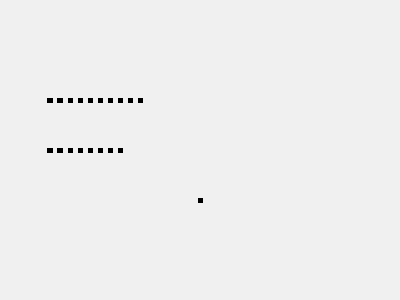

### QPen

```c++
QPen pen;
QString str="咕咕咕(oﾟ▽ﾟ)o!"  
Qpainter painter(this); //创建画笔
painter.setPen(Qt::red); //设置画笔
painter.setFont(QFont("Arial",30));
painter.drawText(rect(),Qt::AlignCenter,str);  //写字

```

`painter.drawText(x,y,str)`

`rect()`用来获取窗体对象的，rect().width()获取窗体宽度。

`painter.drawText(rect(),Qt::AlignCenter,str)`是整体居中

`painter.drawText(rQt::AlignCenter,Qt::AlignCenter,str)`是从中心开始写


### Point

```C++
pen.setWidth(5);
pen.setColor(Qt::green);
painter.setPen(pen);
painter.drwaPoint(200,200);
QPoint pointa(100,100);
painter.drawPoint(pointa);

//画多个点
QPointF pointf[10];
    for (int i=0;i<10;i++){
        pointf[i].setX(50+i*50);
        pointf[i].setY(100);
    }
painter.drawPoints(pointf,10);
```

`drawPoint(x,y)`用来画点

`drawPoints(pointf,num)`用来画多个点，如果该点序列画完，还有其他点序列也会画。是从pointf 先画的意思，然后按创建顺序绘制其他点。

#### demo

```c++
QPainter painter(this);	
QPointF pointf[10];
QPointF point3[10];
for (int i=0;i<10;i++){
    point3[i].setX(50+i*10);
    point3[i].setY(150);
}
for (int i=0;i<10;i++){
    pointf[i].setX(50+i*10);
    pointf[i].setY(100);
}
QPointF point2[2]={
    QPoint(100,100),
    QPoint(200,200)
};
painter.drawPoints(point2,20);
```




### Line
```C++
pen.setColor(QColor(100,100,100));  //可以设置颜色QColor
painter.setPen(pen);
painter.drawLine(100,100,200,200);

//功能与上面一样
QPointF point2[2]={
        QPoint(100,100),
        QPoint(200,200)
};
painter.drawLine(point2[0],point2[1]);

painter.drawLine(rect().topLeft(), rect().bottomRight());
```

`painter.drawLine(x1,y1,x2,y2)`用坐标画

`painter.drawLine(point1,point2)`用点实例画


### Polyline

```C++
static const QPointF points1[3] = {
           QPointF(110.0, 180.0),
           QPointF(120.0, 110.0),
           QPointF(180.0, 130.0),
       };
       painter.drawPolyline(points1, 3);
```


### rectangle
```C++
QRect rectangle(100,100,200,200);
painter.drawRect(rectangle);
//圆角矩形
painter.drawRoundedRect(100,200,300,400, 25.0, 15.0);
```

`public void drawRect (RectF rect, Paint paint)` x,y,width,height

`public void drawRoundRect (RectF rect, float rx, float ry, Paint paint)`圆角矩形


### circle
```C++
QPointF point2[2]={
            QPoint(100,100),
            QPoint(200,200)
        };
QRectF rectangle1(10.0, 100.0, 80.0, 80.0);
   painter.drawEllipse(point2[0].x(),point2[0].y(),point2[1].x(),point2[0].y());
painter.drawEllipse(rectangle1);

//这是一个填充圆
painter.setBrush( QBrush(Qt::red));
painter.drawEllipse(0,0,50,50);
painter.drawLine(0,0,50,50);
```

` void QPaintEngine::drawEllipse(const QRectF &rect)`可以用rect和坐标画


### arc

```C++
painter.drawArc(0,0,200,200,0*16,360*16);

//封闭的弧
painter.drawChord(0,0,200,200,0*16,360*16);
```

**a full circle equals 5760 (16 * 360)**

`void QPainter::drawArc(const QRectF &rectangle, int startAngle, int spanAngle)`

`void QPainter::drawChord(const QRectF &rectangle, int startAngle, int spanAngle)`   //封闭的弧

### ConvexPolygon

```C++
QPoint point5[4]={
        QPoint(100,100),
        QPoint(200,100),
        QPoint(200,200),
        QPoint(100,201),
    };
painter.drawConvexPolygon(point5,4);
```

`void QPainter::drawConvexPolygon(const QPointF *points, int pointCount)`

