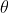
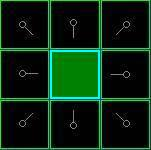

# 寻路介绍

UE4的导航使用的是[RecastDetour](https://github.com/recastnavigation/recastnavigation)组件，这是一个开源组件，主要支持3D场景的导航网格导出和寻路，或者有一个更流行的名字叫做NavMesh。不管是Unity还是UE都使用了这一套组件。不过UE4对其算法做了不小的修改。

简单地来说，寻路分为`体素化`和`利用导航网格寻路`两部分

## 体素化相关概念

### AABB(Axis-aligned bounding box))

即坐标轴对齐的包围盒，它被定义为包含该对象，且边平行于坐标轴的最小六面体


AABB内的点满足以下条件：

```undefined
xmin≤x≤xmax
ymin≤y≤ymax
zmin≤z≤zmax
```

特别重要的两个顶点为：Pmin = [Xmin Ymin Zmin]，Pmax = [ Xmax Ymax Zmax]
 recast项目中用float bmin[3], bmax[3];来描述一个AABB

### 体素（Volume Pixel）

3D空间的像素，是一个量化的固定大小的三维坐标集合，是数字数据于三维空间分割上的最小单位。


### 区间（span）

代表某一方向上连续的格子。


```c++

/// Represents data of span in a heightfield.
/// @see rcHeightfield
struct rcSpanData
{
	unsigned int smin : RC_SPAN_HEIGHT_BITS;	///< The lower limit of the span. [Limit: < #smax]
	unsigned int smax : RC_SPAN_HEIGHT_BITS;	///< The upper limit of the span. [Limit: <= #RC_SPAN_MAX_HEIGHT]
	unsigned int area : 6;			///< The area id assigned to the span.
};

struct rcSpanCache
{
	unsigned short x;
	unsigned short y;
	rcSpanData data;
};

/// Represents a span in a heightfield.
/// @see rcHeightfield
struct rcSpan
{
	rcSpanData data;				///< Span data.
	rcSpan* next;					///< The next span higher up in column.
};
```

### 高度场

容纳所有地图元素的空间容器

高度场维护了一个二维数组来记录空间(特指span)集合，二维数组的单个元素是在xz平面投影相同的span的链表


```c++
/// A dynamic heightfield representing obstructed space.
/// @ingroup recast
struct rcHeightfield
{
	int width;			///< The width of the heightfield. (Along the x-axis in cell units.)
	int height;			///< The height of the heightfield. (Along the z-axis in cell units.)
	float bmin[3];  	///< The minimum bounds in world space. [(x, y, z)]
	float bmax[3];		///< The maximum bounds in world space. [(x, y, z)]
	float cs;			///< The size of each cell. (On the xz-plane.)
	float ch;			///< The height of each cell. (The minimum increment along the y-axis.)
	rcSpan** spans;		///< Heightfield of spans (width*height).
	rcSpanPool* pools;	///< Linked list of span pools.
	rcSpan* freelist;	///< The next free span.

#if EPIC_ADDITION_USE_NEW_RECAST_RASTERIZER
	rcEdgeHit* EdgeHits; ///< h + 1 bit flags that indicate what edges cross the z cell boundaries
	rcRowExt* RowExt;		///< h structs that give the current x range for this z row
	rcTempSpan* tempspans;		///< Heightfield of temp spans (width*height).
#endif
};
```

### 紧缩空间

高度场中的span是三角面的体素集，是“实心”的部分
 紧缩空间是将实心区域之间的“空心”部分取出来
 y是起始高度，也是“实心”空间的可行走的上表面
 h是空心的连续高度
 con用一个uint来表示与4个邻居的联通情况（二进制位压缩表示）

```c++
/// Represents a span of unobstructed space within a compact heightfield.
struct rcCompactSpan
{
	unsigned short y;			///< The lower extent of the span. (Measured from the heightfield's base.)
	unsigned short reg;			///< The id of the region the span belongs to. (Or zero if not in a region.)
	unsigned int con;			///< Packed neighbor connection data.
	unsigned char h;			///< The height of the span.  (Measured from #y.)
};
```


### 紧缩高度场

场景内的紧缩空间集合
 rcCompactCell这个结构记录了投影坐标为xz的这一列上CompactSpan的个数以及在数组中的起始id
 rcCompactSpan* spans 是一个一维数组，按id递增的顺序记录了高度场内的所有CompactSpan

```c++
/// A compact, static heightfield representing unobstructed space.
/// @ingroup recast
struct rcCompactHeightfield
{
	int width;					///< The width of the heightfield. (Along the x-axis in cell units.)
	int height;					///< The height of the heightfield. (Along the z-axis in cell units.)
	int spanCount;				///< The number of spans in the heightfield.
	int walkableHeight;			///< The walkable height used during the build of the field.  (See: rcConfig::walkableHeight)
	int walkableClimb;			///< The walkable climb used during the build of the field. (See: rcConfig::walkableClimb)
	int borderSize;				///< The AABB border size used during the build of the field. (See: rcConfig::borderSize)
	unsigned short maxDistance;	///< The maximum distance value of any span within the field. 
	unsigned short maxRegions;	///< The maximum region id of any span within the field. 
	float bmin[3];				///< The minimum bounds in world space. [(x, y, z)]
	float bmax[3];				///< The maximum bounds in world space. [(x, y, z)]
	float cs;					///< The size of each cell. (On the xz-plane.)
	float ch;					///< The height of each cell. (The minimum increment along the y-axis.)
	rcCompactCell* cells;		///< Array of cells. [Size: #width*#height]
	rcCompactSpan* spans;		///< Array of spans. [Size: #spanCount]
	unsigned short* dist;		///< Array containing border distance data. [Size: #spanCount]
	unsigned char* areas;		///< Array containing area id data. [Size: #spanCount]
};
```

### BVH(Bounding volume hierarchy)

包围体层次结构，是一种用树形结构组织管理空间内物体（几何体）的方法，在项目的代码注释中也被称为AABB Tree。


#### 大致可以看出树和原场景包围盒的对应关系：

 1.根节点是一个大的包围盒，包含所有的几何体
 2.每个叶子节点对应一个独立的几何体
 3.每个非叶子节点有若干个子节点，表示这个大的包围盒内部包含了若干个小的包围盒

#### 存在的作用：

在计算几何中有一个基础的问题：判断一个点是否在场景中的某个几何体内部，如果我们通过枚举场景内的所有几何体，然后依次判断，这显然太暴力了。 一种优化思路是将空间划分成若干区域，首先找到目标点所在的区域，这样就可以剔除掉不在这个区域的几何体，从而减少判断次数。


### 体素化的目标

将整个场景转换为一个个格子内的体素，并标记每个span的可行走状态。以方便后续做区域划分和寻路。

### ue4中的体素化流程

#### 标记可行走的面

这部分逻辑主要在`rcMarkWalkableTrianglesCos()`函数中。

会遍历所有网格的三角形，并计算法线方向。如果发现方向与垂直方向的夹角小于某个配置的值，那么认为这是可行走的。

整个函数的实现如下：

```c++
void rcMarkWalkableTrianglesCos(rcContext* /*ctx*/, const float walkableSlopeCos,
								const float* verts, int /*nv*/,
								const int* tris, int nt,
								unsigned char* areas)
{
	float norm[3];
	for (int i = 0; i < nt; ++i)
	{
		const int* tri = &tris[i*3];
		calcTriNormal(&verts[tri[0]*3], &verts[tri[1]*3], &verts[tri[2]*3], norm);
		// Check if the face is walkable.
		if (norm[1] > walkableSlopeCos)
			areas[i] = RC_WALKABLE_AREA;
	}
}
```

```c++
static void calcTriNormal(const float* v0, const float* v1, const float* v2, float* norm)
{
	float e0[3], e1[3];
	rcVsub(e0, v1, v0);
	rcVsub(e1, v2, v0);
	rcVcross(norm, e0, e1);
	rcVnormalize(norm);
}
```

##### 补充：

1. norm[1] > walkableSlopeCos 判断原理

walkableSlopAngle是面最大可行走倾角

其中norm分别存储了法线的x,y,z分量


如上图所示，设此三角形面的倾角是, 法线是， 则通过简单的三角形原理，可知道

与 的竖直方向分量夹角也是，则

 可知，就是法向量的y分量，也就是代码中的norm[1]

所以 < walkableSlopAngle, 此时代表此三角形是可行走的。

2. 叉积计算法线原理

   https://www.zhihu.com/question/30118900

#### 表格光栅化

这部分逻辑主要在`rcRasterizeTriangles()`函数中。更准确说是在`rasterizeTri()`函数中。

这里使用光栅化这个词，因为Rasterize和渲染管线中的Rasterize是一毛一样的。都是将三角形投影到矩阵（像素或者体素）中。

光栅化的目的，就是找出连续的小格子。不管是连续的开放空间还是连续的密闭空间。光栅化时，也是以三角形为基本单位的。

在上图中，(2,2)这个xz平面的格子上，就有三个span。绿色代表开放空间，红色代表密闭空间。

##### 1.记录xz平面三角形的投影，是一个AABB的包围盒。

```c++
// 这是平面上的点，标记三个顶点分别位于哪个格子
int intverts[3][2];

intverts[0][0] = (int)floorf((v0[0] - bmin[0])*ics);
intverts[0][1] = (int)floorf((v0[2] - bmin[2])*ics);
intverts[1][0] = (int)floorf((v1[0] - bmin[0])*ics);
intverts[1][1] = (int)floorf((v1[2] - bmin[2])*ics);
intverts[2][0] = (int)floorf((v2[0] - bmin[0])*ics);
intverts[2][1] = (int)floorf((v2[2] - bmin[2])*ics);

// 这个三角形所投影出来的AABB包围盒，一个矩形
int x0 = intMin(intverts[0][0], intMin(intverts[1][0], intverts[2][0]));
int x1 = intMax(intverts[0][0], intMax(intverts[1][0], intverts[2][0]));
int y0 = intMin(intverts[0][1], intMin(intverts[1][1], intverts[2][1]));
int y1 = intMax(intverts[0][1], intMax(intverts[1][1], intverts[2][1]));
```

##### 2.在xz平面上，依次遍历三角形的三条边，三条边经过的格子之间划分成一个FlatSpan。

具体原理是按照z轴遍历，并记录某一格z值上的x的最大值和最小值。其数据结构如下：

```c++
struct rcHeightfield
{
	// ...

#if EPIC_ADDITION_USE_NEW_RECAST_RASTERIZER
	rcEdgeHit* EdgeHits; ///< h + 1 bit flags that indicate what edges cross the z cell boundaries
	// 记录了每一个z值上x的最大值和最小值
	rcRowExt* RowExt;		///< h structs that give the current x range for this z row。row代表z，col代表x
	rcTempSpan* tempspans;		///< Heightfield of temp spans (width*height).
#endif
};
```

**核心算法**可以概括为：

i. 记录三角形区域的三条边对应的格子，三条边中间的格子是需要去记录竖直方向体素的格子。  

ii. 记录三角形中间的格子竖直方向连续格子的边界。  

注意，**这个阶段只是标记连续的实心span。至于span是否可行走，则是在第一个阶段通过判断法线方向与竖直方向的夹角就完成了**。实际寻路和后续区域划分用到的都是空心span，会在下一个阶段根据实心span取反生成。

核心算法源代码如下：

```c++
// 记录沿着z方向（Col）的连续格子
static inline void addFlatSpanSample(rcHeightfield& hf, const int x, const int y)
{
    // ...
	hf.RowExt[y + 1].MinCol = intMin(hf.RowExt[y + 1].MinCol, x);
	hf.RowExt[y + 1].MaxCol = intMax(hf.RowExt[y + 1].MaxCol, x);
}

static void rasterizeTri(const float* v0, const float* v1, const float* v2, const unsigned char area, rcHeightfield& hf, const float* bmin, const float* bmax, const float cs, const float ics, const float ich, const int flagMergeThr)
{
    // ...
    // 三条边，每条边有两个float3，分别记录方向向量和向量倒数，用来求交点
    float edges[6][3];
    
    // 如果算出来三角形的y方向均位于同一个y内，只需要计算平面的连续区域
	// 分别遍历三个顶点来计算三条边
	for (int basevert = 0; basevert < 3; basevert++)
	{
		int othervert = basevert == 2 ? 0 : basevert + 1;
		int edge = basevert == 0 ? 2 : basevert - 1;

		rcVsub(&edges[edge][0], vertarray[othervert], vertarray[basevert]);
		//rcVnormalize(&edges[edge][0]);
		//预存斜率。这个用来计算交点。
		edges[3 + edge][0] = 1.0f / edges[edge][0];
		edges[3 + edge][1] = 1.0f / edges[edge][1];
		edges[3 + edge][2] = 1.0f / edges[edge][2];
		
		// ...
		
		// 遍历z方向
		if (intverts[basevert][1] != intverts[othervert][1])
		{
			// 如果当前线段不是沿着x轴平行，即两个端点的z值不相等
			
			// 当前所处理的线段edge的z方向最小格子索引
			int edge0 = intMin(intverts[basevert][1], intverts[othervert][1]);
			// 当前所处理的线段edge的z方向最大格子索引
			int edge1 = intMax(intverts[basevert][1], intverts[othervert][1]);
			int loop0 = intMax(edge0 + 1, y0);
			int loop1 = intMin(edge1, y1_edge);

			// 遍历z方向。因为这是三角形的边，所以只要经过的格子都是体素，都需要记录Hits
			unsigned char edgeBits = (edge << 4) | (othervert << 2) | basevert;
			for (int y = loop0; y <= loop1; y++)
			{
				// 这里的Hits存会记录z方向edge和两个线段的两个终点。
				// Hits的长度为2。因为是三角形的三条边，同一个z最多有两条线段，所以这里记录两次
				int HitIndex = !!hf.EdgeHits[y].Hits[0];
				hf.EdgeHits[y].Hits[HitIndex] = edgeBits;
			}
		}
		
		// 遍历x方向，与z方向大致相同
		if (intverts[basevert][0] != intverts[othervert][0])
		{
			// ...
			addFlatSpanSample(hf, x, y);
			addFlatSpanSample(hf, x - 1, y);
			// ...
		}
		
		// 处理垂直方向
		// ...
		for (int y = loop0; y <= loop1; y++, cz += cs)
		{
		    for (int i = 0; i < 2; i++)
			{
				int edge = Hits.Hits[i] >> 4;
				int othervert = (Hits.Hits[i] >> 2) & 3;
				int basevert = Hits.Hits[i] & 3;

				// 求出三角形的两条边在cz平面上的交点
				intersectZ(vertarray[basevert], &edges[edge][0], cz, Inter[i]);
				// 交点的x值
				int x = (int)floorf((Inter[i][0] - bmin[0])*ics);
				xInter[i] = x;
				if (x >= x0 && x <= x1)
				{
					// 这两个交点之间的格子都可以标记
					addSpanSample(hf, x, y, sint);
					addSpanSample(hf, x, y - 1, sint);
				}
			}
			
			// 处理每条边的情况。这里有个分支，如果三条边都在同一个水平面上，代码会简单并且快速很多。这里讨论不在同一水平面上的情况
			if (xInter[0] != xInter[1])
			{
				// 根据斜率计算每个格子上升的ds值
				int left = Inter[1][0] < Inter[0][0];  
				int xloop0 = intMax(xInter[left] + 1, x0);
				int xloop1 = intMin(xInter[1 - left], x1_edge);

				float d = 1.0f / (Inter[1-left][0] - Inter[left][0]);
				float dy = Inter[1-left][1] - Inter[left][1];
				//float ds = dy * d;
				// ds表示相邻两个格子间上升的y值
				float ds = 0.0f;
				float t = rcClamp((float(xloop0)*cs + bmin[0] - Inter[left][0]) * d, 0.0f, 1.0f);
				float sfloat = (Inter[left][1] + t * dy) - bmin[1];
				if (xloop1 - xloop0 > 0)
				{
					float t2 = rcClamp((float(xloop1)*cs + bmin[0] - Inter[left][0]) * d, 0.0f, 1.0f);
					float sfloat2 = (Inter[left][1] + t2 * dy) - bmin[1];
					ds = (sfloat2 - sfloat) / float(xloop1 - xloop0);
				}
				// 在绝对的sint平面上去addSpan
				for (int x = xloop0; x <= xloop1; x++, sfloat += ds)
				{
					short int sint = (short int)rcClamp((int)floorf(sfloat * ich + 0.5f), -32000, 32000);
					addSpanSample(hf, x, y, sint);
					addSpanSample(hf, x - 1, y, sint);
					addSpanSample(hf, x, y - 1, sint);
					addSpanSample(hf, x - 1, y - 1, sint);
				}
			}
		}
		// 最后一个循环，遍历z轴，找到之前记录的每个z值对应的x的最大值和最小值，进行二维遍历。
		for (int y = y0; y <= y1; y++)
		{
			int xloop0 = intMax(hf.RowExt[y + 1].MinCol, x0);
			int xloop1 = intMin(hf.RowExt[y + 1].MaxCol, x1);
			for (int x = xloop0; x <= xloop1; x++)
			{
				// 二维遍历，取到每个格子列的y轴最大值和最小值
				// ...
				addSpan(hf, x, y, smin, smax, area, flagMergeThr);
			}
			// 清理操作
			// ...
		}
	}
}
```

##### 合并span

```c++
static void addSpan(rcHeightfield& hf, const int x, const int y, const unsigned short smin, const unsigned short smax, const unsigned char area, const int flagMergeThr)
{
    // ...
    // Cur是当前格子的最底层。这是一个链表，记录了从下往上的span列表
	while (cur)
	{
		// 目的是找到与新span相交的span，然后更新span的数据
		// ...
		{
			// 合并span。即更新span的数据
			if (cur->data.smin < s->data.smin)
				s->data.smin = cur->data.smin;
			if (cur->data.smax > s->data.smax)
				s->data.smax = cur->data.smax;
			
			// 合并可行走标记。只要两者有一个是可行走，那么这个span就是可行走
			if (rcAbs((int)s->data.smax - (int)cur->data.smax) <= flagMergeThr)
				s->data.area = rcMax(s->data.area, cur->data.area);

			// 用新span替换掉当前的span
			// ...
		}
	}
	// ...
}
```

#### 过滤可行走表面

##### 高度差合适

**若一个span标记为可行走，那么位于它上方且高度相差小于walkableClimb的span也应标记为可行走**。典型的场景：楼梯台阶。对应的函数为`rcFilterLowHangingWalkableObstacles()`

```c++
void rcFilterLowHangingWalkableObstacles(rcContext* ctx, const int walkableClimb, rcHeightfield& solid)
{
    // ...
    for (rcSpan* s = solid.spans[x + y*w]; s; ps = s, s = s->next)
	{
		const bool walkable = s->data.area != RC_NULL_AREA;
		if (!walkable && previousWalkable)
		{
		    // 如果当前不可行走，但是其下方span可行走，且两者高度差小于walkableClimb，那么认为当前可行走
			if (rcAbs((int)s->data.smax - (int)ps->data.smax) <= walkableClimb)
				s->data.area = previousArea;
		}
		previousWalkable = walkable;
		previousArea = s->data.area;
	}
    // ...
}
```

##### 高度差相差过大

如果一个span和其邻居之间的高度差过大，超过了walkableClimb，那么认为自己在陡坡上，不可达。另外如果其邻居之间的高度差过大，也认为不可达。对应的函数为`rcFilterLedgeSpans()`

```c++
void rcFilterLedgeSpans(rcContext* ctx, const int walkableHeight, const int walkableClimb, rcHeightfield& solid)
{
    // 三维来遍历每个span...
    {
        // 当前span的最顶部
		const int bot = (int)(s->data.smax);
		// 其上方span的最底部
		const int top = s->next ? (int)(s->next->data.smin) : MAX_HEIGHT;
		
		// 表示自己和邻居之间的高度差
		int minh = MAX_HEIGHT;

		// 可达邻居的最小高度
		int asmin = s->data.smax;
		// 可达邻居的最大高度
		int asmax = s->data.smax;

		for (int dir = 0; dir < 4; ++dir)
		{
			// 遍历四个邻居
			// ...
			rcSpan* ns = solid.spans[dx + dy*w];
			// 从可以攀爬的-walkableClimb开始
			int nbot = -walkableClimb;
			// 邻居span的最底部
			int ntop = ns ? (int)ns->data.smin : MAX_HEIGHT;
			// 判断邻居和自己的缝隙的高度差是否容许一个人通过
			if (rcMin(top,ntop) - rcMax(bot,nbot) > walkableHeight)
				minh = rcMin(minh, nbot - bot);
			
			for (ns = solid.spans[dx + dy*w]; ns; ns = ns->next)
			{
			    // 遍历邻居竖直方向的所有span
				nbot = (int)ns->data.smax;
				ntop = ns->next ? (int)ns->next->data.smin : MAX_HEIGHT;
				if (rcMin(top,ntop) - rcMax(bot,nbot) > walkableHeight)
				{
					// 和邻居的地面的高度差
					minh = rcMin(minh, nbot - bot);
				
					// Find min/max accessible neighbour height. 
					if (rcAbs(nbot - bot) <= walkableClimb)
					{
						// 如果高度差可以攀爬，认为该邻居可达，那么记录可达邻居的最小高度asmin和最大高度asmax
						if (nbot < asmin) asmin = nbot;
						if (nbot > asmax) asmax = nbot;
					}
					
				}
			}
		}
		
		// 自己和邻居之间的地面的高度差。如果过大，那么认为不可达
		if (minh < -walkableClimb)
			s->data.area = RC_NULL_AREA;
			
		// 比较可达邻居之间的高度差。如果不同邻居之间高度相差过大，则认为在陡坡上，自己也不可达
		if ((asmax - asmin) > walkableClimb)
		{
			s->data.area = RC_NULL_AREA;
		}
	}
    // ...
}
```

##### span上方有不可行走的障碍

如果某个span可行走，但是其上方有不可行走的障碍物，也认为不可行走。实现函数为`rcFilterWalkableLowHeightSpans()`。源码也非常非常简单。

```c++
for (int y = 0; y < h; ++y)
{
	for (int x = 0; x < w; ++x)
	{
		for (rcSpan* s = solid.spans[x + y*w]; s; s = s->next)
		{
			const int bot = (int)(s->data.smax);
			const int top = s->next ? (int)(s->next->data.smin) : MAX_HEIGHT;
			if ((top - bot) <= walkableHeight)
				s->data.area = RC_NULL_AREA;
		}
	}
}
```

##### 特殊的边缘规则

壁架（ledge）检测（可以理解为过滤边界），如果从span的顶部向下到轴邻域的步进超过可配置的值，则span将被视为壁架并且不可遍历。可视化如下图，蓝色为ledge。

见函数rcFilterLedgeSpans


```c++
/// @par
///
/// A ledge is a span with one or more neighbors whose maximum is further away than @p walkableClimb
/// from the current span's maximum.
/// This method removes the impact of the overestimation of conservative voxelization 
/// so the resulting mesh will not have regions hanging in the air over ledges.
/// 
/// A span is a ledge if: <tt>rcAbs(currentSpan.smax - neighborSpan.smax) > walkableClimb</tt>
/// 
/// @see rcHeightfield, rcConfig
void rcFilterLedgeSpans(rcContext* ctx, const int walkableHeight, const int walkableClimb,
						rcHeightfield& solid)
{
	rcAssert(ctx);
	
	ctx->startTimer(RC_TIMER_FILTER_BORDER);

	const int w = solid.width;
	const int h = solid.height;
	const int MAX_HEIGHT = 0xffff;
	
	// Mark border spans.
	for (int y = 0; y < h; ++y)
	{
		for (int x = 0; x < w; ++x)
		{
			for (rcSpan* s = solid.spans[x + y*w]; s; s = s->next)
			{
				// Skip non walkable spans.
				if (s->data.area == RC_NULL_AREA)
					continue;
				
				const int bot = (int)(s->data.smax);
				const int top = s->next ? (int)(s->next->data.smin) : MAX_HEIGHT;
				
				// Find neighbours minimum height.
				int minh = MAX_HEIGHT;

				// Min and max height of accessible neighbours.
				int asmin = s->data.smax;
				int asmax = s->data.smax;

				for (int dir = 0; dir < 4; ++dir)
				{
					int dx = x + rcGetDirOffsetX(dir);
					int dy = y + rcGetDirOffsetY(dir);
					// Skip neighbours which are out of bounds.
					if (dx < 0 || dy < 0 || dx >= w || dy >= h)
					{
						minh = rcMin(minh, -walkableClimb - bot);
						continue;
					}

					// From minus infinity to the first span.
					rcSpan* ns = solid.spans[dx + dy*w];
					int nbot = -walkableClimb;
					int ntop = ns ? (int)ns->data.smin : MAX_HEIGHT;
					// Skip neightbour if the gap between the spans is too small.
					if (rcMin(top,ntop) - rcMax(bot,nbot) > walkableHeight)
						minh = rcMin(minh, nbot - bot);
					
					// Rest of the spans.
					for (ns = solid.spans[dx + dy*w]; ns; ns = ns->next)
					{
						nbot = (int)ns->data.smax;
						ntop = ns->next ? (int)ns->next->data.smin : MAX_HEIGHT;
						// Skip neightbour if the gap between the spans is too small.
						if (rcMin(top,ntop) - rcMax(bot,nbot) > walkableHeight)
						{
							minh = rcMin(minh, nbot - bot);
						
							// Find min/max accessible neighbour height. 
							if (rcAbs(nbot - bot) <= walkableClimb)
							{
								if (nbot < asmin) asmin = nbot;
								if (nbot > asmax) asmax = nbot;
							}
							
						}
					}
				}
				
				// The current span is close to a ledge if the drop to any
				// neighbour span is less than the walkableClimb.
				if (minh < -walkableClimb)
					s->data.area = RC_NULL_AREA;
					
				// If the difference between all neighbours is too large,
				// we are at steep slope, mark the span as ledge.
				if ((asmax - asmin) > walkableClimb)
				{
					s->data.area = RC_NULL_AREA;
				}
			}
		}
	}
	
	ctx->stopTimer(RC_TIMER_FILTER_BORDER);
}	
```


## 寻路

### A*(A-star algorithm)算法介绍

**别名：**[启发式搜索](http://baike.baidu.com/item/启发式搜索)（它是利用问题拥有的启发信息来引导搜索，达到减少搜索范围、降低问题复杂度的目的，这种利用启发信息的搜索过程称为启发式搜索。）

**原 理：** 距离估算值与实际值越接近程度

**运行条件：** 静态网路

#### 搜索区域(The Search Area)

我们假设某人要从 A 点移动到 B 点，但是这两点之间被一堵墙隔开。如图 1 ，绿色是 A ，红色是 B ，中间蓝色是墙。


图 1

你应该注意到了，我们把要搜寻的区域划分成了正方形的格子。这是寻路的第一步，简化搜索区域，就像我们这里做的一样。这个特殊的方法把我们的搜索区域简化为了 2 维数组。数组的每一项代表一个格子，它的状态就是可走 (walkalbe) 和不可走 (unwalkable) 。通过计算出从 A 到 B需要走过哪些方格，就找到了路径。一旦路径找到了，人物便从一个方格的中心移动到另一个方格的中心，直至到达目的地。

方格的中心点我们成为“节点 (nodes) ”。如果你读过其他关于 A* 寻路算法的文章，你会发现人们常常都在讨论节点。为什么不直接描述为方格呢？因为我们有可能把搜索区域划为为其他多变形而不是正方形，例如可以是六边形，矩形，甚至可以是任意多变形。而节点可以放在任意多边形里面，可以放在多变形的中心，也可以放在多边形的边上。我们使用这个系统，因为它最简单。

#### 开始搜索(Starting the Search)

一旦我们把搜寻区域简化为一组可以量化的节点后，就像上面做的一样，我们下一步要做的便是查找最短路径。在 A* 中，我们从起点开始，检查其相邻的方格，然后向四周扩展，直至找到目标。

我们这样开始我们的寻路旅途：

1. 从起点 A 开始，并把它就加入到一个由方格组成的 open list( 开放列表 ) 中。这个 open list 有点像是一个购物单。当然现在 open list 里只有一项，它就是起点 A ，后面会慢慢加入更多的项。 Open list 里的格子是路径可能会是沿途经过的，也有可能不经过。基本上 open list 是一个待检查的方格列表。

2. 查看与起点 A 相邻的方格 ( 忽略其中墙壁所占领的方格，河流所占领的方格及其他非法地形占领的方格 ) ，把其中可走的 (walkable) 或可到达的 (reachable) 方格也加入到 open list 中。把起点 A 设置为这些方格的父亲 (parent node 或 parent square) 。当我们在追踪路径时，这些父节点的内容是很重要的。稍后解释。

3. 把 A 从 open list 中移除，加入到 close list( 封闭列表 ) 中， close list 中的每个方格都是现在不需要再关注的。

如下图所示，深绿色的方格为起点，它的外框是亮蓝色，表示该方格被加入到了 close list 。与它相邻的黑色方格是需要被检查的，他们的外框是亮绿色。每个黑方格都有一个灰色的指针指向他们的父节点，这里是起点 A 。



图 2 。

下一步，我们需要从 open list 中选一个与起点 A 相邻的方格，按下面描述的一样或多或少的重复前面的步骤。但是到底选择哪个方格好呢？具有最小 F 值的那个。

 

#### 路径排序(Path Sorting)

计算出组成路径的方格的关键是下面这个等式：

F = G + H

这里，

G = 从起点 A 移动到指定方格的移动代价，沿着到达该方格而生成的路径。

H = 从指定的方格移动到终点 B 的估算成本。这个通常被称为试探法，有点让人混淆。为什么这么叫呢，因为这是个猜测。直到我们找到了路径我们才会知道真正的距离，因为途中有各种各样的东西 ( 比如墙壁，水等 ) 。本教程将教你一种计算 H 的方法，你也可以在网上找到其他方法。

我们的路径是这么产生的：反复遍历 open list ，选择 F 值最小的方格。这个过程稍后详细描述。我们还是先看看怎么去计算上面的等式。

如上所述， G 是从起点Ａ移动到指定方格的移动代价。在本例中，横向和纵向的移动代价为 10 ，对角线的移动代价为 14 。之所以使用这些数据，是因为实际的对角移动距离是 2 的平方根，或者是近似的 1.414 倍的横向或纵向移动代价。使用 10 和 14 就是为了简单起见。比例是对的，我们避免了开放和小数的计算。这并不是我们没有这个能力或是不喜欢数学。使用这些数字也可以使计算机更快。稍后你便会发现，如果不使用这些技巧，寻路算法将很慢。

 

既然我们是沿着到达指定方格的路径来计算 G 值，那么计算出该方格的 G 值的方法就是找出其父亲的 G 值，然后按父亲是直线方向还是斜线方向加上 10 或 14 。随着我们离开起点而得到更多的方格，这个方法会变得更加明朗。

 

有很多方法可以估算 H 值。这里我们使用 Manhattan 方法，计算从当前方格横向或纵向移动到达目标所经过的方格数，忽略对角移动，然后把总数乘以 10 。之所以叫做 Manhattan 方法，是因为这很像统计从一个地点到另一个地点所穿过的街区数，而你不能斜向穿过街区。重要的是，计算 H 是，要忽略路径中的障碍物。这是对剩余距离的估算值，而不是实际值，因此才称为试探法。

 

把 G 和 H 相加便得到 F 。我们第一步的结果如下图所示。每个方格都标上了 F ， G ， H 的值，就像起点右边的方格那样，左上角是 F ，左下角是 G ，右下角是 H 。


图 3

好，现在让我们看看其中的一些方格。在标有字母的方格， G = 10 。这是因为水平方向从起点到那里只有一个方格的距离。与起点直接相邻的上方，下方，左方的方格的 G 值都是 10 ，对角线的方格 G 值都是 14 。

 

H 值通过估算起点于终点 ( 红色方格 ) 的 Manhattan 距离得到，仅作横向和纵向移动，并且忽略沿途的墙壁。使用这种方式，起点右边的方格到终点有 3 个方格的距离，因此 H = 30 。这个方格上方的方格到终点有 4 个方格的距离 ( 注意只计算横向和纵向距离 ) ，因此 H = 40 。对于其他的方格，你可以用同样的方法知道 H 值是如何得来的。

 

每个方格的 F 值，再说一次，直接把 G 值和 H 值相加就可以了。

 

#### 继续搜索(Continuing the Search)

为了继续搜索，我们从 open list 中选择 F 值最小的 ( 方格 ) 节点，然后对所选择的方格作如下操作：

4. 把它从 open list 里取出，放到 close list 中。

5. 检查所有与它相邻的方格，忽略其中在 close list 中或是不可走 (unwalkable) 的方格 ( 比如墙，水，或是其他非法地形 ) ，如果方格不在open lsit 中，则把它们加入到 open list 中。

把我们选定的方格设置为这些新加入的方格的父亲。

6. 如果某个相邻的方格已经在 open list 中，则检查这条路径是否更优，也就是说经由当前方格 ( 我们选中的方格 ) 到达那个方格是否具有更小的 G 值。如果没有，不做任何操作。

相反，如果 G 值更小，则把那个方格的父亲设为当前方格 ( 我们选中的方格 ) ，然后重新计算那个方格的 F 值和 G 值。如果你还是很混淆，请参考下图。


图 4

Ok ，让我们看看它是怎么工作的。在我们最初的 9 个方格中，还有 8 个在 open list 中，起点被放入了 close list 中。在这些方格中，起点右边的格子的 F 值 40 最小，因此我们选择这个方格作为下一个要处理的方格。它的外框用蓝线打亮。

 

首先，我们把它从 open list 移到 close list 中 ( 这就是为什么用蓝线打亮的原因了 ) 。然后我们检查与它相邻的方格。它右边的方格是墙壁，我们忽略。它左边的方格是起点，在 close list 中，我们也忽略。其他 4 个相邻的方格均在 open list 中，我们需要检查经由这个方格到达那里的路径是否更好，使用 G 值来判定。让我们看看上面的方格。它现在的 G 值为 14 。如果我们经由当前方格到达那里， G 值将会为 20(其中 10 为到达当前方格的 G 值，此外还要加上从当前方格纵向移动到上面方格的 G 值 10) 。显然 20 比 14 大，因此这不是最优的路径。如果你看图你就会明白。直接从起点沿对角线移动到那个方格比先横向移动再纵向移动要好。

 

当把 4 个已经在 open list 中的相邻方格都检查后，没有发现经由当前方格的更好路径，因此我们不做任何改变。现在我们已经检查了当前方格的所有相邻的方格，并也对他们作了处理，是时候选择下一个待处理的方格了。

 

因此再次遍历我们的 open list ，现在它只有 7 个方格了，我们需要选择 F 值最小的那个。有趣的是，这次有两个方格的 F 值都 54 ，选哪个呢？没什么关系。从速度上考虑，选择最后加入 open list 的方格更快。这导致了在寻路过程中，当靠近目标时，优先使用新找到的方格的偏好。但是这并不重要。 ( 对相同数据的不同对待，导致两中版本的 A* 找到等长的不同路径 ) 。

 

我们选择起点右下方的方格，如下图所示。


图 5

 

这次，当我们检查相邻的方格时，我们发现它右边的方格是墙，忽略之。上面的也一样。

我们把墙下面的一格也忽略掉。为什么？因为如果不穿越墙角的话，你不能直接从当前方格移动到那个方格。你需要先往下走，然后再移动到那个方格，这样来绕过墙角。 ( 注意：穿越墙角的规则是可选的，依赖于你的节点是怎么放置的 )

这样还剩下 5 个相邻的方格。当前方格下面的 2 个方格还没有加入 open list ，所以把它们加入，同时把当前方格设为他们的父亲。在剩下的3 个方格中，有 2 个已经在 close list 中 ( 一个是起点，一个是当前方格上面的方格，外框被加亮的 ) ，我们忽略它们。最后一个方格，也就是当前方格左边的方格，我们检查经由当前方格到达那里是否具有更小的 G 值。没有。因此我们准备从 open list 中选择下一个待处理的方格。

不断重复这个过程，直到把终点也加入到了 open list 中，此时如下图所示。


图 6

 

注意，在起点下面 2 格的方格的父亲已经与前面不同了。之前它的 G 值是 28 并且指向它右上方的方格。现在它的 G 值为 20 ，并且指向它正上方的方格。这在寻路过程中的某处发生，使用新路径时 G 值经过检查并且变得更低，因此父节点被重新设置， G 和 F 值被重新计算。尽管这一变化在本例中并不重要，但是在很多场合中，这种变化会导致寻路结果的巨大变化。

那么我们怎么样去确定实际路径呢？很简单，从终点开始，按着箭头向父节点移动，这样你就被带回到了起点，这就是你的路径。如下图所示。从起点 A 移动到终点 B 就是简单从路径上的一个方格的中心移动到另一个方格的中心，直至目标。就是这么简单！


图 7

 

#### A*算法总结(Summary of the A* Method)

Ok ，现在你已经看完了整个的介绍，现在我们把所有步骤放在一起：

1. 把起点加入 open list 。

2. 重复如下过程：
   -  遍历 open list ，查找 F 值最小的节点，把它作为当前要处理的节点。
   -  把这个节点移到 close list 。
   -    对当前方格的 8 个相邻方格的每一个方格？

◆   如果它是不可抵达的或者它在 close list 中，忽略它。否则，做如下操作。

◆   如果它不在 open list 中，把它加入 open list ，并且把当前方格设置为它的父亲，记录该方格的 F ， G 和 H 值。

◆   如果它已经在 open list 中，检查这条路径 ( 即经由当前方格到达它那里 ) 是否更好，用 G 值作参考。更小的 G 值表示这是更好的路径。如果是这样，把它的父亲设置为当前方格，并重新计算它的 G 和 F 值。如果你的 open list 是按 F 值排序的话，改变后你可能需要重新排序。

3. 停止，当你

◆   把终点加入到了 open list 中，此时路径已经找到了，或者

◆   查找终点失败，并且 open list 是空的，此时没有路径。

4. 保存路径。从终点开始，每个方格沿着父节点移动直至起点，这就是你的路径。

