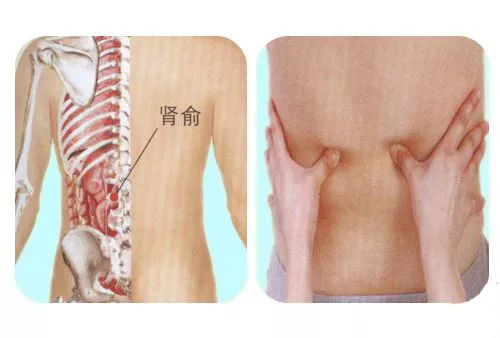
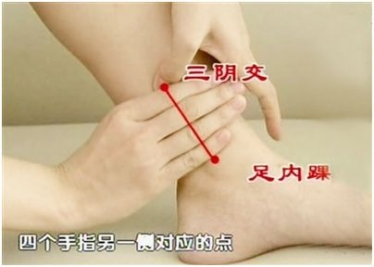
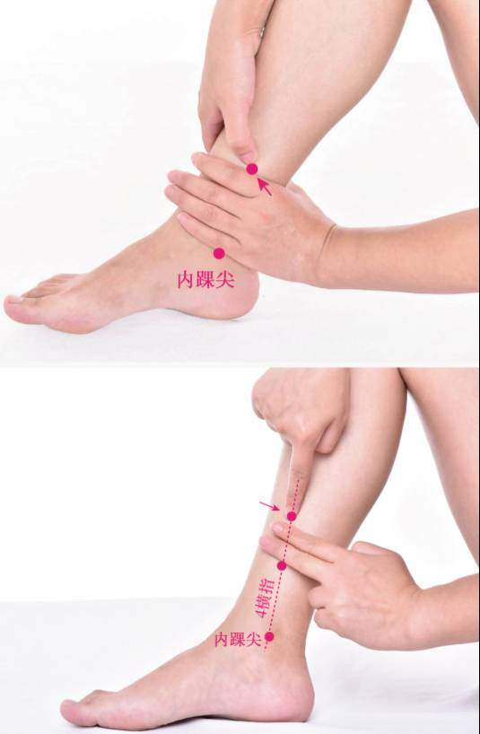

## 忌食

> 需要结合个人情况，每个人可能不太一样。最好别吃，实在忍不住适量摄入，别吃冰过的，在常温状态下吃。

### 寒性食物

原理：吃冰会让体质偏寒的人减低脏腑阳气运作，让身体代谢循环下降，经血量变少，子宫收缩强烈而加重经痛。

如：冷饮，雪糕，冬瓜，黄瓜，蟹，西瓜等等。

### 辛辣食物（刺激性食物）

原理：辛辣的食物很有可能会导致盆腔出现充血，而且有可能会使子宫出现过度收缩的症状，这两种情况都会导致痛经情况加重。会引起内分泌系统的失调，导致月经的周期发生变化。

### 烟酒

原理：可能会影响子宫的收缩，导致月经血过多或者是月经周期延长。

## 宜食

### 热水！

### 热水！

### 热水！

### 温性水果

如：荔枝、金橘、石榴、杨梅、桃子、樱桃、蜜橘、橙子、李子，木瓜。

### 红糖生姜

### 其他

> 维生素B1，维生素E

> 如含有丹参，红花，益母草，泽兰，牛漆，鸡血藤的小食品等。

> 当归芍药散

## 痛经缓解

- 热水，红糖姜茶
- 39度的局部热敷

- 放松，穴位按摩
- 布洛芬（止疼药物，副作用是`容易引起消化道溃疡，出血`，不如和姜茶）

##  实用按摩方法 

### 月经不调

> 症状：周期异常，出血量少，痛经，抑郁。

#### 肾俞

方法：双手叉腰，拇指按揉两侧肾俞一分钟。

位置：肾俞在肚脐平行线与脊椎交接点左右隔开两个指头的位置。

#### 三阴交

方法：用拇指指腹点按三阴交一分钟。

位置：三阴交穴在小腿内侧，脚踝骨的最高点往上三寸处(自己的手横着放，约四根手指横着的宽度)。按压有一骨头为胫骨，此穴位于胫骨后缘靠近骨边凹陷处。在摸的时候一般都有一点胀，压的时候会有痛感。

#### 血海

方法：用拇指指腹点按血海一分钟，力度均匀。

位置：血海穴位于大腿内侧，从膝盖骨内侧的上角，上面约三指宽筋肉的沟，一按就感觉到痛的地方，有称为血海的穴位。

#### 地极

方法：用拇指指腹按揉地极（小腿中部凹陷处很容易找到哦）一分钟，力度适中。

位置：在小腿内侧，当内踝尖与阴陵泉的连线上，阴陵泉下3寸。侧坐或仰卧位。先确定阴陵泉穴的位置，从阴陵泉直下4个横指，在胫骨内侧缘，按压有酸胀感处即为此穴。

###     痛经

> 症状：腰部疼痛，来经疼痛难忍，手和脚都很冷。

#### 气海

方法：中间三指并拢，用手掌顺时针方向在气海（肚脐向下两指处）按摩三十圈。

位置：位于人体下腹部，体前正中线，脐下1寸半，肚脐下两指宽处。

#### 肾俞

方法：双手叉腰，用拇指电压两侧肾俞一分钟。

[位置如上](#xy_pos)

#### 血海

方法：用拇指指腹按压血海两分钟，力度适中。

[位置如上](#xh_pos)

#### 蠡（li）沟

方法：以拇指指端用力点按蠡沟。

位置：在[小腿](https://baike.baidu.com/item/小腿)内侧，当足[内踝尖](https://baike.baidu.com/item/内踝尖)上5寸，胫骨内侧面中央。正坐或仰卧位，先在[内踝尖](https://baike.baidu.com/item/内踝尖)上5寸的[胫骨](https://baike.baidu.com/item/胫骨)内侧面上作一水平线，当胫骨内侧面的后中1/3交点处取穴。

### 少经闭经

> 经少色淡，初潮较迟，面色苍白无华，一点都不红润。

#### 肾俞

方法：双手叉腰，用拇指点压肾俞20次。

[位置如上](#xy_pos)

#### 血海

方法：用拇指指腹用力按压20次。

[位置如上](#xh_pos)

#### 三阴交

方法：用拇指指腹按压20次。

[位置如上](#syj_pos)

#### 足三里

方法：用拇指指腹按揉足三里50次

位置：在小腿前外侧，当犊鼻下3寸（即：外膝眼下四横指），距胫骨前缘一横指，胫骨前肌上。

## 其他建议

来经时脾气暴躁是正常的，不要认为要什么异常，也不要给自己压力。
大部分的痛经闭经都是因为作息和饮食的不正确引起的，所以啊，要好好对自己喔，晚上早点睡，睡前尽量别打竞技类游戏，别看恐怖片，最好再喝点热牛奶，辣条火锅麻辣烫戒肯定是不会戒的，但是一个月四五次就是极限了。

## 懒人版

女生自救方法：
1.暖宝宝，热水袋
2.热水，红糖水，姜茶
3.按三阴交和足三里
4.热水泡脚
5.布洛芬，避孕药

