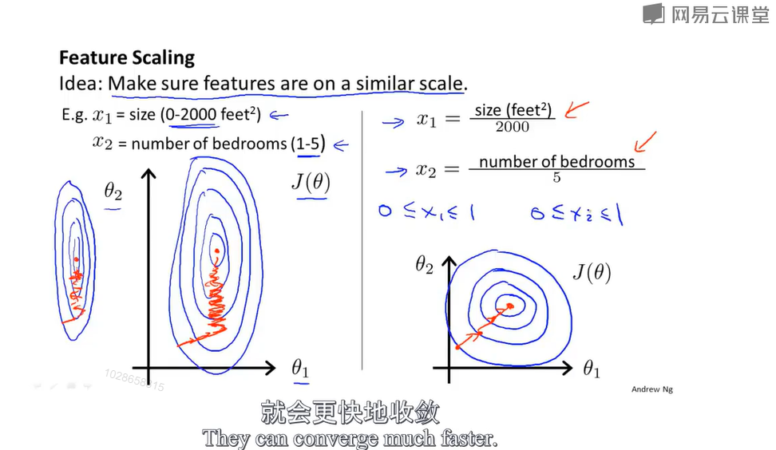

## iris classfication

```python
from sklearn import datasets
from sklearn.model_selection import train_test_split
from sklearn.neighbors import KNeighborsClassifier
iris = datasets.load_iris()
iris_X = iris.data
iris_y = iris.target

##print(iris_X[:2, :])
##print(iris_y)

X_train, X_test, y_train, y_test = train_test_split(
    iris_X, iris_y, test_size=0.3)
#将iris_X和iris_y分别分成X_train, X_test, y_train, y_test,其中test占30%

# print(iris_X)
print(iris_y,len(iris_X),len(iris_y))
print(y_train)
print(y_test)

knn = KNeighborsClassifier()
knn.fit(X_train, y_train)
print(knn.predict(X_test))
print(y_test)
```

https://scikit-learn.org/stable/modules/classes.html#module-sklearn.datasets

sklearn的数据库

## sklearn的数据使用

```python
from sklearn import datasets
from sklearn.linear_model import LinearRegression
import matplotlib.pyplot as plt

loaded_data = datasets.load_boston()
data_X = loaded_data.data
data_y = loaded_data.target

model = LinearRegression()
model.fit(data_X, data_y)

print(model.predict(data_X[:4, :]))
print(data_y[:4])
#取前四个对比预测情况

X, y = datasets.make_regression(n_samples=100, n_features=1, n_targets=1, noise=10)
#自己构造数据
plt.scatter(X, y)
plt.show()
```

## moudle的常用数据和功能

```python
from sklearn import datasets
from sklearn.linear_model import LinearRegression

loaded_data = datasets.load_boston()
data_X = loaded_data.data
data_y = loaded_data.target

model = LinearRegression()
model.fit(data_X, data_y)

print(model.predict(data_X[:4, :]))
print(model.coef_)#输出w z=w1x1+w2x2+w3x3+w4x4...+b
print(model.intercept_)#输出b
print(model.get_params())#输出构建模型时的参数LinearRegression()里面的
print(model.score(data_X, data_y)) # R^2 coefficient of determination
#输出模型预测的准确度
```

## normalization 特征缩放



```python
from sklearn import preprocessing
import numpy as np
from sklearn.model_selection import train_test_split
from sklearn.datasets.samples_generator import make_classification
from sklearn.svm import SVC
import matplotlib.pyplot as plt

a = np.array([[10, 2.7, 3.6],
              [-100, 5, -2],
              [120, 20, 40]], dtype=np.float64)
print(a)
print(preprocessing.scale(a))

X, y = make_classification(n_samples=300, n_features=2 , n_redundant=0, n_informative=2,
                           random_state=22, n_clusters_per_class=1, scale=100)
plt.scatter(X[:, 0], X[:, 1], c=y)
plt.show()
X = preprocessing.scale(X)    # normalization step
X_train, X_test, y_train, y_test = train_test_split(X, y, test_size=.3)
clf = SVC()
clf.fit(X_train, y_train)
print(clf.score(X_test, y_test))
```

