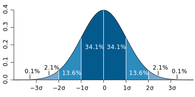

## tf.random_normal()函数




所以默认的mu = 0, sigma =1 大约在-3~3	

分布率：0.1%(-∞~-3)	2.1%(-3~-2)	13.6%(-2~-1)	34.1%(-1~0)	34.1%(0~1)	13.6%(1~2) 	2.1%(2~3)	0.1%(3~+∞)

```python
tf.random_normal()函数用于从服从指定正太分布的数值中取出指定个数的值x。

tf.random_normal(shape, mean=0.0, stddev=1.0, dtype=tf.float32, seed=None, name=None)


    shape: 输出张量的形状，必选
    mean: 正态分布的均值，默认为0
    stddev: 正态分布的标准差，默认为1.0
    dtype: 输出的类型，默认为tf.float32
    seed: 随机数种子，是一个整数，当设置之后，每次生成的随机数都一样，当跨会话访问时产生相同的随机序列
    name: 操作的名称

```

## tf.reduce_sum()

```python
x = tf.constant([[1, 1, 1], [1, 1, 1]])
tf.reduce_sum(x)  # 6
tf.reduce_sum(x, 0)  # [2, 2, 2]
tf.reduce_sum(x, 1)  # [3, 3]
tf.reduce_sum(x, 1, keepdims=True)  # [[3], [3]]
tf.reduce_sum(x, [0, 1])  # 6

tf.math.reduce_sum(
    input_tensor,
    axis=None,
    keepdims=None,
    name=None,
    reduction_indices=None,#就是axis
    keep_dims=None#就是keepdims
)
```

## reduce_mean()

```python
x = tf.constant([[1., 1.], [2., 2.]])
tf.reduce_mean(x)  # 1.5
tf.reduce_mean(x, 0)  # [1.5, 1.5]
tf.reduce_mean(x, 1)  # [1.,  2.]
```

## tf.compat.v1.placeholder()

```python
x = tf.compat.v1.placeholder(tf.float32, shape=(1024, 1024))
y = tf.matmul(x, x)

with tf.compat.v1.Session() as sess:
	print(sess.run(y))  # ERROR: will fail because x was not fed.
	rand_array = np.random.rand(1024, 1024)
	print(sess.run(y, feed_dict={x: rand_array}))  # Will succeed.

shape(None,1)#行数不限,列数为1
shape(1,None)#行列数不限,行数为1
```

