## 变量

```python
import tensorflow as tf

state = tf.Variable(0,name='counter')
print(state,state.name)
one = tf.constant(1)

new_value = tf.add(state,one)
update = tf.compat.v1.assign(state,new_value) #将new_value加载到state,就是把state=new_value

init = tf.compat.v1.global_variables_initializer(); #must have this if define variable
sess = tf.compat.v1.Session()
sess.run(init)
for _ in range(5):
    sess.run(update)
print(sess.run(state),sess.run(one))

<tf.Variable 'counter:0' shape=() dtype=int32_ref> counter:0
5 1

inputone = tf.compat.v1.placeholder(tf.float32)#placeholder(tf.float32,[[],[]])可以规定输入的类型
inputtwo = tf.compat.v1.placeholder(tf.float32)

outputmatmul = tf.multiply(inputone,inputtwo)
outputmat = tf.matmul(inputone,inputtwo)

print('outputmatmul：',sess.run(outputmatmul,feed_dict={inputone:[7.],inputtwo:[2.]}))
print('outputmat：',sess.run(outputmat,feed_dict={inputone:[[7.]],inputtwo:[[2.]]}))

outputmatmul： [14.]
outputmat： [[14.]]
```

## Session()

```python
import tensorflow as tf
martix1  = tf.constant([[3,3]])
martix2 = tf.constant([[2],[2]])

product = tf.matmul(martix1,martix2) #matrix multiply np.dot(m1,m2)

#method 1
sess=tf.Session()
result = sess.run(product)
print(result)
sess.close()

#method 2 
with tf.Session() as sess:
    result2 = sess.run(product)
    print(result2)

[[12]]
[[12]]    
```

## 激励函数

激励函数运行时激活神经网络中某一部分神经元，将激活信息向后传入下一层的神经系统。激励函数的实质是非线性方程。 Tensorflow 的神经网络 里面处理较为复杂的问题时都会需要运用激励函数 `activation function` 。


激励函数的作用：

激活函数是用来加入非线性因素的，因为线性模型的表达能力不够。

以下，同种颜色为同类数据。

某些数据是线性可分的，意思是，可以用一条直线将数据分开。比如下图：

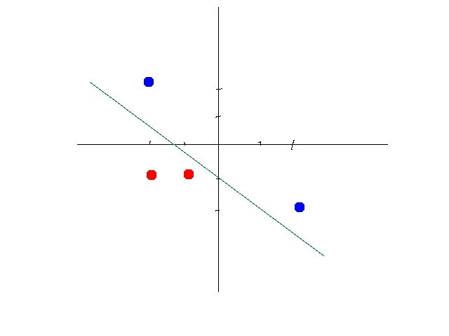


这时候你需要通过一定的机器学习的方法，比如感知机算法(perceptron learning algorithm) 找到一个合适的线性方程。

但是有些数据不是线性可分的。比如如下数据：

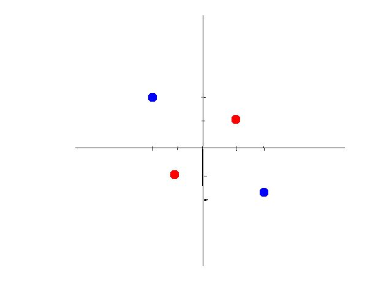


第二组数据你就没有办法画出一条直线来将数据区分开。

这时候有两个办法，第一个办法，是做线性变换(linear transformation)，比如讲x,y变成x^2,y^2，这样可以画出圆形。如图所示：

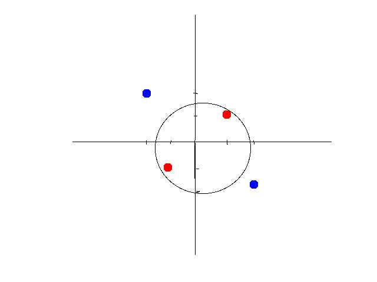


如果将坐标轴从x,y变为以x^2,y^2为标准，你会发现数据经过变换后是线性可分的了。大致示意图如下：

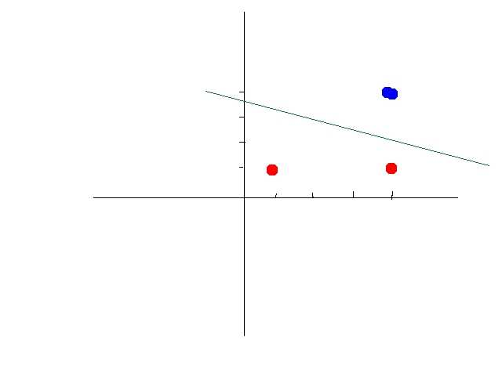

另外一种方法是引入非线性函数。我们来看异或问题(xor problem)。以下是xor真值表


这个真值表不是线性可分的，所以不能使用线性模型，如图所示

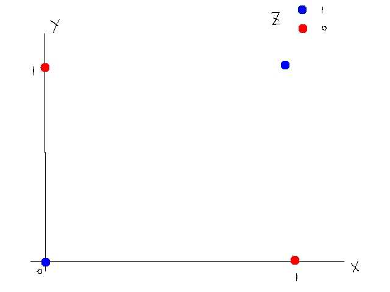


我们可以设计一种神经网络，通过激活函数来使得这组数据线性可分。激活函数我们选择阀值函数（threshold function），也就是大于某个值输出1（被激活了），小于等于则输出0（没有激活）。这个函数是非线性函数。

神经网络示意图如下：


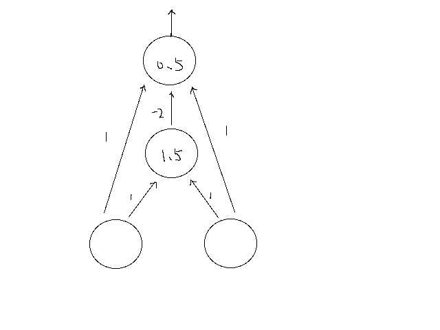

其中直线上的数字为权重。圆圈中的数字为阀值。第二层，如果输入大于1.5则输出1，否则0；第三层，如果输入大于0.5，则输出1，否则0.


我们来一步步算。

第一层到第二层（阀值1.5）

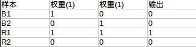


第二层到第三层(阀值0.5)

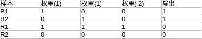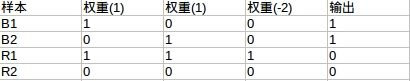


可以看到第三层输出就是我们所要的xor的答案。

经过变换后的数据是线性可分的（n维，比如本例中可以用平面），如图所示：

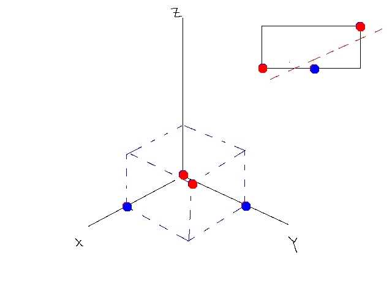

总而言之，激活函数可以引入非线性因素，解决线性模型所不能解决的问题。

## 制作神经层

```python
import tensorflow as tf
import numpy as np
def add_layer(inputs,in_size,out_size,activation_function=None):
    Weights = tf.Variable(tf.random.normal([in_size,out_size]))
    biases = tf.Variable(tf.zeros([1,out_size])+0.1)
    Wx_plus_b = tf.matmul(inputs,Weights)+biases
    if activation_function is None:
        outputs = Wx_plus_b
    else:
        outputs = activation_function(Wx_plus_b)
    return outputs
```

## 构造神经网络

```python
import tensorflow as tf
import numpy as np
def add_layer(inputs,in_size,out_size,activation_function=None):
    Weights = tf.Variable(tf.random.normal([in_size,out_size]))
    #tf.random_normal()函数用于从服从指定正态分布的数值中取出指定个数的值x。mu=0,sigma=1.0,shape=[in_size,out_size]
    #默认的mu = 0, sigma =1 大约在-3~3	分布率：0.1%(-∞~-3) 2.1%(-3~-2) 13.6%(-2~-1) 34.1%(-1~0) 34.1%(0~1) 13.6%(1~2) 2.1%(2~3) 0.1%(3~+∞)
    biases = tf.Variable(tf.zeros([1,out_size])+0.1)
    #产生一个shape=[1,out_size]的值为0.1的序列
    Wx_plus_b = tf.matmul(inputs,Weights)+biases
    #Weights与inputs的点积+biases
    if activation_function is None:
        outputs = Wx_plus_b
    else:
        outputs = activation_function(Wx_plus_b)
        #使用非激励函数判断是否激活这个数
    return outputs
    
x_data = np.linspace(-1,1,300)[:,np.newaxis] 
#产生从-1~1的300个元素，每一个元素有一个新的维度（np.newaxis == None），就是[300,1]
#当np.newaxis在【，】前面时，变为列扩展的二维数组 
#当np.newaxis在【，】后面时，变为行扩展的二维数组

noise = np.random.normal(0,0.05,x_data.shape)
#numpy.random.normal(loc=0.0, scale=1.0, size=None)
#shape 是个数,从mu=0,sigma=0.05,的正态分布中取x_data.shape个样本
#noise 大约在-4mu~4mu(-0.2~0.2)之间

y_data = np.square(x_data)-0.5+noise
#y=x^2-0.5+noise

xs=tf.compat.v1.placeholder(tf.float32,[None,1])
#表示xs的shape为行数不定，列数为1
ys=tf.compat.v1.placeholder(tf.float32,[None,1])
#表示ys的shape为行数不定，列数为1


l1 = add_layer(xs,1,10,activation_function=tf.nn.relu)
#输入层到隐藏层
production = add_layer(l1,10,1,activation_function=None)
#隐藏层到输出层

loss = tf.reduce_mean(tf.reduce_sum(tf.square(ys-production),axis=[1]))
#对(ys-production)^2进行行（axis=[1]）的求和，再对整体求平均值,求方差，反应了ys与production的差异
train_step = tf.compat.v1.train.GradientDescentOptimizer(0.1).minimize(loss)
#训练过程，学习效率为0.1,以减小loss（误差，方差）的方式

init = tf.compat.v1.global_variables_initializer()
#初始化tf变量
sess=tf.compat.v1.Session()
#打开session会话
sess.run(init)
for i in range(1000):
    sess.run(train_step,feed_dict={xs:x_data,ys:y_data})
    #训练一千次,在需要使用到xs,ys的时候需要传入x_data和y_data
    if i%50 ==0:
        print(sess.run(loss,feed_dict={xs:x_data,ys:y_data}))
    
0.23923172
0.00806976
0.0060603623
0.004861292
0.0042515188
0.0038913016
0.0036340267
0.0034474453
0.0033081323
0.003212941
0.0031421692
0.00308567
0.003031146
0.0029847773
0.0029421616
0.0029094915
0.0028847102
0.0028647787
0.0028485947
0.0028353517
```
$$
\begin{equation}
\sigma^2=\frac{\sum{(X-\mu)^2}}{N}
\end{equation}\\
\sigma^2为总体方差，X为变量，\mu为总体均值，N为总体例数。
$$

## 将数据可视化

```python
#在上面的例子中添加如下代码
import matplotlib.pyplot as plt
fig = plt.figure()#生成一个图片框
ax = fig.add_subplot(1,1,1)#将画布分隔成一行一列，图像画在从左到右从上到下的第1块
ax.scatter(x_data,y_data)#点类型
plt.ion()#用于连续show,不然show之后会停止程序
plt.show()

for i in range(1000):
    sess.run(train_step,feed_dict={xs:x_data,ys:y_data})
    #训练一千次,在需要使用到xs,ys的时候需要传入x_data和y_data
    if i%50 ==0:
        try:
            ax.lines.remove(lines[0])
        except:
            pass
        print(sess.run(loss,feed_dict={xs:x_data,ys:y_data}))
        production_value = sess.run(production,feed_dict={xs:x_data})
        lines = ax.plot(x_data,production_value,'r-',lw=5)#r-红色
        plt.pause(.1)

plt.pause(0)#暂停程序，不然执行完会自动关闭
```

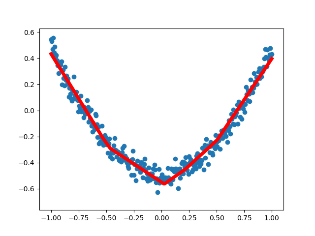

## 加速神经网络和常用优化器

包括以下几种模式:

- Stochastic Gradient Descent (SGD)
- Momentum
- AdaGrad
- RMSProp
- Adam

### GSD

将数据分成小批来加入NN运算，能够提升训练效率。

[](https://morvanzhou.github.io/static/results/ML-intro/speedup3.png)

事实证明, SGD 并不是最快速的训练方法, 红色的线是 SGD, 但它到达学习目标的时间是在这些方法中最长的一种. 我们还有很多其他的途径来加速训练.

### Momentum 更新方法

传统的参数 W 的更新是把原始的 W 累加上一个负的学习率(learning rate) 乘以校正值 (dx). 这种方法可能会让学习过程曲折无比,看起来像 喝醉的人回家时, 摇摇晃晃走了很多弯路.

[](https://morvanzhou.github.io/static/results/ML-intro/speedup5.png)

所以我们把这个人从平地上放到了一个斜坡上, 只要他往下坡的方向走一点点, 由于向下的惯性, 他不自觉地就一直往下走, 走的弯路也变少了. 这就是 Momentum 参数更新. 另外一种加速方法叫AdaGrad.

### AdaGrad 更新方法

[](https://morvanzhou.github.io/static/results/ML-intro/speedup6.png)

这种方法是在学习率上面动手脚, 使得每一个参数更新都会有自己与众不同的学习率, 他的作用和 momentum 类似, 不过不是给喝醉酒的人安排另一个下坡, 而是给他一双不好走路的鞋子, 使得他一摇晃着走路就脚疼, 鞋子成为了走弯路的阻力, 逼着他往前直着走. 他的数学形式是这样的. 接下来又有什么方法呢? 如果把下坡和不好走路的鞋子合并起来, 是不是更好呢? 没错, 这样我们就有了 RMSProp 更新方法.

### RMSProp 更新方法

[](https://morvanzhou.github.io/static/results/ML-intro/speedup7.png)

有了 momentum 的惯性原则 , 加上 adagrad 的对错误方向的阻力, 我们就能合并成这样. 让 RMSProp同时具备他们两种方法的优势. 不过细心的同学们肯定看出来了, 似乎在 RMSProp 中少了些什么. 原来是我们还没把 Momentum合并完全, RMSProp 还缺少了 momentum 中的 这一部分. 所以, 我们在 Adam 方法中补上了这种想法.

### Adam 更新方法

[](https://morvanzhou.github.io/static/results/ML-intro/speedup8.png)

计算m 时有 momentum 下坡的属性, 计算 v 时有 adagrad 阻力的属性, 然后再更新参数时 把 m 和 V 都考虑进去. 实验证明, 大多数时候, 使用 adam 都能又快又好的达到目标, 迅速收敛. 所以说, 在加速神经网络训练的时候, 一个下坡, 一双破鞋子, 功不可没.

优化器的差异：http://cs231n.github.io/neural-networks-3/

## 可视化神经网络

可以看到神经网络结构

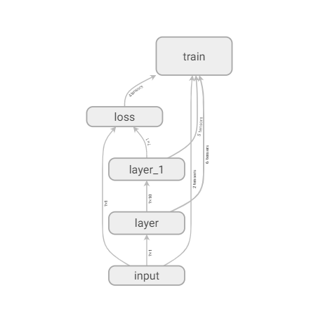

```python
import tensorflow as tf

def add_layer(inputs, in_size, out_size, activation_function=None):
    # add one more layer and return the output of this layer
    with tf.name_scope('layer'):
        with tf.name_scope('weights'):
            Weights = tf.Variable(tf.random_normal([in_size, out_size]), name='W')
        with tf.name_scope('biases'):
            biases = tf.Variable(tf.zeros([1, out_size]) + 0.1, name='b')
        with tf.name_scope('Wx_plus_b'):
            Wx_plus_b = tf.add(tf.matmul(inputs, Weights), biases)
        if activation_function is None:
            outputs = Wx_plus_b
        else:
            outputs = activation_function(Wx_plus_b, )
        return outputs


# define placeholder for inputs to network
with tf.name_scope('inputs'):
    xs = tf.placeholder(tf.float32, [None, 1], name='x_input')
    ys = tf.placeholder(tf.float32, [None, 1], name='y_input')

# add hidden layer
l1 = add_layer(xs, 1, 10, activation_function=tf.nn.relu)
# add output layer
prediction = add_layer(l1, 10, 1, activation_function=None)

# the error between prediciton and real data
with tf.name_scope('loss'):
    loss = tf.reduce_mean(tf.reduce_sum(tf.square(ys - prediction),
                                        reduction_indices=[1]))

with tf.name_scope('train'):
    train_step = tf.train.GradientDescentOptimizer(0.1).minimize(loss)

sess = tf.Session()

# tf.train.SummaryWriter soon be deprecated, use following
if int((tf.__version__).split('.')[1]) < 12 and int((tf.__version__).split('.')[0]) < 1:  # tensorflow version < 0.12
    writer = tf.train.SummaryWriter('logs/', sess.graph)
else: # tensorflow version >= 0.12
    writer = tf.summary.FileWriter("logs/", sess.graph)

# tf.initialize_all_variables() no long valid from
# 2017-03-02 if using tensorflow >= 0.12
if int((tf.__version__).split('.')[1]) < 12 and int((tf.__version__).split('.')[0]) < 1:
    init = tf.initialize_all_variables()
else:
    init = tf.global_variables_initializer()
sess.run(init)
```

最后在log的上级目录执行就可以打开

```powershell
tensorboard --logdir logs --host=127.0.0.1
```

```python
import tensorflow as tf
import numpy as np

def add_layer(inputs,in_size,out_size,layername,activation_function=None):
    layer_name = 'layer%s' % layername
    with tf.name_scope('layer'):
        with tf.name_scope('Weights'):
            Weights = tf.Variable(tf.random.normal([in_size,out_size]),name='W')
            tf.summary.histogram(layer_name+'/weights',Weights)#以historgram展示
        with tf.name_scope('biases'):
            biases = tf.Variable(tf.zeros([1,out_size])+0.1,name='B')
            tf.summary.histogram(layer_name+'/biases',biases)
        with tf.name_scope('Wx_plus_b'):
            Wx_plus_b = tf.matmul(inputs,Weights)+biases
        if activation_function is None:
            outputs = Wx_plus_b
        else:
            outputs = activation_function(Wx_plus_b)
        tf.summary.histogram(layer_name+'/outputs',outputs)
        return outputs
    
x_data = np.linspace(-1,1,300)[:,np.newaxis] 
noise = np.random.normal(0,0.05,x_data.shape)
y_data = np.square(x_data)-0.5+noise


with tf.name_scope("input"):
    xs=tf.compat.v1.placeholder(tf.float32,[None,1],name='x_input')
    ys=tf.compat.v1.placeholder(tf.float32,[None,1],name='y_input')

l1 = add_layer(xs,1,10,"1",activation_function=tf.nn.relu)

production = add_layer(l1,10,1,"2",activation_function=None)

with tf.name_scope('loss'):
    loss = tf.reduce_mean(tf.reduce_sum(tf.square(ys-production),axis=[1]))
    tf.summary.scalar('loss', loss)#以scalars展示
with tf.name_scope('train'):
    train_step = tf.compat.v1.train.GradientDescentOptimizer(0.1).minimize(loss)

sess = tf.compat.v1.Session()
merged = tf.summary.merge_all()#进行合并
writer = tf.summary.FileWriter('logs/',sess.graph)
init = tf.compat.v1.global_variables_initializer()
sess=tf.compat.v1.Session()
sess.run(init)

for i in range(1000):
    sess.run(train_step,feed_dict={xs:x_data,ys:y_data})
    if i%50 ==0:
        print(sess.run(loss,feed_dict={xs:x_data,ys:y_data}))
        result = sess.run(merged, feed_dict={xs: x_data, ys: y_data})
        writer.add_summary(result, i)
```

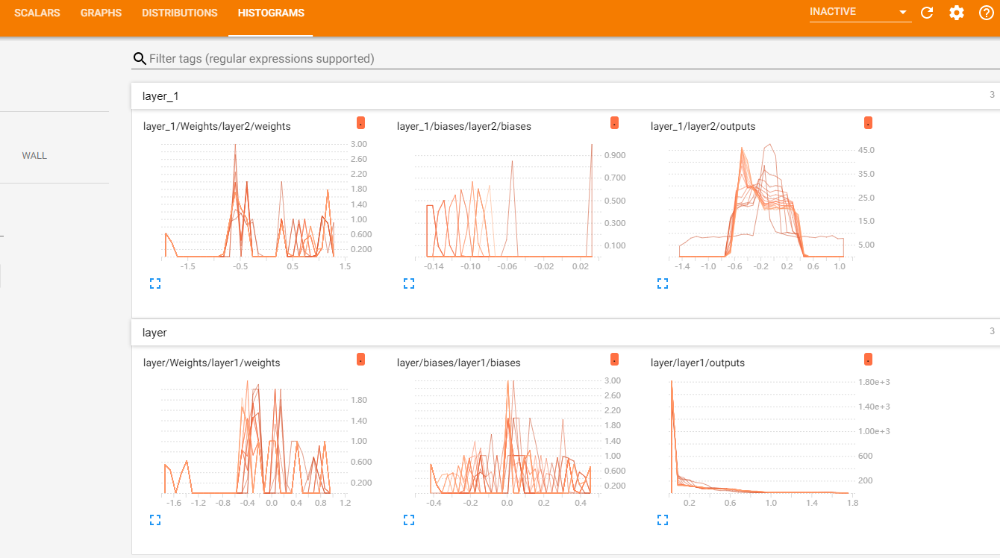

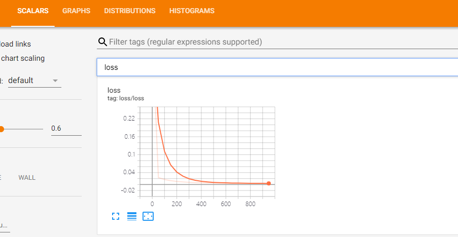

## Classifiation 分类学习

## MNIST数据集

MNIST数据集的官网是[Yann LeCun's website](http://yann.lecun.com/exdb/mnist/)。在这里，我们提供了一份python源代码用于自动下载和安装这个数据集。你可以下载[这份代码](https://tensorflow.googlesource.com/tensorflow/+/master/tensorflow/examples/tutorials/mnist/input_data.py)，然后用下面的代码导入到你的项目里面，也可以直接复制粘贴到你的代码文件里面。

```python
import input_data
mnist = input_data.read_data_sets("MNIST_data/", one_hot=True)
```

下载下来的数据集被分成两部分：60000行的训练数据集（`mnist.train`）和10000行的测试数据集（`mnist.test`）。这样的切分很重要，在机器学习模型设计时必须有一个单独的测试数据集不用于训练而是用来评估这个模型的性能，从而更加容易把设计的模型推广到其他数据集上（泛化）。

正如前面提到的一样，每一个MNIST数据单元有两部分组成：一张包含手写数字的图片和一个对应的标签。我们把这些图片设为“xs”，把这些标签设为“ys”。训练数据集和测试数据集都包含xs和ys，比如训练数据集的图片是 `mnist.train.images` ，训练数据集的标签是 `mnist.train.labels`。

每一张图片包含28像素X28像素。我们可以用一个数字数组来表示这张图片：


我们把这个数组展开成一个向量，长度是 28x28 = 784。如何展开这个数组（数字间的顺序）不重要，只要保持各个图片采用相同的方式展开。从这个角度来看，MNIST数据集的图片就是在784维向量空间里面的点, 并且拥有比较[复杂的结构](http://colah.github.io/posts/2014-10-Visualizing-MNIST/) (提醒: 此类数据的可视化是计算密集型的)。

展平图片的数字数组会丢失图片的二维结构信息。这显然是不理想的，最优秀的计算机视觉方法会挖掘并利用这些结构信息，我们会在后续教程中介绍。但是在这个教程中我们忽略这些结构，所介绍的简单数学模型，softmax回归(softmax regression)，不会利用这些结构信息。

因此，在MNIST训练数据集中，`mnist.train.images` 是一个形状为 `[60000, 784]` 的张量，第一个维度数字用来索引图片，第二个维度数字用来索引每张图片中的像素点。在此张量里的每一个元素，都表示某张图片里的某个像素的强度值，值介于0和1之间。

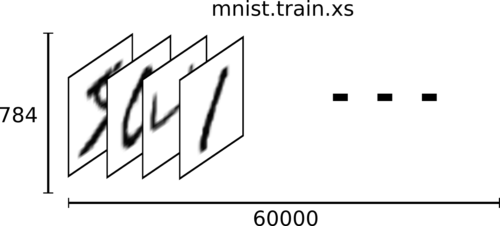

相对应的MNIST数据集的标签是介于0到9的数字，用来描述给定图片里表示的数字。为了用于这个教程，我们使标签数据是"one-hot vectors"。 一个one-hot向量除了某一位的数字是1以外其余各维度数字都是0。所以在此教程中，数字n将表示成一个只有在第n维度（从0开始）数字为1的10维向量。比如，标签0将表示成([1,0,0,0,0,0,0,0,0,0,0])。因此， `mnist.train.labels` 是一个 `[60000, 10]` 的数字矩阵。


```python
import tensorflow as tf
import numpy as np
from tensorflow.examples.tutorials.mnist import input_data
mnist = input_data.read_data_sets('MNIST_data', one_hot=True)
#如果没有数据从网上下载，如果有则使用本地数据

def add_layer(inputs,in_size,out_size,activation_function=None):

    Weights = tf.Variable(tf.random.normal([in_size,out_size]),name='W')
    biases = tf.Variable(tf.zeros([1,out_size])+0.1,name='B')
    Wx_plus_b = tf.matmul(inputs,Weights)+biases
    if activation_function is None:
        outputs = Wx_plus_b
    else:
        outputs = activation_function(Wx_plus_b)
    return outputs
    

xs = tf.placeholder(tf.float32, [None, 784]) # 28x28
ys = tf.placeholder(tf.float32, [None, 10])


production = add_layer(xs,784,10,activation_function=tf.nn.softmax)
cross_entropy = tf.reduce_mean(-tf.reduce_sum(ys*tf.log(production),reduction_indices=[1]))
train_step = tf.compat.v1.train.GradientDescentOptimizer(0.5).minimize(cross_entropy)


init = tf.compat.v1.global_variables_initializer()
sess=tf.compat.v1.Session()
sess.run(init)

def compute_accuracy(v_xs, v_ys):
    global production
    y_pre = sess.run(production, feed_dict={xs: v_xs})#预测值
    correct_production = tf.equal(tf.argmax(y_pre,1), tf.argmax(v_ys,1))
    #tf.argmax 是一个非常有用的函数，它能给出某个tensor对象在某一维上的其数据最大值所在的索引值。由于标签向量是由0,1组成，因此最大值1所在的索引位置就是类别标签，比如tf.argmax(y,1)返回的是模型对于任一输入x预测到的标签值，而 tf.argmax(y_,1) 代表正确的标签，我们可以用 tf.equal 来检测我们的预测是否真实标签匹配(索引位置一样表示匹配)。
    accuracy = tf.reduce_mean(tf.cast(correct_production, tf.float32))
    #这行代码会给我们一组布尔值。为了确定正确预测项的比例，我们可以把布尔值转换成浮点数，然后取平均值。例如，[True, False, True, True] 会变成 [1,0,1,1] ，取平均值后得到 0.75.
    result = sess.run(accuracy, feed_dict={xs: v_xs, ys: v_ys})
    return result

for i in range(1000):
    batch_xs,batch_ys = mnist.train.next_batch(100)
    #每次取一百个组数据进行训练,就是mnist.train[100][784]
    sess.run(train_step,feed_dict={xs:batch_xs,ys:batch_ys})
    if i%50 ==0:
        print(compute_accuracy(mnist.test.images,mnist.test.labels))
   
```

### “交叉熵”（cross-entropy）


**y** 是我们预测的概率分布, **y'** 是实际的分布（我们输入的one-hot vector)。比较粗糙的理解是，交叉熵是用来衡量我们的预测用于描述真相的低效性。

注意，`W`的维度是[784，10]，因为我们想要用784维的图片向量乘以它以得到一个10维的证据值向量，每一位对应不同数字类。`b`的形状是[10]，所以我们可以直接把它加到输出上面。

## 使用dropout解决overfitting

```python

import tensorflow as tf
from sklearn.datasets import load_digits
from sklearn.model_selection import train_test_split
from sklearn.preprocessing import LabelBinarizer

# load data
digits = load_digits()
X = digits.data
y = digits.target
y = LabelBinarizer().fit_transform(y)
X_train, X_test, y_train, y_test = train_test_split(X, y, test_size=.3)


def add_layer(inputs, in_size, out_size, layer_name, activation_function=None, ):
    # add one more layer and return the output of this layer
    Weights = tf.Variable(tf.random_normal([in_size, out_size]))
    biases = tf.Variable(tf.zeros([1, out_size]) + 0.1, )
    Wx_plus_b = tf.matmul(inputs, Weights) + biases
    # here to dropout
    Wx_plus_b = tf.nn.dropout(Wx_plus_b, keep_prob)
    if activation_function is None:
        outputs = Wx_plus_b
    else:
        outputs = activation_function(Wx_plus_b)
    tf.summary.histogram(layer_name + '/outputs', outputs)
    return outputs


# define placeholder for inputs to network
keep_prob = tf.compat.v1.placeholder(tf.float32)
xs = tf.compat.v1.placeholder(tf.float32, [None, 64])  # 8x8
ys = tf.compat.v1.placeholder(tf.float32, [None, 10])

# add output layer
l1 = add_layer(xs, 64, 50, 'l1', activation_function=tf.nn.tanh)
prediction = add_layer(l1, 50, 10, 'l2', activation_function=tf.nn.softmax)

# the loss between prediction and real data
cross_entropy = tf.reduce_mean(-tf.reduce_sum(ys * tf.log(prediction),
                                              reduction_indices=[1]))  # loss
tf.summary.scalar('loss', cross_entropy)
train_step = tf.train.GradientDescentOptimizer(0.5).minimize(cross_entropy)

sess = tf.Session()
merged = tf.summary.merge_all()
# summary writer goes in here
train_writer = tf.summary.FileWriter("logs/train", sess.graph)
test_writer = tf.summary.FileWriter("logs/test", sess.graph)


init = tf.global_variables_initializer()
sess.run(init)
for i in range(500):
    # here to determine the keeping probability
    sess.run(train_step, feed_dict={xs: X_train, ys: y_train, keep_prob: 0.5})
    if i % 50 == 0:
        # record loss
        train_result = sess.run(merged, feed_dict={xs: X_train, ys: y_train, keep_prob: 1})
        test_result = sess.run(merged, feed_dict={xs: X_test, ys: y_test, keep_prob: 1})
        train_writer.add_summary(train_result, i)
        test_writer.add_summary(test_result, i)
```

## 卷积神经网络

