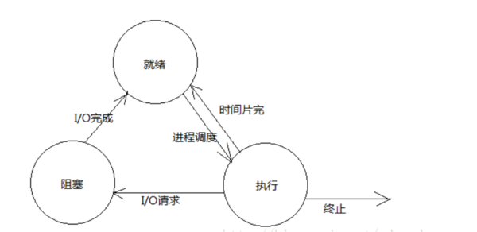

### **1.常用的文件存取控制方式有哪些？**

主要有存取控制矩阵、用户权限表、使用口令、使用密码。

###  **2.何谓死锁?产生死锁的原因和必要条件是什么?**

死锁是指多个进程在运行过程中因争夺资源而造成的一种僵局，当进程处于这种僵持状态时，若无外力作用，它们都将无法再向前推进。

产生死锁的原因：（1）竞争资源。（2) 进程间推进顺序非法。

产生死锁的必要条件：（1）互斥条件；(2) 请求和保持条件；(3) 不剥夺条件；(4) 环路等待条件。

### **3.试从调度性、并发性、 拥有资源和系统开销4个方面对进程和线程进行比较。**

调度性： 线程在OS中作为调度和分派的基本单位，进程只作为资源拥有的基本单位。

并发性： 进程可以并发执行，一个进程的多个线程也可以并发执行。

拥有资源： 进程始终是拥有资源的基本单位，线程只拥有运行时必不可少的资源，本身基本不拥有资源，但可以访问隶属进程的资源。

系统开销： 操作系统在创建、撤销和切换进程时付出的开销远大于线程。

### **4.SPOOLing技术如何使一台打印机虚拟成多台打印机**

用户请求打印后，1.将打印数据输出到输出井申请的空闲盘块中，2.将打印请求登记后排到打印队列，3.打印机空闲时，首取第一张申请表，将数据从输出井传送到内存缓冲区进行打印。

### 5.进程调度与作业调度的本质区别是什么

进程调度是真正让某个就绪状态的进程到处理机上运行，而作业调度只是使作业具有了竞争处理机的机会。
进程调度（又称微观调度、低级调度、短程调度）：是按照某种调度算法从就绪状态的进程中选择一个进程到处理机上运行。负责进程调度功能的内核程序称为进程调度程序。
作业调度（又称高级调度、宏观调度、长程调度）：是按某种调度算法从后备作业队列中选择作业装入内存运行；另外当该作业执行完毕后，还负责回收系统资源。完成作业调度功能的程序称为作业调度程序。

6.微内核操作系统的优点

提高可拓展性,增强了安全性和可靠性，增强了可移植性，提供了对分布式系统的支持，融入了面向对象技术

7.什么是动态连接

是把程序的[模块](https://baike.baidu.com/item/模块)相互划分开来，形成独立的文件，而不再将他们[静态](https://baike.baidu.com/item/静态)的链接在一起。简单地讲，就是不对那些组成程序的[目标文件](https://baike.baidu.com/item/目标文件)进行链接，等到程序要运行时才进行链接。

8.进程和程序有什么区别

- 进程是程序的一次执行过程，是动态概念，程序是一组有序的指令集和，是静态概念
- 进程是暂时的，是程序在数据集上的一次执行，可创建可撤销，程序是永存的
- 进程具有并发行，程序没有
- 进程是竞争计算机资源的最小单位，程序不是
- 进程与程序不是一一对应，多个进程可执行一个程序，一个程序可执行多个程序

9.操作系统提供给用户和计算机之间的接口有哪三种

命令接口，图形接口，程序接口

10.常用的文件存取方式有哪三种

顺序存取和随机存取,按键存取

11.记录的成组个分解

· 成组：把若干逻辑记录合并成一组，存入一个物理块的工作称为记录的成组； · 分解：从一组中把一个逻辑

12.**进程间同步和互斥的含义是什么**

进程互斥：指两个或多个进程共享临界资源进，各进程不能同时进入临界区.
进程同步：指两个或多个相关进程相互合作，完成一个共同任务，它们在执行时序上必协调.

13.简述设备管理的任务和功能

提高设备的利用率
设备独立性
字符编码的独立性
设备处理的一致性
2．设备管理的功能
（1）监视系统中所有设备的状态。
（2）设备分配。
（3）设备控制是设备管理的另一功能，它包括设备驱动和设备中断处理，具体的工作过程是在设备处理的程序中发出驱动某设备工作的I/O指令后，再执行相应的中断处理。

14.**引入分段存储管理是为了满足用户哪几方面的需要**

(1)方便了编程； (2)实现了分段共享； (3)实现了分段保护； (4)实现了动态链接； (5)实现了动态增长

15.进程状态图

进程在其生命周期内通常进程有以下三种状态：

1、就绪(Ready)状态：指进程已处于准备好运行的状态，及进程已经分配到需要的系统资源，只要在获得CPU就可以执行 。

2、执行(Running)状态：指进程获得了CPU正在执行，在单处理机系统中，最多只有一个进程处于该状态 。

3、阻塞(Block)状态：指正在执行的进程，在执行过程中发生了某时间（如：I/O请求、申请缓冲区失败等） 。

16.**从操作系统提供的服务出发，操作系统可分哪几类？**

批处理操作系统、分时操作系统、实时操作系统、网络操作系统、分布式操作系统。

17.为什么说批处理多道系统能极大地提高计算机系统的工作效率？

①多道作业并行工作，减少了处理器的空闲时间。

②作业调度可以合理选择装入主存储器中的作业，充分利用计算机系统的资源。

③作业执行过程中不再访问低速设备，而直接访问高速的磁盘设备，缩短执行时间。

④作业成批输入，减少了从操作到作业的交接时间。

18.什么是输入输出操作?什么是通道?

主存与外围设备之间的信息传送操作称为输入/输出操作。 通道可称为输入/输出处理机。

19.简述存储器的工作原理

计算机在运行时，先从内存中取出第一条指令，通过控制器的译码，按指令的要求，从存储器中取出数据进行指定的运算和逻辑操作等加工，然后再按地址把结果送到内存中去。接下来，再取出第二条指令，在控制器的指挥下完成规定操作。依此进行下去。直至遇到停止指令。

20.简述文件系统的结构

文件的组成结构一般分为[物理结构](https://www.baidu.com/s?wd=物理结构&tn=SE_PcZhidaonwhc_ngpagmjz&rsv_dl=gh_pc_zhidao)和逻辑结构。[物理结构](https://www.baidu.com/s?wd=物理结构&tn=SE_PcZhidaonwhc_ngpagmjz&rsv_dl=gh_pc_zhidao)是指文件在磁盘上的存储方式，而逻辑结构是指文件信息的逻辑结构。象我们常提到的FAT,[FAT32](https://www.baidu.com/s?wd=FAT32&tn=SE_PcZhidaonwhc_ngpagmjz&rsv_dl=gh_pc_zhidao),NTFS等等都是文件的[物理结构](https://www.baidu.com/s?wd=物理结构&tn=SE_PcZhidaonwhc_ngpagmjz&rsv_dl=gh_pc_zhidao)，它规定了文件信息在磁盘上的存储方式，与具体的文件无关。而文件的逻辑结构则不同，它规定的是具体的一类文件中信息的组织方式，象记录式文件和流文件等等。文件的逻辑结构多种多样，几乎每个种类的文件都有自己特殊的结构，比如WORD文档，比如BMP文件，比如MP3等

21.何谓多道程序设计技术,应解决哪些问题

[多道程序设计](https://www.baidu.com/s?wd=多道程序设计&tn=SE_PcZhidaonwhc_ngpagmjz&rsv_dl=gh_pc_zhidao) 是在计算机内存中同时存放几道[相互独立](https://www.baidu.com/s?wd=相互独立&tn=SE_PcZhidaonwhc_ngpagmjz&rsv_dl=gh_pc_zhidao)的程序，使它们在管理程序控制之下，相互穿插的运行。 两个或两个以上程序在计算机系统中同处于开始个结束之间的状态。

①存储保护和地址重定位。（几道程序共享同一主存）
②处理机的管理和调度。（共享同一处理机）
③资源的管理与分配。（共享系统资源）

22.什么是系统调用?系统调用与一般过程调用的主要区别是什么?

答:所谓系统调用，就是用户在程序中调用操作系统所提供的一些子功能.
　　它是通过系统调用命令，中断现行程序而转去执行相应的子程序，以完成特定的系统功能。完成后，控制又返回到发出系统调用命令之后的一条指令.被中断的程序将继续执行下去。
　　系统调用与一般过程调用不同，其主要区别是:
　　(1）运行的状态不同。在程序中的过程一般或者都是用户程序.或者都是系统程序，即都是运行在同一系统状态下(用户态或系统态)。而系统调用的调用过程是用户程序，它运行在用户态，而其被调用过程是系统过程，运行在系统态下。
　　(2)进人的方式不同。一般的过程调用可以直接由调用过程转向被调用的过程.而执行系统调用时，由于调用过程与被调用过程是处于不同的系统状态，因而不允许由调用过程直接转向被调用过程，通常是通过访管中断(即软中断)进人，先进人操作系统，经分析后，才能转向相应的命令处理程序。
　　(3)代码层次不同。一般过程调用中的被调用程序是用户级程序，而系统调用是操作系统中的代码程序，是系统级程序。

23.**常用的文件存取控制方式有哪些？**

主要有存取控制矩阵、用户权限表、使用口令、使用密码。

24.操作系统的基本特征？

并发,虚拟，共享，异步

25.简述信号量的物理意义。

信号量S>0时，S的数值表示某类可用资源的数目，执行P操作意味着申请分配一个单位的资源;当S≤0时，表示无资源可用，此时S的绝对值表示信号量S的阻塞队列中的进程数。执行V操作意味着释放一个单位的资源。

26.什么是请求页式管理？

请求页式管理的基本原理是将逻辑地址空间分成大小相同的页，将存储地址空间分块，页和块的大小相等，通过页表进行管理。

27.用户与操作系统的接口有哪几种类型？有何区别？

命令接口：脱机、联机

程序接口：系统调用

图形用户界面接口

28.时操作系统和实时操作系统的主要区别是什么

分时操作系统和实时操作系统的区别可以从多路性、独立性、及时性、交互性和可靠性5个方面进行比较。
(1) 多路性。实时系统与分时系统一样具有多路性，分时系统按分时原则为多个终端用户服务；而实时系统，其多路性则主要表现在经常对多路的现场信息进行采集及对多个对象或多个执行机构进行控制。
(2) 独立性。实时系统与分时系统一样具有独立性。每个终端用户在向实时系统提出服务请求时，是彼此独立的操作，互不干扰；而且在实时系统中信息的采集和对对象的控制也是彼此互不干扰的。
(3) 及时性。实时系统对实时性的要求与分时系统类似，都是以人能接受的等待时间来确定；但实时系统的及时性，则是以控制对象所要求的开始截止时间或完成截止时间来确定的，一般为秒级、百毫秒直至毫秒级，甚至有的要低于100μs。
(4) 交互性。实时系统具有交互性，但这里人与系统的交换，仅限于访问系统中某些特定的专用服务程序。它不像分时系统那样能向终端用户提供数据处理服务、资源共享等服务。
(5) 可靠性。分时系统要求系统可靠，相比之下，实时系统则要求系统高度可靠。因为任何差错都可能带来巨大的经济损失，甚至无法预料的灾难后果。因此，在实时系统中，采取了多级容错措施来保证系统的安全及数据的安全。

29.进程的定义

进程是一个具有一定独立功能的程序关于某个数据集合的一次运行活动。它是[操作系统](https://baike.baidu.com/item/操作系统/192)动态执行的[基本单元](https://baike.baidu.com/item/基本单元)，在传统的[操作系统](https://baike.baidu.com/item/操作系统)中，进程既是基本的[分配单元](https://baike.baidu.com/item/分配单元)，也是基本的执行单元。

30.简答题**什么是虚拟存储器？**

虚拟存储器是系统为了满足用户对存储器容量的巨大需求而采用软硬伯技术虚设的一个非常大的存储空间，从而使用户在编程时无须担心...

31.为什么要引入缓冲？

引入缓冲是为了匹配外设和CPU 之间的处理速度，减少中断次数和CPU 的中断处理时间，同时。解决DMA 或通道方式时的数据传输瓶颈问题

32.**进程通信有那三种基本类型？**

基于共享存储器的通信、基于消息传递系统的通信和基于管理文件的通信。

33.**什么是原语**

原语是指由若干条机器指令构成的，并用以完成特定功能的一段程序。这段程序在执行期间是不可分割的。

34.互斥是什么

互斥：是指某一资源同时只允许一个访问者对其进行访问，具有唯一性和排它性。但互斥无法限制访问者对资源的访问顺序，即访问是无序的。