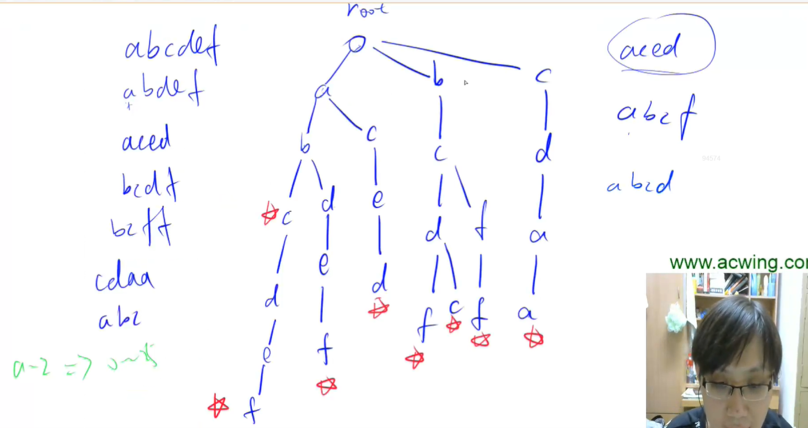
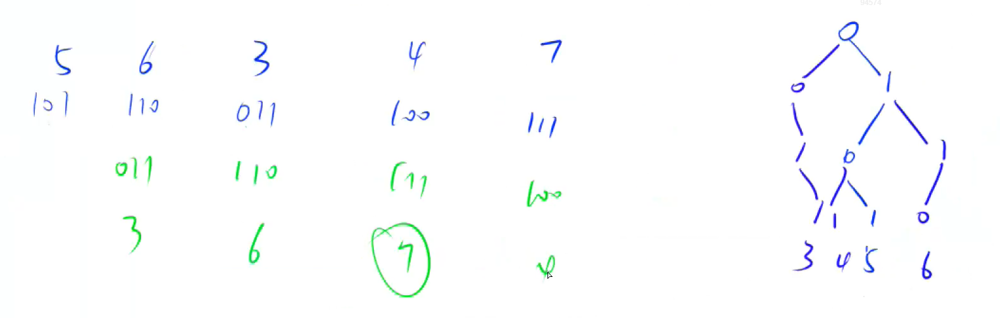

作用:

1.高效地存储和查找字符串集合



### 835. Trie字符串统计

 https://www.acwing.com/problem/content/description/837

```c++
#include<iostream>

const int N = 100010;

int son[N][26], cnt[N], idx;
char str[N];

void insert(char str[]) {
    int p = 0;
    for(int i = 0; str[i]; i++) {
        int u = str[i] - 'a';
        if(!son[p][u]) son[p][u] = ++idx;
        p = son[p][u];
    }
    cnt[p]++;
}

int query(char str[]) {
    int p = 0;
    for(int i = 0; str[i]; i++) {
        int u = str[i] - 'a';
        if (!son[p][u]) return 0;
        p = son[p][u];
    }
    return cnt[p];
}

int main() {
    int n;
    scanf("%d", &n);
    while(n--) {
        char q[2];
        scanf("%s%s", &q, &str);
        if (q[0] == 'I') insert(str);
        else printf("%d\n", query(str));
    }
    return 0;
}
```


### 143. 最大异或对

https://www.acwing.com/problem/content/145/

```c++
#include<iostream>

using namespace std;

const int N = 100010, M = 31 * N;

// idx 存储当前的下标
int son[M][2], a[N], idx;

void insert(int x) {
    int p = 0;
    for(int i = 30; i >= 0; i--) {
        int u = x >> i & 1;
        if (!son[p][u]) son[p][u] = ++idx;
        p = son[p][u];
    }
}

int query(int x) {
    int p = 0;
    int res = 0;
    for(int i = 30; i >= 0; i--) {
        int u = x >> i & 1;
        if (son[p][!u]) {
            p = son[p][!u];
            res = res *2 + !u;
        } else {
            p = son[p][u];
            res = res *2 + u;
        }
    }
    return res;
}

int main() {
    int n, res = 0;
    scanf("%d", &n);
    for(int i = 0; i < n; i++) {
        int num ;
        scanf("%d", &num);
        insert(num);
        int t = query(num);
        res = max(res, num ^ t);
    }
    printf("%d\n", res);
}
```


将每个数看成31位的trie， 从左至右依次为1为最大



