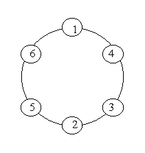
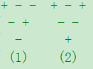

### 1.部分和问题

**描述**

给定整数a1、a2、.......an，判断是否可以从中选出若干数，使它们的和恰好为K。

**输入**

首先，n和k，n表示数的个数，k表示数的和。
 接着一行n个数。
 （1<=n<=20,保证不超int范围）

**输出**

如果和恰好可以为k，输出“YES”，并按输入顺序依次输出是由哪几个数的和组成，否则“NO”

**样例输入**

4 13

1 2 4 7

**样例输出**

YES

2 4 7

```c
#include <stdio.h>
#include <stdlib.h>
#define bool int
#define true 1
#define false 0
int a[20],b[20];
int k=0;
int n=0,j=0;
bool dfs(int i,int sum){
    if(i == n+1)return sum==k;
    if(sum==k)return true;
    if(dfs(i+1,sum+a[i])){
        printf("%d ",a[i]);
        return true;
    };
    if(dfs(i+1,sum))return true;
    return false;
}
int main()
{
    int i=0;
    scanf("%d",&n);
    scanf("%d",&k);
    for(;i<n;i++){
        scanf("%d",&a[i]);
    }
    if(dfs(0,0)){printf("\nYes\n");}
    else{printf("\nNo\n");};
    return 0;
}

深度优先搜索-----部分和问题
bool dfs(int i, int sum) //分别表示当前函数的序号和前i个中的若干数的和
{
    if(i == n + 1) return sum == k;
    ///if(sum == k) return true; //若是前i个数就存在，后面的数，不用考虑直接输出ture
    if(dfs(i + 1, sum + a[i])) return true;//判断当前数存在的情况
    if(dfs(i + 1, sum)) return true; //判断当前数不存在的情况
    return false; //该情况不成立的情况
}
```

### 2.素数环

**描述**

有一个整数n，把从1到n的数字无重复的排列成环，且使每相邻两个数（包括首尾）的和都为素数，称为素数环。

为了简便起见，我们规定每个素数环都从1开始。例如，下图就是6的一个素数环。



**输入**

有多组测试数据，每组输入一个n(0<n<20)，n=0表示输入结束。

**输出**

每组第一行输出对应的Case序号，从1开始。
 如果存在满足题意叙述的素数环，从小到大输出。
 否则输出No Answer。

**样例输入**

6

8

3

0

**样例输出**

Case 1:

1 4 3 2 5 6

1 6 5 2 3 4

Case 2:

1 2 3 8 5 6 7 4

1 2 5 8 3 4 7 6

1 4 7 6 5 8 3 2

1 6 7 4 3 8 5 2

Case 3:

No Answer

```c
#include<stdio.h>
#include<string.h>
#define maxn 40
int a[maxn];
int b[maxn];
int c[maxn];
void init()//筛法求素数
{
    int i,j;
    a[0]=a[1]=1;
    for(i=2; i<maxn; i++)
    {
        if(!a[i])
        {
            for(j=i*i; j<maxn; j+=i)
            {
                a[j]=1;
            }
        }
    }
}
void dfs(int k,int n)//递归
{
    int i;
    if(k==n+1&&!a[b[1]+b[n]])
    {
        printf("1");
        for( i=2;i<=n;i++)
        {
            printf(" %d",b[i]);
        }
        printf("\n");
        return ;
    }
    for(i=2;i<=n;i++)
    {
        if(!a[b[k-1]+i]&&!c[i])
        {
            b[k]=i;
            c[i]=1;
            bfs(k+1,n);
            c[i]=0;
        }
    }
}
int main()
{
    init();
    int g=0;
    int n;
    while(scanf("%d",&n)!=0)
    {g++;
        if(n==0)
            break;
             printf("Case %d:\n",g);
            if(n==1)
                printf("1\n");
            else if(n%2==1)
                printf("No Answer\n");
            else
            {
            b[1]=1;
            c[1]=1;
            dfs(2,n);
            }
    }
}

```

### 3.组合数

**描述**

找出从自然数1、2、... 、n（0<n<10）中任取r(0<r<=n)个数的所有组合。

**输入**

输入n、r。

**输出**

按特定顺序输出所有组合。
 特定顺序：每一个组合中的值从大到小排列，组合之间按逆字典序排列。

**样例输入**

5 3

**样例输出**

543

542

541

532

531

521

432

431

421

321

```c
#include<stdio.h>
int n,r;
void comb(int a,int r)
{
    int i=0;
    if(!r){
        printf("%d\n",a);
        return;
    }
    for(i=a%10-1;i>=r;i--){
        comb(a*10+i,r-1);
    }
}

int main()
{
    int i=0;
    scanf("%d%d",&n,&r);
    for(i=n;i>=r;i--)
        comb(i,r-1);
    return 0;
}
```

### 4.幸运三角形

**描述**

​        话说有这么一个图形，只有两种符号组成（‘+’或者‘-’），图形的最上层有n个符号，往下个数依次减一，形成倒置的金字塔形状，除第一层外（第一层为所有可能情况），每层形状都由上层决定，相邻的符号相同，则下层的符号为‘+’，反之，为‘-’;如下图所示（n = 3 时的两种情况)：

​                                           

如果图中的两种符号个数相同，那这个三角形就是幸运三角形，如上图中的图（2）.

**输入**

有多组测试数据（少于20组）。
 每行含一个整数n（0<n<20)。

**输出**

输出相应的幸运三角形个数。

**样例输入**

3

4

**样例输出**

4

6

```c

#include<stdio.h>
#include<string.h>
#define bool int
#define true 1
#define false 0
int n,cnt,vis[20],dp[20][20];
int a,b;
bool fun()
{
    int i,j;
    for(i=0;i<n;i++)
    {
        for(j=0;j<n-i-1;j++)
        {
            if(dp[i][j]==dp[i][j+1])
            {
                dp[i+1][j]=1;
                b++;
            }
            else
            {
                dp[i+1][j]=0;
                a++;
            }
        }
    }
    if(a==b) return true;
    else return false;
}

void dfs(int cur)
{   int i;
    a=0,b=0;
    if(cur>=n)
    {
        for(i=0;i<n;i++)
        {
            dp[0][i]=vis[i];
            if(dp[0][i]==0) a++;
            else b++;
        }
        if(fun()) cnt++;
        return;
    }
    vis[cur]=0;
    dfs(cur+1);
    vis[cur]=1;
    dfs(cur+1);
}

int main()
{
    while(scanf("%d",&n))
    {
        cnt=0;
        dfs(0);
        printf("%d\n",cnt);
    }
}

```

